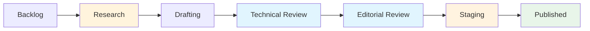

# Agile documentation workflows
*Managing documentation in sprint environments*

---

In an agile environment, documentation must be as flexible and iterative as the software it describes. Moving away from the waterfall model, where documentation is a massive project at the end of a software development cycle, requires a shift toward agile documentation workflows. 

By using frameworks such as [scrum](https://www.scrum.org/){: target="_blank" rel="noopener" } and [kanban](https://www.atlassian.com/agile/kanban){: target="_blank" rel="noopener" }, technical writers can make their workload visible and predictable while integrating it into the development workflow.

---

## The documentation backlog

The foundation of any agile workflow is the *backlog*. For a technical writer, the documentation backlog is a prioritized list of all known work. This includes:

- **New feature documentation:** Tasks tied to upcoming software releases.
- **Content maintenance:** Updates to existing pages based on UI changes.
- **Technical debt:** Fixing placeholder text, outdated screenshots, or broken links.
- **Strategic projects:** [Information architecture (IA)](../references/ia-design.md) overhauls or style guide updates.

By maintaining a single source of truth for all tasks, the technical writer can negotiate priorities with product managers to ensure that high-value user needs are met first.

---

## Story pointing for documentation

Story pointing is an agile estimation technique used to measure the relative effort required to complete a task. Instead of estimating in hours or days, teams assign "points" based on the complexity, risk, and amount of work involved. This relative approach allows teams to account for the uncertainty inherent in technical work.

Estimation is often the hardest part of agile for technical writers. Unlike coding, where effort is tied to logic, writing effort is often tied to research complexity.

When story pointing, technical writers should estimate based on:

- **SME availability:** How difficult is it to schedule time with the subject matter expert (SME)?
- **Product stability:** Is the UI still changing daily?
- **Research depth:** Is there a need to learn a new programming language or protocol?
- **Review requirements:** How many stakeholders must sign off on this specific page?

!!! tip "Complexity over word count"
    A 100-word API reference page for a complex security protocol can take 10 times longer to write than a 1,000-word tutorial for a simple UI feature. Always point based on complexity, not length.

---

## Kanban for content flow

Kanban is a visual system for managing work as it moves through a process. Unlike scrum, which uses fixed time blocks (sprints), kanban focuses on a continuous, pull-based workflow. 

!!! info "Why kanban works for writers"
    Technical writers often face sudden, ad-hoc requests such as emergency bug fixes or UI label updates. These requests cannot wait for the next scrum sprint. Kanban allows these high-priority tasks to be "pulled" into the workflow immediately.

### Visualizing the pipeline

A kanban board uses columns to represent the specific stages of the documentation life cycle. This visibility helps identify bottlenecks; for example, if multiple articles are stuck in *Technical Review*, the writer knows to follow up with their engineers to keep the pipeline moving.

*Figure 1: The progression of a documentation task from the initial backlog to live deployment.*{: .caption }

### Managing Work-in-Progress (WIP)

A critical component of the kanban method is the WIP limit. By restricting the number of tasks allowed in a single column, you prevent the multitasking trap and ensure work is completed rather than just started.

- **The Rule:** If your **Drafting** column has a WIP limit of "2," you must move an existing draft into the review stage before you can pull a new task from the backlog.
- **The Result:** This maintains a steady flow of finished content and prevents a pile-up of half-written articles.

!!! tip "Avoid the 'stale draft' trap"
    High WIP limits often lead to stale content. The longer an article sits in a *drafting* or *review* state, the more likely the software will change, requiring you to restart your research. Keep your WIP limits low (1–2 tasks per writer) to ensure maximum velocity.

---

## Jidoka: Automation with a human touch

Jidoka is a concept borrowed from the Toyota Production System that refers to *autonomation* (automation with a human touch). In documentation, it refers to systems that automatically stop a build or alert the technical writer when a quality issue is detected.

In a modern workflow, Jidoka is implemented through automated gatekeepers:

- **Build failures:** If a Markdown file has a broken link or a syntax error, the automated pipeline stops the deployment.
- **Style linting:** [Automated tools](../doc-stack/prose-linting.md), such as [Vale](https://vale.sh/){: target="_blank" rel="noopener" }, alert the technical writer to non-inclusive language or passive voice before the content is reviewed.

This automation allows the technical writer to focus on high-level cognitive tasks, such as clarity and structure, while the machine handles formatting and syntax.

---

## Managing content debt

Just as developers face technical debt, technical writers face content debt. This occurs when documentation is skipped to meet a deadline, resulting in stale or missing information.

**Agile debt management strategy:**

- **Identify:** Tag tickets in your backlog as "debt."
- **Quantify:** [Use analytics](../doc-lifecycle/observability-analytics.md) to see which pages with debt receive high traffic.
- **Amortize:** Dedicate 10% to 20% of every sprint or work period to paying down the debt by updating old pages.

---

## Retrospectives and automation

At the end of an iteration or sprint, writers should participate in or hold their own *retrospectives*. This is the time to ask: *"Why did the API docs take three days longer than expected?"* or *"Was the SME too busy to review the work?"* Use these insights to adjust the points for the next sprint.

To gain more time for these improvements, technical writers should use automation for routine tasks.

- **Auto-ticket generation:** Set up triggers so that when a developer labels a [GitHub](https://github.com/){: target="_blank" rel="noopener" } issue as `documentation-required`, a ticket is automatically added to the writer's backlog.
- **Release note scrapers:** Automate the collection of commit messages to create the first draft of a changelog.

---

## Agile workflow state definitions

To successfully track work, the team must agree on what each column in the diagram above actually represents. These *definitions of done* ensure consistency across the writing team.

### **STATE: Research**
- **Entrance criteria:** A ticket is moved from the *Backlog* into the active work stream.
- **Action:** Interviewing SMEs, reading developer tickets, and exploring the product in a test environment.
- **Exit criteria:** All technical questions are answered, and a high-level outline or table of contents (TOC) is approved.

### **STATE: Drafting**
- **Entrance criteria:** Research is at least 80% complete.
- **Action:** Writing the Markdown files, creating Mermaid.js diagrams, and capturing necessary screenshots or GIFs.
- **Exit criteria:** A full draft exists that follows the internal style guide and fulfills the ticket requirements.

### **STATE: Technical Review**
- **Entrance criteria:** The draft is published to a private branch for inspection.
- **Action:** The SME reviews the content strictly for technical accuracy.
- **Exit criteria:** The SME provides a technically accurate sign-off.

### **STATE: Editorial Review**
- **Entrance criteria:** Technical accuracy is confirmed by the SME.
- **Action:** A peer writer reviews the content for voice, tone, clarity, and the [seven Cs of technical communication](../technical-writing/7-cs.md).
- **Exit criteria:** All peer review comments are addressed, and the prose meets the organizational quality standard.

### **STATE: Staging**
- **Entrance criteria:** The content has passed both technical and editorial gates.
- **Action:** The technical writer builds the site in a staging environment to check for broken links, image rendering issues, or layout bugs.
- **Exit criteria:** The documentation renders correctly on the preview site and passes all automated build tests.

### **STATE: Published**
- **Entrance criteria:** The staging build is *green* (successful).
- **Action:** The branch is merged into the main repository, and the site is redeployed.
- **Exit criteria:** The page is live, searchable, and stakeholders are notified of the update.

!!! tip "Definition of done (DoD)"
    In an agile workflow, a task is not "done" just because the writing is finished. It is only "done" when it meets the exit criteria of the *Published* state. Always refer to your state definitions to avoid "almost finished" tasks cluttering your board.