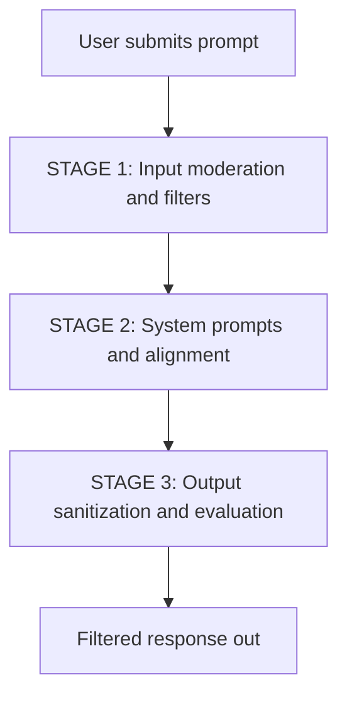

# AI safety guardrails

*Documenting rules that prevent AI from generating harmful, biased, or restricted content*

---

As enterprise software increasingly deploys generative AI features, documenting AI safety guardrails has become a crucial responsibility for technical writers. Safety guardrails are the programmatic boundaries, filters, and system-level prompt layers that prevent large language models (LLMs) from generating harmful, biased, illegal, or restricted content. 

Documentation for these guardrails is more than an internal compliance requirement; it is a critical deliverable for external developers, enterprise customers, and regulatory compliance auditors who must verify that your system is safe, predictable, and legally compliant.

As a technical writer, you translate complex machine learning safety mechanisms into clear, actionable, and structured documentation. This documentation bridges the gap between engineering implementations and corporate safety policies.

---

## AI saftey guardrails three-tier architecture

When you document how safety systems protect an AI application, structure your content to reflect the lifecycle of an AI query. Safety checks do not only happen when the model generates text; they are enforced at three distinct stages.



### 1. Input moderation and filters (preprocessing)

This stage intercepts incoming user queries before they reach the model. Documenting this stage requires detailing the specific classification taxonomies, denylists, and third-party moderation APIs used to flag toxic queries, hate speech, or prompt-injection attacks.

### 2. System prompts and model alignment (in-flight)

This stage consists of system-level prompt instructions and safety alignment protocols, such as reinforcement learning from human feedback (RLHF), built into the model. Documenting this stage involves detailing the core instructions that define the model persona, its restricted boundaries, and its default refusal policies.

### 3. Output sanitization and evaluation (postprocessing)

This stage reviews the model response before displaying it to the user. Documenting this stage involves describing the automated regular expression sweeps for personally identifiable information (PII), toxic language classifiers, and semantic similarity evaluations that verify the output matches safe company source materials.

---

## Documenting input moderation rules

When you write technical reference material for [developer portals](../doc-stack/developer-portals.md), engineers must understand exactly which types of user prompts your safety system will flag or reject. 

Organize these rules by using a multi-column mapping format. This format translates safety policy guidelines into concrete system parameters.

| Policy category | System definition | Developer action required |
| :--- | :--- | :--- |
| **Hate and harassment** | Content that attacks, demeans, or dehumanizes individuals based on protected characteristics. | Handle API error code `#!json 400` with the category payload `harassment`. |
| **Prompt injection** | User prompts designed to override system instructions (for example, "ignore previous instructions"). | Ensure input fields are preprocessed through a validation sanitizer before API ingestion. |
| **Data privacy (PII)** | Requests for Social Security numbers, credit cards, or internal private system keys. | Implement client-side masking scripts before payload serialization. |

---

## Developer and compliance specifications

Documenting safety guardrails requires addressing two distinct audiences: developers who integrate the APIs and compliance officers who audit model safety. Use a comparative layout to present both configuration perspectives.

=== "Developer API configuration"
    Developers must know how to configure the safety parameters programmatically within their API requests. Document the [JSON payload](../doc-stack/json-logic.md#anatomy-of-a-json-payload) fields, acceptable data types, and default safety threshold levels:
    
    ```json hl_lines="5-8"
    {
      "model": "enterprise-chat-v2",
      "prompt": "Analyze the customer database.",
      "temperature": 0.2,
      "safety_settings": [
        { "category": "harassment", "threshold": "BLOCK_MEDIUM_AND_ABOVE" },
        { "category": "pii_leak", "threshold": "BLOCK_ALL" }
      ]
    }
    ```

=== "Compliance and audit guidelines"
    Compliance officers, legal teams, and customers require a nontechnical breakdown of safety thresholds. Focus on describing the real-world boundaries of each classification level rather than the code syntax:
    
    - **BLOCK_ALL:** Complete restriction. The system intercepts any content that contains elements of the safety category. Recommended for medical and financial industries.
    - **BLOCK_MEDIUM_AND_ABOVE:** Standard enterprise protection. This level permits discussion of sensitive concepts in professional contexts but restricts hostile, graphic, or actionable material.

---

## Writing clear refusal and fallback messages

When an AI safety guardrail is triggered, the model must return a fallback message. A poorly written refusal message frustrates users and confuses developers who are trying to debug their applications. 

Design a "helpful reflow" strategy for safety errors that explains *why* the system blocked the action and *how* the user can adjust the query.

### Comparison of user-facing guardrail errors

| Refusal strategy | Error message style | Impact on user experience |
| :--- | :--- | :--- |
| **Poor design** | "An error occurred. Request blocked." | **Frustrating.** Provides no context, which prevents the developer or user from diagnosing if the issue is a bug or a safety violation. |
| **Defensive design** | "Your prompt violates our anti-abuse policy and has been reported to administrators." | **Hostile.** Accuses the user, which creates a poor brand association during accidental system triggers. |
| **Strategic design** | "I can't fulfill this request because it falls outside our safety boundaries for private database access. To proceed, please reformulate your query to focus on public mock data." | **Helpful and instructive.** Explicitly identifies the safety boundary and guides the user toward a safe path. |

---

??? note "Advanced red-teaming documentation scenarios"
    To keep your safety guardrails current, security engineers perform simulated adversarial attacks (red-teaming) on the models. Documenting these exercises is a highly sensitive process.
    
    When you write reports or internal wikis on red-teaming, you must document:

    - **Vulnerability vectors:** How the model was bypassed (for example, by using translation loops or roleplay scenarios).
    - **Remediation code:** The exact changes applied to the system prompts or input filters to prevent the bypass.
    - **Tracking metrics:** Logs that show the reduction in model vulnerability rates over time.

---

## Verification and maintenance checklist

To ensure your safety documentation remains accurate as engineering teams update underlying models, verify your content against this checklist:

- [ ] **Alignment with APIs:** Do all documented safety classification categories match the active keys in your production schema?
- [ ] **Refusal message alignment:** Have all standardized user-facing error strings been mapped in your technical reference guides?
- [ ] **Dual-audience verification:** Is there a clear separation of instructions between developers (API configuration) and legal compliance teams (risk assessments)?
- [ ] **Vulnerability transparency:** For enterprise integrations, does the documentation explain how AI safety guardrails manage false positives?