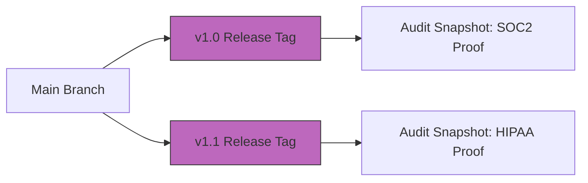

# Compliance and legal documentation
*Manage documentation for high-stakes regulations such as GDPR, SOC2, and HIPAA*

---

In high-growth technology sectors, documentation is more than a guide; it is a legal artifact. If your company operates under regulations such as [General Data Protection Regulation (GDPR)](https://gdpr-info.eu/){: target="_blank" rel="noopener" }, [Systems and Organization Controls (SOC2)](https://www.aicpa-cima.com/resources/landing/system-and-organization-controls-soc-suite-of-services){: target="_blank" rel="noopener" }, or [Health Insurance Portability and Accountability Act (HIPAA)](https://www.hhs.gov/hipaa/index.html){: target="_blank" rel="noopener" }, the documentation itself is subject to audit.

Compliance-driven technical writing focuses on traceability, security, and risk mitigation. It ensures that your organization can prove what it does and how it protects data. It also ensures that information is accessible to all users as required by law.

---

## Confidentiality and the NDA framework

As a technical writer, you are often an insider who has access to pre-release software, internal security protocols, and sensitive intellectual property. Managing this information requires strict adherence to confidentiality protocols.

- **Non-disclosure agreements (NDAs):** You must understand the boundaries of the NDAs you operate under. Make sure that internal-only screenshots or subject matter expert (SME) comments do not leak into public-facing documentation.
- **Staging security:** Host pre-release documentation on password-protected staging servers to prevent accidental indexing by search engines before the official product launch.

!!! danger "Security warning: Internal leaks"
    Never use real internal server names, IP addresses, or employee names in your documentation. Even in internal engineering documentation, these details can create security vulnerabilities if a repository is ever misconfigured as public.

---

## Eliminating PII

A core requirement of GDPR and HIPAA is the protection of personally identifiable information (PII). In technical writing, the risk of PII exposure usually occurs in code samples and screenshots.

**The "clean sample" protocol:**

1.  **Synthetic data:** Use obviously fake names. For example, use "Jane Doe" or "Example User" and placeholder emails such as `user@example.com`.
2.  **Redaction:** Use image editing software to blur or black out sensitive fields in screenshots.
3.  **Code sanitization:** Make sure that API keys, tokens, and secrets are replaced with placeholders such as `YOUR_API_KEY_HERE`.

---

## Immutable versioning for legal audits

During a legal audit, such as for SOC2 compliance, a company may be asked to prove what their documentation said on a specific date. Traditional live wikis fail this test because they change constantly.

Using a [Git-based workflow](../doc-stack/git.md) provides immutable versioning. By using tags and releases, you create a permanent snapshot of the documentation.

- **Audit trail:** Every change is timestamped and attributed to a specific author.
- **Version history:** If a customer claims they were misled by documentation in June 2024, the legal team can pull the exact version of the site that was live on that date.

---

## Mapping documentation to controls

For SOC2 or [ISO 27001](https://www.iso.org/standard/27001){: target="_blank" rel="noopener" }, documentation is often used to satisfy a control. A control is a specific requirement, such as *"The organization must have a documented process for offboarding employees."*

To assist in this process:

- **Structural alignment:** Organize the internal knowledge base to mirror the auditor’s checklist.
- **Cross-referencing:** Explicitly link a standard operating procedure (SOP) to the specific regulatory control it addresses.

---

## Accessibility as legal compliance

In many jurisdictions, providing accessible documentation is a legal requirement under the [Americans with Disabilities Act (ADA)](https://www.ada.gov/){: target="_blank" rel="noopener" } or [Section 508](https://www.section508.gov/){: target="_blank" rel="noopener" }.

Treating [Web Content Accessibility Guidelines (WCAG)](https://www.w3.org/WAI/standards-guidelines/wcag/){: target="_blank" rel="noopener" } standards as a compliance requirement ensures that:

- Screen readers can navigate the content hierarchy.
- Complex diagrams have descriptive alt text.
- Code samples have sufficient color contrast for visually impaired users.

---

## Legal review workflow

High-stakes content, such as terms of service, privacy policies, or safety warnings, requires a specific legal review. This is a multi-stakeholder loop where legal counsel has the final authority to reject or approve.

??? note "Click to see the legal sign-off workflow"
    1.  **Writer:** Drafts the technical content and placeholders for legal disclaimers.
    2.  **SME:** Reviews for technical accuracy.
    3.  **Legal counsel:** Reviews for regulatory compliance and risk.
    4.  **Writer:** Incorporates legal edits, which are often required verbatim.
    5.  **Final gate:** Content is locked. No further changes are allowed without re-approval.

---

## Regulatory standards reference table

The following table summarizes the documentation requirements for common high-stakes regulations.

| Regulation | Primary focus | Documentation requirement |
| :--- | :--- | :--- |
| **GDPR** | Data privacy (EU) | Documentation of data processing and "right to be forgotten" procedures |
| **SOC2** | Security and trust | Documented internal controls, system descriptions, and security policies |
| **HIPAA** | Health privacy (US) | Strict PII or protected health information (PHI) redaction and access logs |
| **WCAG** | Accessibility | Semantic HTML, alt text, and keyboard-navigable information architecture |
| **ISO 27001** | Security management | A formal [information security management system (ISMS)](https://www.techtarget.com/whatis/definition/information-security-management-system-ISMS){: target="_blank" rel="noopener" } manual |

---

## Compliance action plan

To make sure your documentation meets regulatory standards, follow these six steps:

1.  **Audit for PII:** Scan all existing tutorials and code blocks for real names, emails, or API keys.
2.  **Tag releases:** Implement a Git-tagging system for every software release to preserve an audit-ready snapshot.
3.  **Implement WCAG:** Run an automated accessibility checker on your site and fix all high-priority errors.
4.  **Define access:** Make sure your internal-only documents are behind a single sign-on (SSO) and are not being crawled by external bots.
5.  **Standardize disclaimers:** Create a centralized disclaimer snippet that is automatically pulled into every high-risk page.
6.  **Review the NDA:** Re-read the company's NDA to confirm which pre-release features can be discussed in public beta documentation.

---

### Audit-ready validation checklist

Before moving compliance-heavy documentation to a production environment, verify every item on this checklist.

- [ ] **Data privacy:** All code samples use synthetic data and no real names or emails exist.
- [ ] **Information security:** No internal IP addresses, server names, or API keys are visible.
- [ ] **Legal liability:** Legal counsel has approved the current "Terms of Use" and disclaimer text.
- [ ] **Accessibility compliance:** Descriptive alt text exists for every technical diagram and chart.
- [ ] **Audit traceability:** The current version is tagged in Git and the history is immutable.
- [ ] **Confidentiality:** All "Pre-release" tags are removed or confirmed for public viewing.

---

### Compliance status key

| Indicator | Meaning | Required action |
| :--- | :--- | :--- |
| **Pass** | All checkboxes cleared | Proceed to public deployment |
| **Warning** | Minor accessibility or style issues | Deploy with a scheduled clean-up ticket |
| **Fail** | PII or security leak detected | **CONTENT BLOCK:** Do not merge to the main branch |