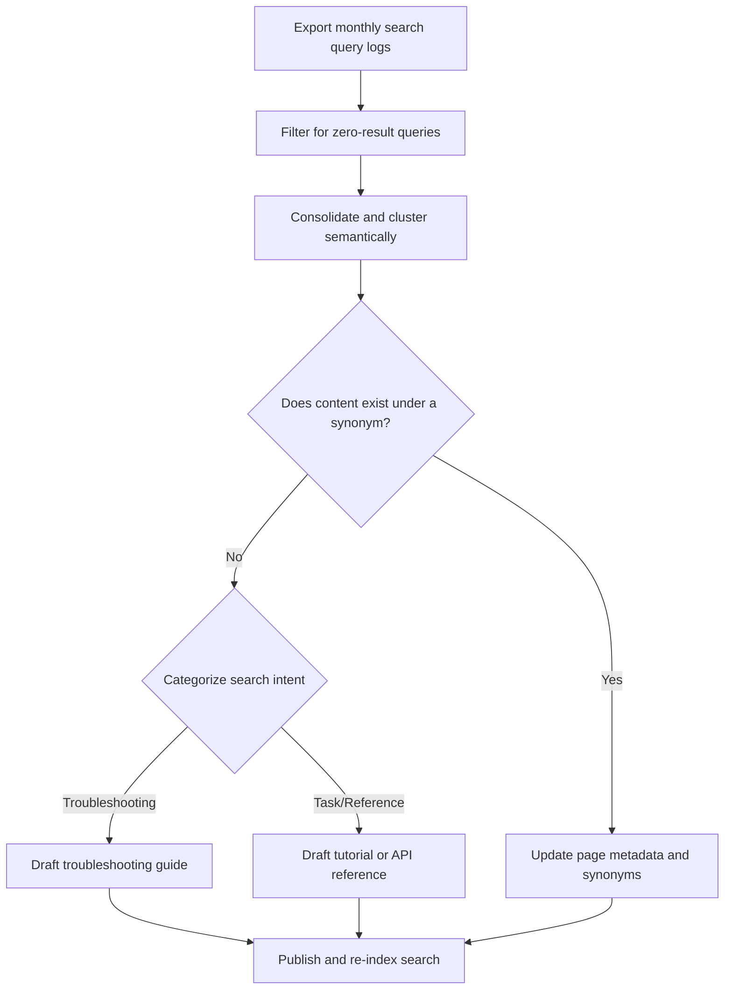

# Content gap analysis methodologies

*Using search intent data and zero-result searches to identify what is missing from your documentation*

---

Traditional documentation audits focus on evaluating the quality, accuracy, and structure of existing content. While valuable, this approach leaves a significant blind spot: it cannot tell you what is completely missing from your documentation. 

To build a comprehensive knowledge base, technical writers should shift from a reactive editing posture to a proactive, data-driven content gap analysis. By analyzing user search behavior, identifying search queries that return zero results, and classifying user intent, you can map out exactly where your documentation falls short of user needs.

This guide details the methodologies for capturing, analyzing, and resolving documentation gaps using search data and user telemetry.

---

## Documentation search intent matrix

In [search engine optimization (SEO)](../doc-stack/metadata-frontmatter.md#search-engine-optimization), search intent is typically categorized as informational, navigational, transactional, or commercial. For technical documentation, search intent is classified through a different lens. Users navigating a documentation site are already deep within your ecosystem; their searches are highly targeted and action-oriented.

To analyze search logs effectively, categorize queries into one of four documentation-specific intent lanes:

| Intent category | Query characteristics | Example queries | Primary content resolution |
| :--- | :--- | :--- | :--- |
| **Troubleshooting** | High urgency. Includes error codes and keywords such as *fail*, *broken*, *error*, or *issue* | `error 403 webhook failed` | Troubleshooting guide, FAQ, or error index page |
| **Task-oriented** | Verb-based. Used to find step-by-step guides, scripts, or configuration processes | `how to configure saml sso` | Tutorial, Quickstart guide, or procedural task topic |
| **Reference** | Specific nouns. Used to find API endpoints, CLI syntax, parameters, or schema types | `POST /api/v1/users schema` | API reference, syntax block, or code sample |
| **Conceptual** | Broad nouns. Used to find system architecture, conceptual explanations, or limits | `rate limits security policy` | Conceptual overview, architectural diagram, or system limits table |

---

## Zero-result searches

The most direct indicator of a documentation gap is a zero-result search. When a user types a query into your search bar and sees a blank page or a "No results found" warning, it represents a friction point in the user journey. 

To prioritize your writing queue, track your overall **zero-result rate** ($ZRR$) using database telemetry or search platform analytics. 

$ZRR = \frac{Q_{zero}}{Q_{total}} \times 100$

$$
ZRR = \left( \frac{\text{Zero-result Queries}}{\text{Total Search Queries}} \right) \times 100
$$

A rising $ZRR$ indicates that your software features are outstripping your documentation, or that users are searching with terminology that your team has not mapped to synonyms.

??? note "Terminology gaps versus content gaps"
    Not every zero-result search means a page is missing. Often, it is a **terminology gap** rather than a **content gap**. 
    
    Before writing a new page, analyze your zero-result queries to see if the topic already exists under a different name. For example, if users search for `environment variables` and get zero results, but you have a comprehensive page titled `Configuring configuration variables`, you do not need new content. You only need to:

    - Add `environment variables` to your metadata alias or keyword list.
    - Configure search synonym mappings (for example, mapping `env vars` to `configuration variables`) within your search engine indexing configuration.

---

## Content gap analysis workflow

To systematically turn raw search logs into an actionable documentation roadmap, establish a repeatable analysis workflow. This loop ensures that user queries constantly feed back into your [document development lifecycle](../doc-lifecycle/ddlc.md).

### Step 1: Export and filter data

Export your search query logs from your search engine (such as [Algolia](https://www.algolia.com/){: target="_blank" rel="noopener" }, [Elasticsearch](https://www.elastic.co/elasticsearch/){: target="_blank" rel="noopener" }, [Pagefind](https://pagefind.app/){: target="_blank" rel="noopener" }, or native static site generator search logs). Filter the list to display only queries where the result count is `0`. Sort this list by query frequency so that you address the most common user frustration points first.

### Step 2: Cluster semantically

Users search for the same concepts using slightly different phrasing. Group similar zero-result queries together to identify the underlying topic. For example, the following queries should be clustered into a single [OAuth 2.0 configuration](https://oauth.net/2/){: target="_blank" rel="noopener" } gap:

- `how to set up oauth2`
- `oauth endpoints`
- `authorization grant flow failed`

### Step 3: Classify intent and map content

Analyze your clustered topics against the documentation search intent matrix. Determine whether the missing information should be solved by writing a quick procedural troubleshooting guide, adding parameters to an API reference table, or building a new conceptual overview.

### Step 4: Measure deflection impact

The final step is verifying that your new content resolved the gap. Monitor the specific query terms after you publish. You should see the zero-result count for those terms drop to zero, accompanied by an increase in page views on your new target pages.

---

## Continuous feedback: Incorporate ticket data

To take your gap analysis further, correlate your zero-result search queries with your customer support ticket tags. If you notice a high volume of support tickets tagged with `Webhooks Troubleshooting` at the same time your search logs show a high volume of zero-result searches for `webhook validation signature fail`, you have found a critical, high-impact content gap.

By closing this loop, you can directly attribute support ticket reduction and **search deflection** to your technical writing team's targeted interventions, proving the direct business value of your documentation site.