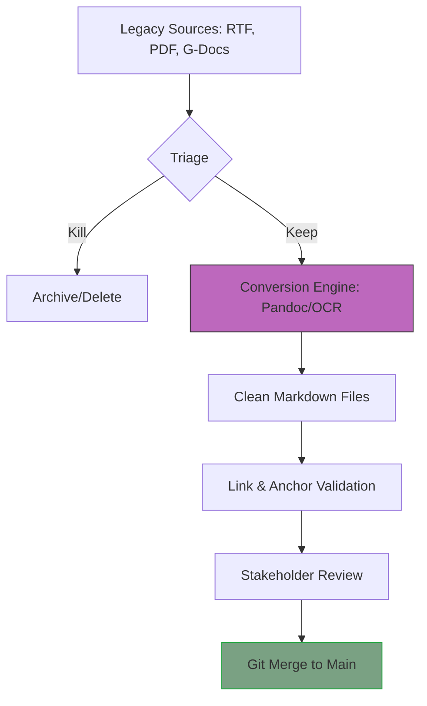

# Orchestrate content migrations
*Strategies for the complex process of moving content from legacy tools to Markdown and Git*

---

A content migration is rarely as simple as copying and pasting text. When you move from legacy systems, such as [Microsoft Word](https://www.microsoft.com/en-us/microsoft-365/word){: target="_blank" rel="noopener" } or scanned [PDFs](https://www.adobe.com/acrobat/about-adobe-pdf.html){: target="_blank" rel="noopener" }, into a [modern Markdown and Git-based environment](../doc-stack/docs-as-code.md), you are doing more than moving text. You are transforming unstructured data into structured, [version-controlled code](../doc-stack/git.md).

A successful migration requires a balance of technical automation and editorial oversight. Without a clear orchestration strategy, you risk importing technical debt into your new system. This outcome is commonly referred to as "garbage in, garbage out" (GIGO).

---

## Phase 1: Triage (keep, kill, combine)

The most important step in a migration happens before you convert a single file. You must audit your legacy content to determine what is worth moving. 

- **Keep:** High-traffic, technically accurate pages.
- **Kill:** Outdated release notes from five years ago, duplicate setup guides, and internal-only notes that no longer apply.
- **Combine:** If you have five short pages describing different parts of the same UI, combine them into a single, comprehensive functional group description (FGD).

!!! Info
    An FGD is a consolidated content type that organizes fragmented UI or feature information into a single, logical topic. This reduces 'click-fatigue' and ensures users see all related capabilities in one context.

!!! WARNING "The hoarder’s trap"
    Do not migrate content only because it exists. Every page you migrate represents a future maintenance burden. If a page has not been visited in 12 months, consider killing it or archiving it outside of your new documentation site.

---

## Phase 2: Universal resource identification

Legacy systems often organize files by creation date or author. In modern systems, files must be organized by using uniform resource identifier (URI) logic.

You must map your old URLs to a new, [logical folder structure](../doc-stack/kb-architecture.md). This ensures that when the site goes live, you can implement redirects so that old bookmarks do not result in 404 errors.

**Example URI mapping:**

- *Old:* `docs.google.com/document/d/12345...`
- *New:* `/api-reference/v2/authentication/`

---

## Phase 3: Legacy data conversion

This is the intensive phase where you convert various file formats into Markdown.

- **RTF to Markdown:** Use conversion tools such as [Pandoc](https://pandoc.org/){: target="_blank" rel="noopener" } to turn Rich Text Format (RTF) files and Word documents into clean Markdown. This removes the hidden styling that Word often adds to text.
- **OCR for scanned media:** If your legacy documentation exists only as scanned PDFs or physical manuals, you must use optical character recognition (OCR) software to digitize the text before you can structure it.

!!! tip "Cleaning the output"
    Conversion tools are not perfect. Automated conversion often results in unformatted Markdown. For example, the converted files might include unnecessary HTML tags or broken tables. Always schedule a manual formatting pass after the automated conversion.

---

## Phase 4: Asset and link management

During a migration, internal links and images are the most likely elements to break. 

1.  **Anchor tag standardization:** Ensure that internal anchor tags (the IDs that allow you to link to a specific section on a page) follow a consistent naming convention. For example, use `#setup-instructions` instead of `#section-2`.
2.  **Asset consolidation:** Move all images from disparate folders into a single, centralized `/assets/images/` directory. 
3.  **Path normalization:** Change absolute paths (for example, `C:\Users\Documents\image.png`) to relative paths (for example, `../assets/images/logo.png`).

---

## Phase 5: Stakeholder communication

The complex part of a migration is not just the code; it is the people. Moving from a What You See Is What You Get (WYSIWYG) editor, such as Microsoft Word, to a Git-based Markdown workflow is a massive culture shift.

**Change management tasks:**

- **Briefing:** Explain to stakeholders how Git-based documentation prevents version conflicts and improves quality.
- **Training:** Provide quick reference guides for [Markdown syntax](../doc-stack/markup-languages.md#markdown-fundamentals) and [basic Git commands](../doc-stack/git.md#git-quick-reference-for-technical-writers).
- **Content freeze:** Establish a content freeze period where no one is allowed to edit the legacy documentation while the migration is in progress.

---

## The migration pipeline

A standardized migration pipeline ensures that content moves through a predictable sequence of triage, conversion, and validation. This workflow helps maintain data integrity and prevents manual errors during large-scale transitions.

The following flowchart illustrates the document lifecycle from legacy source to final publication. The process begins with an initial triage to filter content, followed by automated conversion, manual cleanup, and a series of validation checks before the content is merged into the main repository.

---

## Migration readiness scorecard

Before you finalize the move to the new system, evaluate your migration batch against these four technical readiness dimensions.

=== "1. Structural integrity"
    - **URI logic:** Are the folder names lowercase and hyphenated?
    - **Frontmatter:** Does every `.md` file have the required [title and description tags](../doc-stack/metadata-frontmatter.md)?
    - **Redundancy:** Were all combined files deleted to prevent duplicates?

=== "2. Asset health"
    - **Alt text:** Did the OCR or conversion process preserve [image descriptions](../references/accessibility.md#visual-and-media-checklist-alt-text-and-color)?
    - **Formatting:** Do tables use the standard Markdown pipe syntax (`| --- |`)?
    - **Size:** Were large legacy images compressed for web performance?

=== "3. Link validation"
    - **Internal:** Do all anchor tags correctly point to their intended subheadings?
    - **External:** Did you run a link-checker to verify that legacy external URLs are still active?
    - **Redirects:** Is there a `redirects.txt` file ready to handle old traffic?

=== "4. Team readiness"
    - **Permissions:** Does the team have write access to the new Git repository?
    - **Review flow:** Is the [pull request (PR)](../doc-lifecycle/review-approval.md#the-pull-request-workflow) template ready for the first batch of migrated content?
    - **Knowledge:** Was the team briefed on the content freeze end date?

---

## The clean-up command center

| Problem found | Technical root cause | Recommended action |
| :--- | :--- | :--- |
| **Garbage characters** | Improper RTF encoding during conversion | Re-run conversion using UTF-8 flags |
| **Broken image links** | Absolute paths pointing to local drives | Run a find and replace for relative paths |
| **Missing sections** | OCR failed to read low-quality scan | Manually transcribe missing text from original source |
| **Duplicated headers** | Merging multiple files without re-indexing | Standardize heading tags for the new single file |
| **Broken backlinks** | Anchor IDs changed in the new system | Update the master cross-reference spreadsheet |

!!! abstract "Summary: Success via triage"
    A content migration is successful only if the resulting documentation is easier to maintain than the legacy version. By prioritizing triage and URI strategy over raw speed, your new documentation site becomes a high-value asset rather than a digital landfill.