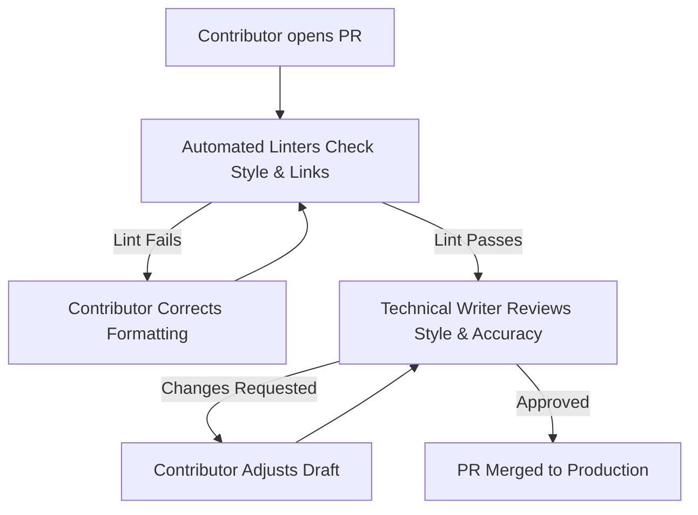

# Documentation contribution guidelines

*Designing a `CONTRIBUTING.md` file that successfully onboards developers and non-writers to a Docs as Code repository*

---

In a [Docs as Code](../doc-stack/docs-as-code.md) environment, the documentation repository is only as strong as its contributors. While technical writers manage the infrastructure, strategy, and overall quality of the site, much of the raw technical knowledge lives in the heads of developers, product managers, and support engineers. 

However, asking these non-writers to contribute directly to a [Git](../doc-stack/git.md) repository often introduces friction. Non-writers often struggle with complex local setup steps, unfamiliar Markdown flavors, rigid style manuals, and the fear of making Git mistakes.

An effective `CONTRIBUTING.md` file acts as an interactive onboarding guide. Its goal is to minimize this friction, protect the integrity of your codebase, and provide options that match the technical capability of every potential contributor.

---

## Identify contribution friction points

To build a guide that people read, you must first understand the barriers that prevent non-writers from contributing. Most friction falls into three categories:

- **Technical barriers:** Requiring contributors to clone a repository, install local runtimes (such as Node.js, Ruby, or Python), and run local servers to fix a typographical error.
- **Formatting barriers:** Complex directory structures, undocumented YAML [frontmatter](../doc-stack/metadata-frontmatter.md#what-is-frontmatter) requirements, and custom [Markdown](../doc-stack/markup-languages.md#markdown-fundamentals) extensions.
- **Creative barriers:** Staring at a blank page without templates or feeling overwhelmed by a long corporate style guide.

---

## Structure of a CONTRIBUTING file

A `CONTRIBUTING.md` file must be structured logically, prioritizing quick access to information. Use collapsible sections to keep the document readable, allowing experienced Git users to bypass basic setup guides while ensuring beginners can expand them for step-by-step help.

???+ note "1. Welcome and code of conduct"
    Briefly state the goal of the documentation and encourage contributions. Explicitly declare that contributions of all sizes, from fixing a broken link to writing a new tutorial, are valued. Link directly to your repository's code of conduct to establish community standards.

??? note "2. Quick edit versus full contribution paths"
    Provide two distinct avenues. The "quick edit" path should guide users on how to use the web-based repository editor for fast typographical errors, while the "full contribution" path details the local development setup.

??? note "3. Writing style cheat sheet"
    Do not link to a massive style manual here. Instead, provide a five-bullet summary of your style requirements (for example, use active voice, write for a clear reading level, and avoid regional jargon).

??? note "4. Pull request checklist"
    List the exact criteria a [pull request (PR)](../doc-lifecycle/review-approval.md#the-pull-request-workflow) must meet before a technical writer approves and merges it. This ensures contributors self-lint their work before submitting.

---

## Tailor workflows to contributor skill levels

Not all contributors have the same familiarity or comfort level with Git. Your guide should offer different workflows based on the scale of the contribution and the user's familiarity with command-line tools.

=== "Quick web edit (Beginners)"
    This workflow is designed for minor edits, spelling corrections, and simple additions. It requires no local software installation.
    
    1. Select the **Edit this page** button at the top of any documentation page (or go directly to the file on the web repository).
    2. Select the **Edit** (pencil) icon in the upper-right corner of the file viewer.
    3. Make your changes directly in the web editor interface.
    4. Scroll down to the **Commit changes** section.
    5. Select **Create a new branch for this commit and start a pull request**.
    6. Name your branch using lowercase letters and hyphens (for example, `fix-typo-auth-page`).
    7. Select **Propose changes** to open a pull request.

=== "Local Docs as Code workflow (Advanced)"
    This workflow is designed for developers, engineers, and regular contributors who are writing extensive guides or modifying site layout assets.
    
    1. Fork the repository and clone it to your local machine:
       ```bash
       git clone https://github.com/your-org/docs-repo.git
       ```
    2. Install the project dependencies:
       ```bash
       npm install
       ```
    3. Create a descriptive feature branch:
       ```bash
       git checkout -b feature/new-api-endpoints
       ```
    4. Start the local development server to preview your changes in real time (for example, `http://localhost:8000`):
       ```bash
       npm run start
       ```
    5. Commit your work using clean imperative language:
       ```bash
       git commit -m "feat: add query parameters to auth endpoint documentation"
       ```
    6. Push your branch and open a pull request against the main branch.

---

## Standardize the review process

To prevent contributions from stalling, your guide must illustrate how work travels from an open draft to production-ready documentation. A clear pipeline manages expectations regarding response times and review cycles.



---

## Use an automated pull request template

A great `CONTRIBUTING.md` file is backed by an automated pull request template. By placing a `pull_request_template.md` file in your repository's `.github/` or `.gitlab/` directory, you can automatically provide a standardized checklist every time a contributor opens a review request.

This helps contributors double-check their work and reduces the review burden on technical writers.

```markdown
## Description
<!-- Provide a brief summary of the changes introduced by this PR and link to any related issues -->
Resolves #1024 - Documented the new `/v2/users` query parameters.

## Contribution Checklist
- [ ] This change is written in the active voice.
- [ ] Any new code examples have been verified and are technically accurate.
- [ ] All cross-links and external URLs are functional.
- [ ] The file structure and naming conventions follow the existing hierarchy.
- [ ] I have verified that this page renders correctly in a local environment (or via web preview).

## Reviewer Notes
<!-- Add any specific aspects of the draft you would like the technical writer to review closely -->
Please verify that the return payload schemas align with the latest backend release.
```

---

## Five tips to improve your contribution guidelines

- **Keep it actionable:** Do not clutter the guide with theoretical documentation philosophy. Focus on how to get a change published.
- **Provide copy-paste commands:** Do not assume developers know your exact local run, install, or lint commands. Provide them in clear, copyable code blocks.
- **Leverage web previews:** If possible, configure your hosting platform to deploy temporary "deploy previews" for every open pull request. This allows contributors to see how their formatting looks on the web without setting up a local server.
- **Maintain an active presence:** If a developer takes the time to write a pull request and it sits unreviewed for weeks, they may not contribute again. Respond to documentation pull requests within 24 to 48 hours.
- **Keep the formatting simple:** Use basic Markdown. Avoid proprietary plugins or extensions in the `CONTRIBUTING.md` file itself so it renders correctly across standard repository viewers such as GitHub, GitLab, and Bitbucket.