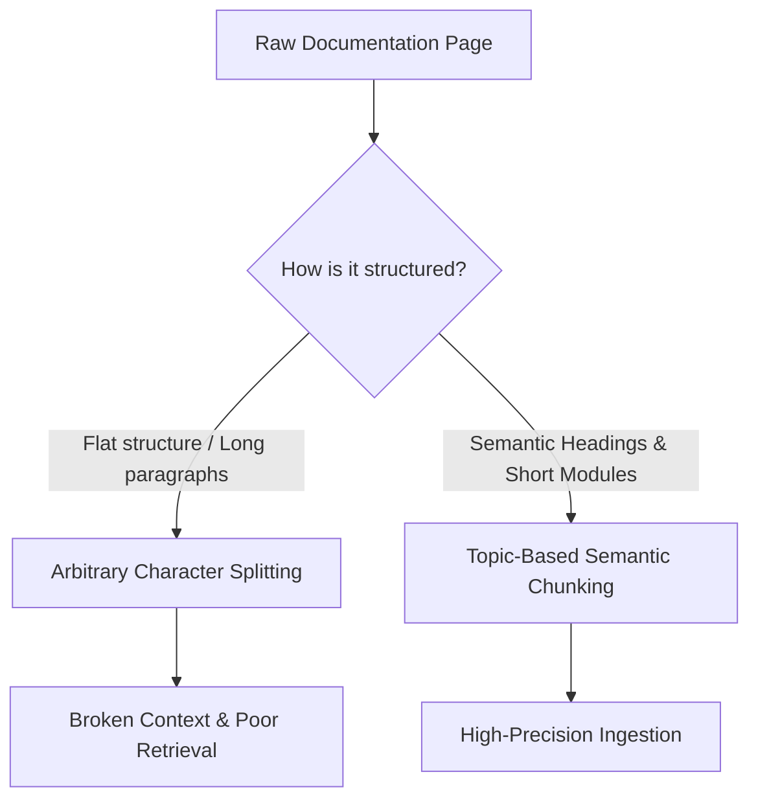
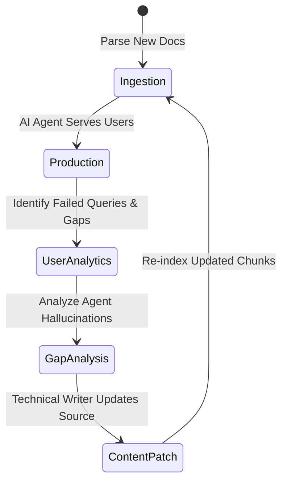

# AI knowledge management

> *Best practices for building and maintaining knowledge bases that power AI conversational agents*

---

The rise of AI conversational agents, virtual assistants, and [retrieval-augmented generation (RAG)](../doc-stack/machine-readable-content.md#chunking-strategy-for-rag) pipelines has fundamentally changed how people consume technical documentation. Instead of browsing a hierarchical table of contents or typing queries into a search bar, users increasingly ask natural-language questions directly to AI agents. 

For technical writers, this means the primary consumer of documentation is no longer only a person reading a page; it is a large language model (LLM) parsing, chunking, and retrieving content to synthesize answers. 

Structuring documentation so that AI agents can cleanly ingest, retrieve, and summarize it is called AI knowledge management. This discipline requires technical writers to transition from writing static page-level layouts to designing structured, highly semantic information architectures.

---

## The math behind retrieval: semantic similarity

To optimize documentation for AI agents, it helps to understand how these systems find your content. In a standard RAG pipeline, documentation is broken down into small pieces called *chunks*, which are then converted into numeric vectors (coordinate points in a high-dimensional space). 

When a user asks an AI agent a question, the question is also vectorized. The database calculates the mathematical distance, often using **cosine similarity**, between the user's question vector ($\mathbf{A}$) and your documentation chunk vectors ($\mathbf{B}$):

$$ cos(\theta) = \frac{\mathbf{A} \cdot \mathbf{B}}{\|\mathbf{A}\| \|\mathbf{B}\|} $$

If the cosine similarity score is close to $1.0$, the vectors are highly aligned. This means the AI agent has determined your documentation chunk contains the answer to the user's question. If your documentation is poorly structured, confusing, or too long, the math fails, the system retrieves the wrong chunks, and the AI agent hallucinates.

---

## 1. Structural granularity: semantic chunking

Most AI agents do not read an entire 3,000-word documentation page at once. Instead, ingestion algorithms split pages into pieces (usually 500 to 1,500 characters). If you write long paragraphs that cover multiple unrelated features, the chunking algorithm might split the text in the middle of a concept, destroying the context.

To prevent this, enforce strict [topic-based authoring](../references/dita.md#core-philosophy-topic-based-authoring) and semantic chunking:



### Chunk-friendly writing rules
*   **One concept per heading:** Every H2 and H3 should cover exactly one task, error, or concept. Do not combine topics (for example, avoid "Installation and troubleshooting" as a single header).
*   **The 150-word limit:** Keep paragraphs under 150 words. Shorter paragraphs act as clean, self-contained semantic units that are easy for vector databases to index.
*   **Explicit contextual anchors:** Do not rely on visual layout to convey context. If a paragraph is under a subsection about "API authentication," write "To configure API authentication, use..." rather than "To configure this, use...". The AI agent needs explicit nouns within the local chunk.

---

## 2. Ingestion metadata schemas

When an AI agent searches a knowledge base, it should not search the entire corpus blindly. By attaching structured metadata to documentation files, typically using YAML or JSON [frontmatter](../doc-stack/metadata-frontmatter.md#what-is-frontmatter), you allow the RAG pipeline to pre-filter search queries, which increases retrieval accuracy.

For example, if a user asks a developer-focused AI agent a question about "Python integration," the agent should ignore all documentation tagged for "Ruby" or "No-code UI."

```yaml
---
title: Initializing the REST Client
id: rest-client-init
type: reference           # Helps the AI prioritize 'reference' over 'conceptual' docs
audience: developer       # Filters out consumer/admin-level answers
product_version: v4.2     # Prevents the AI from serving outdated instructions
related_components:
  - authentication
  - connectivity
---
```

If your documentation platform relies on a [static site generator (SSG)](../doc-stack/ssg.md) or a headless content management system (CMS), work with your engineering team to ensure these metadata fields map directly to the vector database's metadata indexing schema.

---

## 3. Writing for neural search

Neural search engines look for semantic intent rather than exact keyword matching. To write documentation that aligns with semantic search queries, adjust your writing style to anticipate user intent.

=== "Standard writing"
    *   **Characteristics:** Highly formal, passive, and systemic.
    *   **Drafting style:** "This portal facilitates the self-service reset of administrator credentials through security question verification."
    *   **AI performance:** Poor. If a user asks, "How do I reset my admin password?", the semantic mapping to "facilitates the self-service reset of administrator credentials" is weak and can lead to lower similarity scores.

=== "AI-friendly writing"
    *   **Characteristics:** Actionable, noun-heavy, direct, and conversational.
    *   **Drafting style:** "To reset your administrator password, answer your security verification questions in the portal."
    *   **AI performance:** Excellent. The direct verb-object relationship matches the phrasing patterns AI agents expect from user queries.

---

## 4. The maintenance and curation lifecycle

Documentation for AI agents is not a "set it and forget it" process. Stale or conflicting information in an AI knowledge base is a leading cause of hallucinations. If a legacy article says a feature is "deprecated" but a newer article says it is "fully supported," the AI agent often blends these facts.

To keep an AI knowledge base clean, establish a closed feedback loop:



### Analyzing AI diagnostics

To maintain your AI knowledge base, review your agent's conversation analytics regularly. Use these analytics as a content auditing tool:

*   **Unanswered queries (no retrieval match):** This indicates a content gap. The technical writer should create new articles covering these missing topics.
*   **Low-confidence retrieval:** When the AI agent retrieves chunks with low similarity scores (for example, below 0.65), the content is likely too ambiguous or lacks explicit terminology.
*   **Frequent corrections (thumbs-down feedback):** If users frequently select "thumbs down" on an AI agent's response, trace the response back to the retrieved source chunks. You might find that the source page contains outdated parameters or conflicting instructions.

---

## AI knowledge management standards

| Documentation asset | Optimized structure | What to avoid |
| :--- | :--- | :--- |
| **Code tutorials** | Step-by-step numbered lists where every code block has a clear, explanatory heading preceding it | Long, multi-page tutorials with inline comments as the only explanation for the code |
| **API references** | Structured parameter tables with explicit data types and valid range constraints | Freeform descriptive paragraphs detailing parameter operations |
| **Troubleshooting guides** | Discrete symptom-cause-resolution structures (for example, "Symptom: Error 401. Cause: Invalid Token. Resolution: Regenerate...") | Stream-of-consciousness, forum-style posts or long Q&A threads |
| **Product specifications** | Immutable, version-tagged reference lists with clear support lifecycle dates | Single, living pages that overwrite old feature behaviors without explicit versioning |