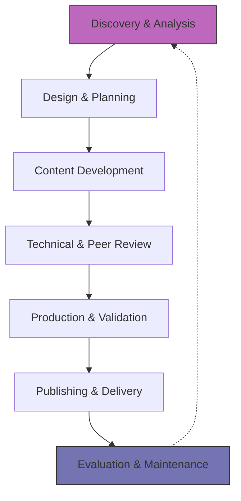

# The document development life cycle (DDLC)
*A standardized process for creating content from the initial handoff to final publishing*

---

The DDLC is a specialized version of the [software development life cycle (SDLC)](../doc-lifecycle/sdlc-integration.md) tailored for the creation and maintenance of technical documentation. While many assume that technical writing begins with typing, a professional DDLC proves that writing is just one phase of a much larger engineering process.

Implementing a rigorous DDLC ensures that technical documentation is not an afterthought but a synchronized deliverable that arrives alongside the product it describes.

---

## Process maturity and the CMMI

Before examining the steps of the DDLC, understand why a standardized process matters. In technical writing, documentation quality is often measured by the [Capability Maturity Model Integration (CMMI)](https://cmmiinstitute.com/){: target="_blank" rel="noopener" }.

The CMMI is a process-level improvement training and appraisal program. A standardized DDLC allows an organization to move from "Level 1" (Initial/Ad-hoc) to "Level 5" (Optimizing). 

When technical documentation follows a repeatable, mapped process, the organization reduces the risk of knowledge silos and ensures that quality stays high regardless of which individual writer is assigned to a project.

!!! info "CMMI in documentation"
    A mature documentation process is not only about "good writing" but also about *predictability*. By aligning the DDLC with CMMI standards, documentation and product teams can estimate the time, cost, and resources needed for a project with high accuracy.

---

## The DDLC process map

---

## Phase 1: Discovery and analysis

The first phase of the DDLC is purely investigative. A technical writer acts as a detective, gathering the raw requirements for the documentation project.

- **Audience analysis:** Technical writers define the users, their technical proficiency, and their environment during [audience analysis](../technical-writing/audience-analysis.md).
- **User goals:** The technical writer identifies exactly what the users need to do to complete their tasks as part of [content design](../technical-writing/content-design-foundations.md).
- **Technical requirements:** The technical writer determines which features are in scope and which are deferred to future releases within the SDLC.
- **Subject matter experts:** The technical writer identifies the [subject matter experts (SMEs)](../doc-lifecycle/sme-interviewing.md) who provide the raw data.

---

## Phase 2: Design and planning

Once the requirements are clear, the technical writer designs the blueprint for the documentation. Writing without a plan leads to disorganized, hard-to-navigate content.

1.  **Information architecture (IA):** The team maps out folder structures, navigation hierarchy, and internal linking strategy as part of the [information architecture](../references/ia-design.md).
2.  **Content type selection:** The technical writer decides whether the user needs a tutorial (learning-oriented), reference (information-oriented), or troubleshooting guide (problem-oriented).
3.  **Table of contents (TOC):** The technical writer creates a detailed outline that serves as a contract between the writer and the stakeholders.

---

## Phase 3: Content development

This is the execution phase. With the help of the design plan, the technical writer begins drafting the initial content.

Modern documentation teams commonly use [lightweight markup languages](../doc-stack/markup-languages.md), such as Markdown or AsciiDoc, to allow the technical writer to focus on the content's structure without being distracted by visual formatting. 

During this stage, the technical writer will often test the software, following their own instructions to make sure they are accurate.

!!! tip "Drafting tip"
    Focus on drafting for accuracy first. Styling, formatting, and high-level editing should be saved for the second and third passes to avoid interrupting the flow of information.

---

## Phase 4: Technical and peer review

No piece of technical documentation should be published without a [review cycle](../doc-lifecycle/review-approval.md). This phase involves two distinct types of scrutiny:

- **Technical review:** An SME checks for technical accuracy, ensuring that the logic, code snippets, and system behaviors described are correct.
- **Peer and editorial review:** Other writers conduct this review to check for style guide adherence, grammar, tone, and [the seven Cs of technical writing](../technical-writing/7-cs.md).

??? note "The feedback loop"
    Reviews are often iterative. A document may go through three or four rounds of SME feedback before it is deemed technically accurate. Using [version control](../doc-stack/git.md) such as Git is essential here to track changes and prevent the loss of information.

---

## Phase 5: Production and validation

Before the content goes live, it must pass through a production gate. This phase focuses on the technical integrity of the documentation files.

- **Automated prose linting:** Technical writers run programs such as [Vale](https://vale.sh/){: target="_blank" rel="noopener" } or [Grammarly](https://www.grammarly.com/){: target="_blank" rel="noopener" } to check for style violations automatically through [automated prose linting](../doc-stack/prose-linting.md).
- **Link checking:** The team uses automation scripts to ensure every internal and external link is functional.
- **Staging:** The team deploys the documentation to a staging environment that mimics the live site to see exactly how the content will appear to the end user.

---

## Phase 6: Publishing and delivery

Publishing is the act of making the documentation available to the target audience. In a modern [Docs as Code](../doc-stack/docs-as-code.md) environment, this is often handled by a [continuous integration/continuous deployment (CI/CD)](../doc-stack/cicd.md) pipeline.

When a technical writer pushes their final draft to a specific branch in a repository, the system automatically triggers a build using a [static site generator (SSG)](../doc-stack/ssg.md) and deploys the resulting files to the web server.

---

## Phase 7: Evaluation and maintenance

The DDLC does not end when the "Publish" button is pressed. Technical documentation is a living asset that requires ongoing care.

- **User feedback:** As part of [usability testing](../doc-lifecycle/usability-testing.md), the team uses "Was this helpful?" buttons and monitors community forums to find gaps in the content.
- **Analytics:** The team tracks which pages are most visited and where users are getting lost by using [data and feedback loops](../doc-lifecycle/observability-analytics.md).
- **Content rot prevention:** As part of [content governance](../doc-lifecycle/governance-maintenance.md), the team schedules regular audits every six months to ensure that screenshots and instructions are still accurate for the current version of the product.

---

## DDLC execution checklist

To ensure your documentation project stays on track, use the following interactive checklist for each phase of the cycle.

=== "Initial phases"
    - [ ] **Discovery:** Have I interviewed the lead developer/SME?
    - [ ] **Audience:** Have I defined the "technical persona" of the reader?
    - [ ] **IA:** Is the Table of Contents approved by stakeholders?

=== "Development phases"
    - [ ] **Drafting:** Have I verified every step in a local environment?
    - [ ] **Reviews:** Has the SME signed off on technical accuracy?
    - [ ] **Style:** Have I run an automated spell-checker and prose linter?

=== "Delivery phases"
    - [ ] **Staging:** Have I checked the layout on both mobile and desktop views?
    - [ ] **Links:** Are all external URLs currently active?
    - [ ] **Maintenance:** Is there a "Last Updated" date visible to the user?

---

## Maintenance matrix

| Metric | Measurement tool | Target action |
| :--- | :--- | :--- |
| **Search queries** | Google Analytics / Search Console | Create content for the top unanswered search terms. |
| **Bounce rate** | Site Analytics | Simplify the introduction of high-bounce pages. |
| **SME availability** | Project management tool | Re-verify content if the lead developer leaves the team. |
| **Version aging** | Git commit history | Audit any file that has not been modified in more than 180 days. |