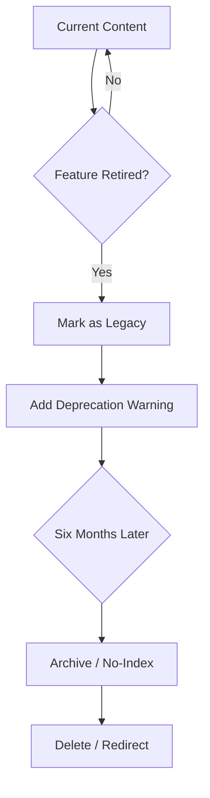

# Content governance and maintenance
> *Strategies for auditing, updating, and retiring stale documentation to prevent content rot.*

---

Documentation is not a static product; it is a living ecosystem. As soon as a page is published, it begins to age. Without a formal governance strategy, documentation sites eventually experience *content rot*. This is a state where outdated information, broken links, and inconsistent styling erode user trust and increase support costs.

Effective content governance ensures that [technical communication](../technical-writing/basics.md) remains accurate, discoverable, and professional throughout its entire lifecycle, from initial creation to final retirement.

---

## Content audit framework

A content audit is a systematic review of all existing documentation to assess its health and relevance. Mature organizations use a rotating audit schedule rather than attempting to audit the entire site at once.

- **Quantitative audit:** Use automated tools to identify pages with low traffic, high bounce rates, or broken links.
- **Qualitative audit:** Conduct a human review where a technical writer or subject matter expert (SME) assesses whether the content is still technically accurate and follows current [style standards](../doc-stack/prose-linting.md).
- **The 365-day rule:** Every page on the site should be reviewed by a person at least once every 12 months. Pages covering high-traffic or mission-critical features should be audited quarterly.

---

## The one voice principle

As documentation grows, maintaining consistency becomes difficult. The one voice principle dictates that regardless of how many writers contribute, the documentation should feel like it was written by a single, cohesive entity.

The most effective way to achieve this is to use boilerplate content.

- **Boilerplates:** These are standardized blocks of text used for legal disclaimers, support contact information, or "Prerequisites" sections.
- **Standardized components:** Use global *snippets* or *includes* so that when a piece of common information changes (for example, a company address or a supported operating system version), you update it in one file, and it propagates across the entire site.

---

## Ownership assignment

Content without an owner is content that will inevitably rot. Every page in your [knowledge base](../doc-stack/kb-architecture.md) should be assigned to a specific content owner (usually a technical writer) and a technical owner (usually an SME).

By including ownership data in the [file metadata](../doc-stack/metadata-frontmatter.md), you can automate notifications. For example, if a page has not been updated in six months, the system can automatically notify the assigned owners to verify its accuracy.

!!! tip "Metadata tip"
    In your Markdown files, use metadata fields such as `owner: @username` and `last_verified: YYYY-MM-DD`. This makes it easy to generate stale content reports.

---

## Broken link management

Link rot is the most visible sign of a neglected site. It occurs when internal pages move or external sites go dark. 

**Management strategy:**

1.  **Automated checkers:** Integrate a link-checker into your [build process](../doc-stack/cicd.md). If a link is broken, the build should fail.
2.  **Redirect strategy:** Never simply delete a high-traffic page. Always implement a 301 redirect to the most relevant new location to preserve search engine optimization (SEO) and user bookmarks.
3.  **External link audits:** Periodically review external links to third-party tools or libraries, as these are the most likely to break without notice.

---

## Deprecation and archiving policies

Not all content should live forever. As software evolves, features are retired. Your governance plan must include clear deprecation policies.

To manage the lifecycle of your content, follow these stages:

- **Legacy status.** Mark the page as legacy when the feature it describes is no longer actively developed. The page remains on the site, but you must add a prominent warning at the top, such as *"This feature is no longer supported."*
- **Retirement warning.** Add a specific notice to the metadata or page body to inform users that the content is scheduled for removal. 
- **Archiving.** Six months after a feature is retired, move the page to an "Archive" folder. At this stage, use `no-index` tags to remove the page from the site search index. This prevents users from finding outdated instructions by accident while keeping the content available for those with direct links.
- **Deletion or redirection.** If the content is no longer used or has been replaced, delete the page. Always implement a `301 redirect` to a relevant new location to preserve SEO and prevent broken bookmarks.

---

## Metadata governance

Metadata is the connective tissue of your documentation site. Proper governance requires a strict taxonomy, which is a standardized list of tags and categories.

If one writer tags a page as `Tutorial` and another as `Guide`, your search and filtering systems will break. Metadata governance ensures that:

- **Tags:** Only approved tags from a master list are used.
- **SEO descriptions:** Every page has a unique, high-quality description for search engine results.
- **Categories:** The site hierarchy remains logical and does not become disorganized with redundant folders.

---

## The documentation health scorecard

To maintain high standards, evaluate your content against the following health metrics. A healthy page should meet all criteria in the **Healthy** status section.

???+ info "How to read the scorecard"
    Use this scorecard during your annual qualitative audit to determine if a page stays, needs a rewrite, or should be retired.

**Status: Healthy (Keep)**

- **Accuracy:** Verified by an SME within the last six months.
- **Links:** Zero broken internal or external links.
- **Engagement:** Consistent traffic or high "helpful" ratings.
- **Style:** Fully compliant with the current style guide and the one voice principle.

**Status: Needs attention (Update)**

- **Accuracy:** Not verified in over nine months.
- **Visuals:** Screenshots show an outdated UI or older version of the software.
- **Metadata:** Missing SEO description or using unapproved tags.
- **Formatting:** Contains large blocks of text that need better [information architecture](../references/ia-design.md).

**Status: Stale (Deprecate/Archive)**

- **Relevance:** Describes a feature that was removed or replaced in the last two releases.
- **Traffic:** Zero visits in the last 90 days.
- **Accuracy:** Instructions no longer work on the current build of the software.
- **Redundancy:** Information is duplicated more effectively on another page.

---

## Maintenance automation log

!!! note "Automated maintenance tasks"
    | Task | Frequency | Automated tool type |
    | :--- | :--- | :--- |
    | **Broken link check** | Every build | Link checker (for example, [lychee](https://github.com/lycheeverse/lychee){: target="_blank" rel="noopener" }) |
    | **Prose linting** | Every build | Style linter (for example, [Vale](https://vale.sh/){: target="_blank" rel="noopener" }) |
    | **Stale content report** | Monthly | Custom script (checking `last_updated` metadata) |
    | **SEO and metadata audit** | Quarterly | SEO crawler (for example, [Screaming Frog SEO Spider](https://www.screamingfrog.co.uk/seo-spider/){: target="_blank" rel="noopener" }) |
    | **Dependency check** | Weekly | Security and package audits (for code snippets) |