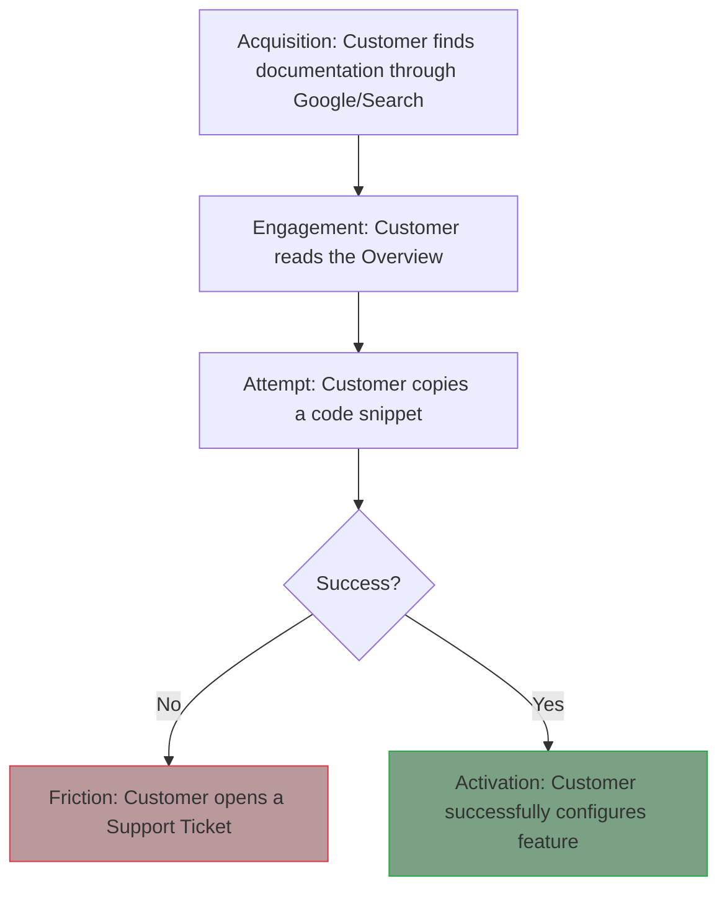

# Documentation observability
*Using data and feedback loops to measure the effectiveness and impact of your content*

---

Effective documentation management relies on data-driven insights to identify and implement improvements. Documentation observability is the practice of using data, analytics, and direct customer feedback to move beyond guesswork. 

By treating documentation like a product, technical writers can identify exactly where customers are getting lost through [usability testing](../doc-lifecycle/usability-testing.md), which content is driving success, and where content gaps exist. Refer to the [governance and maintenance](../doc-lifecycle/governance-maintenance.md) guide for more information.

An observable documentation site provides a clear window into the customer's mind. This allows the writing team to make data-driven decisions about where to invest their time and effort.

---

## Business intelligence tools

Business intelligence (BI) tools, such as [Tableau](https://www.tableau.com/){: target="_blank" rel="noopener" }, [Power BI](https://powerbi.microsoft.com/){: target="_blank" rel="noopener" }, or [Looker](https://cloud.google.com/looker){: target="_blank" rel="noopener" }, allow documentation teams to visualize high-level health metrics. Instead of looking at raw spreadsheets, BI dashboards provide trends over time.

- **Documentation health dashboards:** These visualize stale content, average page length, and the percentage of pages that have passed recent [technical reviews](../doc-lifecycle/review-approval.md).
- **Customer engagement trends:** These track "new compared with returning" visitors to see if customers are using the documentation as a one-time setup guide or a long-term reference.
- **Version distribution:** This shows the percentage of customers reading legacy documentation compared with the current version.

---

## SQL for documentation analytics

While standard web analytics, such as [Google Analytics](https://analytics.google.com/){: target="_blank" rel="noopener" }, provide basic page views, [structured query language (SQL)](https://en.wikipedia.org/wiki/SQL){: target="_blank" rel="noopener" } allows you to perform deep-dive analysis by joining documentation data with product usage data.

By querying documentation databases, technical writers can answer complex questions:

- *"Which customers read the **Advanced API** page and then successfully made their first API call within 24 hours?"*
- *"Is there a correlation between reading the troubleshooting guide and a reduction in session drop-offs?"*

!!! info "Example SQL logic"
    A technical writer might use SQL to pull a report of all pages with more than 1,000 views but a "Helpful" rating of less than 40%. This creates a high-priority list for immediate revision.

---

## Search query analysis

The search bar is the most direct way a customer communicates their needs to you. Search query analysis is the process of reviewing what customers type into your site's search engine.

**The zero results indicator:**

The most critical metric in search analysis is the *zero results* or *null result* query. If 100 customers search for "Webhooks" and get zero results, you have identified a critical content gap. This is a data-backed mandate to create a new page.

---

## Sentiment widgets

Quantitative data, such as clicks and views, tells you what happened, but qualitative data tells you why. Sentiment widgets, which are typically "Was this helpful? Yes and No" buttons, capture the customer's response to a page.

???+ tip "Beyond Yes and No"
    A successful sentiment widget should always include an optional text field for "No" votes. Common reasons for negative sentiment include:

    - The instructions are out of date.
    - A code sample is missing.
    - The explanation is too complex.

---

## The documentation funnel

Just like a marketing funnel, the documentation funnel tracks a customer's journey from acquisition to activation. Understanding where customers drop out of this funnel allows you to fix the leaks in your [information architecture (IA)](../references/ia-design.md).

This flowchart illustrates the customer journey from documentation discovery to feature activation. It tracks the progression from finding a page and reading content to attempting a task, which results in either a support ticket (friction) or successful configuration (activation).

---

## Support ticket correlation

The primary goal of documentation metrics is *ticket deflection*. This is the ability to prove that an improvement in documentation led to a decrease in the volume of support tickets.

- **Baseline:** Identify a high-volume support topic, such as "Password Reset Issues."
- **Intervention:** Rewrite or create a high-visibility guide for that specific topic.
- **Correlation:** Measure the number of tickets created for that topic in the 30 days before and after the new documentation was published.

---

## Observability implementation roadmap

To build a robust data strategy, move from basic tracking to integrated business intelligence. The following roadmap outlines the stages of documentation observability.

### Stage 1: Basic tracking (essentials)
- **Primary tool:** Standard web analytics, such as Google Analytics or [Plausible](https://plausible.io/){: target="_blank" rel="noopener" }.
- **Key metric:** Page views and unique visitors.
- **Goal:** Understand which pages are the most popular.

### Stage 2: Sentiment capture (qualitative layer)
- **Primary tool:** "Was this helpful?" widgets and page comments.
- **Key metric:** Helpful percentage and customer feedback text.
- **Goal:** Identify which pages are confusing or inaccurate.

### Stage 3: Intent analysis (search layer)
- **Primary tool:** Search log analysis.
- **Key metric:** Zero search results and top search terms.
- **Goal:** Discover content gaps and vocabulary mismatches.

### Stage 4: Product integration (advanced layer)
- **Primary tool:** SQL, BI tools, and product telemetry.
- **Key metric:** [Documentation ROI](../doc-lifecycle/roi.md) and ticket deflection rate.
- **Goal:** Prove the business value of documentation and correlate it with customer success.

---

### Observability glossary for technical writers

-   :lucide-bar-chart-2: **Conversion rate**
    
    The percentage of customers who read a tutorial and then successfully perform the action in the product.

-   :lucide-clock: **Dwell time**
    
    The amount of time a customer spends on a page. High dwell time on conceptual pages is good. On a quick start page, it may indicate confusion.

-   :lucide-log-out: **Exit page**
    
    The last page a customer sees before leaving. If a troubleshooting page is a frequent exit, the customer either found the fix or gave up.

-   :lucide-refresh-ccw: **Bounce rate**
    
    The percentage of customers who leave after viewing only one page. In documentation, a high bounce rate often means the customer found their answer immediately through a search engine.

