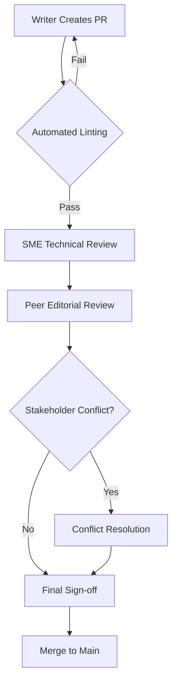

# Review and approval workflows
*Implementing structured peer reviews and technical sign-offs to ensure content quality*

---

In [technical communication](../technical-writing/basics.md), the review process is the final safety net that ensures information is not only clear but, more importantly, accurate. A structured review and approval workflow transforms documentation from a personal draft into a validated asset.

By implementing a formal protocol, organizations can prevent the two most common documentation failures: technical inaccuracy (the software doesn't work as described) and linguistic ambiguity (the user can't understand the instructions).

---

## Workflow management systems

A workflow management system (WMS) is the platform used to track the status, history, and approval of documentation. While some teams use dedicated project management tools, modern technical writing teams often use [Git](https://git-scm.com/){: target="_blank" rel="noopener" }-based platforms as their WMS.

This allows the team to see the lineage of approval:

- **Who** requested a change.
- **Why** the change was made (linked to a [Jira](https://www.atlassian.com/software/jira){: target="_blank" rel="noopener" } ticket or [GitHub](https://github.com/){: target="_blank" rel="noopener" } issue).
- **When** the final sign-off was granted.

---

## Multi-tier review logic

Not all reviews are created equal. To be efficient, a workflow must distinguish between technical accuracy and editorial style. Sending a document to an engineer to check for comma splices is a waste of their time; similarly, asking a peer writer to verify database schema logic may be outside their expertise.

=== "Tier 1: The technical review"
    **Conducted by:** Subject matter experts (SMEs) or engineers.

    - **Focus:** Is it true? Does the code work? Are the parameters correct?
    - **Goal:** Technical validation.

=== "Tier 2: The peer review"
    **Conducted by:** Other technical writers.

    - **Focus:** Is it clear? Does it follow the style guide? Is the voice consistent?
    - **Goal:** Linguistic and structural quality.

---

## The pull request workflow

In a [Docs as Code](../doc-stack/docs-as-code.md) environment, the pull request (PR) is the engine of quality control. It provides a transparent, threaded conversation where changes are suggested, debated, and finalized.

1.  **Drafting:** The technical writer pushes a new page to a *feature branch*.
2.  **The PR:** The technical writer opens a pull request and tags the SME and a peer writer.
3.  **Comments & edits:** Reviewers leave comments directly on specific lines of text.
4.  **Iteration:** The technical writer makes the requested edits and pushes them to the same branch.
5.  **Approval:** Once all comments are resolved, the reviewers provide a formal "approve" vote.

This flowchart details the technical path of a pull request, from automated linting and multi-stage reviews to conflict resolution and the final merge to main.

By mapping the process this way, you can see how automated checks provide immediate feedback to the technical writer before human reviewers begin their work. It also ensures that any stakeholder disagreements are formally resolved before the content is finalized and merged.

---

## Automated linting

Before a human ever sees the document, [automated linting](../doc-stack/prose-linting.md) tools such as [Vale](https://vale.sh/){: target="_blank" rel="noopener" }, [Hemingway](https://hemingwayapp.com/){: target="_blank" rel="noopener" }, or custom regex scripts should be triggered. These tools act as the first gatekeeper.

!!! info "The role of the linter"
    Automation is best at catching binary errors: spelling, forbidden words, passive voice, or broken links. By clearing these low-level errors automatically, you ensure that your human reviewers can focus on high-level cognitive tasks such as logic, clarity, and [user experience](../technical-writing/content-design-foundations.md).

---

## Conflict resolution protocol

It is common for stakeholders to disagree on how a feature should be documented. A technical writer may want clarity, an engineer may want technical precision, and a product manager may want marketing appeal.

When a deadlock occurs, use the following hierarchy:

1.  **User data:** Prioritize [usability testing](../doc-lifecycle/usability-testing.md) results. If the data shows users are struggling, let those insights guide the revision.
2.  **Style guide:** Refer to the company style guide to settle stylistic or grammatical disagreements.
3.  **Final word:** When data and standards don't provide a clear answer, the designated project owner makes the final decision.

---

## Formal sign-off protocols

For high-stakes documentation, such as [API references](../doc-stack/openapi.md) for financial systems or safety manuals for hardware, a thumbs up emoji in [Slack](https://slack.com/){: target="_blank" rel="noopener" } is not enough. A *formal sign-off* is a recorded, immutable action that indicates a document is ready for public consumption.

???+ note "Approval checklist for high-stakes content"
    - [ ] **SME validation:** All code samples have been run and verified in the current build.
    - [ ] **Legal/compliance:** All necessary disclaimers and copyright notices are present.
    - [ ] **Accessibility:** Alt text for all diagrams has been reviewed for [accessibility standards](../references/accessibility.md).
    - [ ] **Traceability:** The document version is correctly mapped to the software release version.

---

## Reviewers' responsibility matrix

To help reviewers focus on their areas of expertise and provide the most value, use this matrix to define accountabilities.

| Review element | SME or engineer | Peer writer | Product manager |
| :--- | :---: | :---: | :---: |
| Technical accuracy | :lucide-check-check: | :lucide-minus: | :lucide-check: |
| Grammar and syntax | :lucide-minus: | :lucide-check-check: | :lucide-minus: |
| Style guide compliance | :lucide-minus: | :lucide-check-check: | :lucide-minus: |
| User persona fit | :lucide-check: | :lucide-check: | :lucide-check-check: |
| Formatting and layout | :lucide-minus: | :lucide-check-check: | :lucide-minus: |
| Safety and legal compliance | :lucide-check-check: | :lucide-check: | :lucide-check: |

### Legend

*   :lucide-check-check: **Primary responsibility:** This is your main goal.
*   :lucide-check: **Secondary support:** Check this if you have the time or capacity.
*   :lucide-minus: **Ignore:** Do not spend time on this item; others will handle it.

---

## Approval decision logic

!!! quote "The golden rule of approvals"
    If the document is technically accurate but has a grammar error, it is dangerous but usable. If it is grammatically perfect but technically wrong, it is useless. If a deadline is imminent, always prioritize technical sign-off over editorial polish.