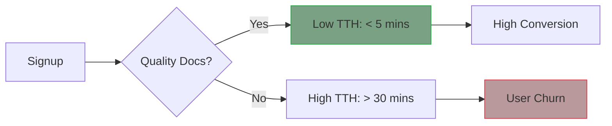

# Documentation return on investment
> *Using data to prove that quality documentation reduces support costs and increases user retention*

---

Documentation is often viewed as a cost center, which is an expense necessary for business operations that does not directly generate revenue. However, high-quality documentation is a powerful value driver. By shifting the perspective from writing manuals to return on investment (ROI), technical writers can prove that their work directly impacts the company’s profitability by reducing costs, accelerating sales, and retaining customers.

Quantifying the value of documentation enables teams to secure better tools, more staffing, and a seat at the strategic table.

---

## Support deflection metric

The most direct way to measure documentation ROI is through *support deflection*. Each time a user finds an answer in your documentation site instead of contacting support, the company saves money.

Industry standards suggest that a single Tier 1 support ticket costs a company between 15 USD and 50 USD (including salary, software, and overhead).

!!! info "ROI formula: Support deflection"
    **Total monthly savings** = (Reduction in ticket volume) × (Average cost per ticket)
    
    **Example:** If a new troubleshooting guide leads to 200 fewer tickets per month at a cost of 50 USD per ticket, the documentation has saved the company 10,000 USD per month.

---

## Sales enablement velocity

In business to business (B2B) and enterprise software, prospective customers rarely buy without reviewing the documentation first. They use it to verify that the product meets their technical requirements.

Documentation acts as a silent salesperson in the following ways:

- **Building trust:** Transparent, detailed documentation proves the product is stable and mature.
- **Proof of Concept (POC) acceleration:** During the POC phase, developers use the documentation to see how easily they can integrate the tool. Clear documentation reduces the sales cycle time, which lets deals close weeks faster.

---

## Time to hello

For API-first products, the most critical metric is time-to-hello (TTH). This is the duration between a user signing up and making their first successful API call (the "Hello World" moment).

Documentation is the primary driver of TTH.

- **Low TTH:** Users feel an immediate win and are more likely to convert to paid plans.
- **High TTH:** Users get frustrated by nonfunctional code samples or missing prerequisites and abandon the product.

---

## Onboarding cost reduction

Customer Success (CS) teams often spend hundreds of hours assisting new users through the setup process. High-quality onboarding documentation automates this process.

By measuring the reduction in time spent on onboarding per account, you can demonstrate how documentation enables the CS team to triple its capacity without the need for additional staff.

---

## Internal engineering efficiency

Documentation ROI is not just external. Internal [runbooks](../technical-writing/engineering-runbooks.md) and "How-to" guides for engineers reduce the time spent on institutional knowledge transfers.

- **Operational continuity:** Clear documentation ensures that if a lead developer leaves, the system remains functional.
- **Onboarding new hires:** A new engineer who can use internal documentation to set up their environment in one day instead of five saves the company a full week of salary.

!!! note "Calculating internal efficiency"
    If 50 developers save just 30 minutes per week because they can find answers in a searchable internal knowledge base instead of asking peers, the company gains more than 100 hours of engineering time per month. This is the equivalent of a full-time senior developer.

---

## Brand trust and authority

In the developer community, the quality of your documentation represents your brand.

- **Authority:** Well-structured documentation signals that your engineering team is disciplined.
- **Search engine optimization (SEO) value:** Public documentation often ranks high for "how-to" keywords, serving as a powerful top-of-funnel marketing asset that brings in organic traffic. Reference your [metadata schema](../doc-stack/metadata-frontmatter.md) to optimize these rankings.

---

## Churn reduction and retention

Customer retention is the ability of a company to keep its users over time, while churn is the rate at which customers stop using the product or cancel their subscriptions. 

Users often abandon software when they encounter friction or cannot find the information they need to complete a task. High-quality documentation empowers users to overcome these hurdles and gain expertise quickly.

By correlating documentation page views with product telemetry (user activity data), teams can measure the impact of content on the user lifecycle. 

Internal analytics and industry research frequently show that users who engage with documentation are 30% to 50% less likely to churn. When users use your documentation to learn the system, they are more likely to realize the full value of the features for which they are paying.

---

## Strategic ROI impact matrix

To present documentation value to executives, use the following matrix to categorize how documentation impacts different parts of the business.

-   :lucide-shield-check: __Cost reduction (Defensive)__
    
    **Metric:** Ticket deflection rate

    **Impact:** Directly lowers the operational overhead of the Support and Customer Success departments

-   :lucide-trending-up: __Revenue generation (Offensive)__
    
    **Metric:** Sales cycle velocity 

    **Impact:** Shortens the time it takes for a lead to move from evaluation to paid customer by building technical trust

-   :lucide-zap: __User activation (Product)__
    
    **Metric:** Time-to-hello (TTH)

    **Impact:** Increases the activation rate of new sign-ups, which directly impacts monthly recurring revenue (MRR)

-   :lucide-users: __Operational scale (Internal)__
    
    **Metric:** Engineering onboarding time

    **Impact:** Allows the engineering team to scale faster and reduces the time spent on repetitive internal questions

---

## ROI calculation framework

If you are preparing a business case for a documentation project, use these specific data points to prove its value.

| Business goal | Data point to track | How documentation solves it |
| :--- | :--- | :--- |
| **Lower support costs** | Top five ticket categories | Create "quick fix" guides for those specific categories |
| **Increase sales** | Time to close for new deals | Provide technical white papers and deep-dive architecture specifications |
| **Improve product usage** | Feature adoption rates | Release feature-specific tutorials and use-case guides |
| **Reduce churn** | Sign-ins versus knowledge base hits | Correlate documentation usage with users who have high retention scores |
| **Faster engineering** | Slack "how-to" question frequency | Centralize institutional knowledge in a searchable internal repository |