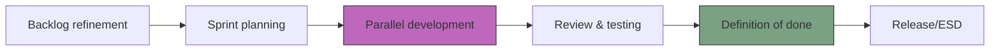

# The technical writer’s role in the SDLC
*How documentation tasks fit into the software development life cycle (SDLC) and agile ceremonies*

---

In a modern software organization, documentation is not a task that happens after the code is written; it is a critical component of the application lifecycle management (ALM) framework. 

For a technical writer, being integrated into the SDLC means moving from a reactive order-taker to a proactive contributor who ensures that information matures alongside the software.

When documentation is treated as a first-class citizen in the SDLC, the organization avoids the documentation lag that often delays product launches or results in stale content.

---

## Application lifecycle management

Application lifecycle management (ALM) is the umbrella that covers the entire life of a product, from the initial idea to its eventual retirement. Within this framework, the [document development life cycle (DDLC)](../doc-lifecycle/ddlc.md) serves as the historical record and the user interface for the product's logic.

By aligning documentation tasks with ALM, technical writers can track the history of a feature, understand the business requirements that birthed it, and ensure that the final instructions are perfectly synchronized with the software's functional reality.

---

## The shift-left philosophy

One of the most significant changes in modern technical writing is the move toward *shift-left documentation*. 

In traditional models, technical writers were involved only at the end of the development cycle. 

In a shift-left environment, technical writers engage with the development cycle earlier. This allows them to identify documentation requirements and resolve technical inconsistencies when the cost of making changes is at its lowest.

- **Design phase participation:** Technical writers review mockups to ensure UI terminology is consistent.
- **Prototyping:** Technical writers draft conceptual documentation during the rapid application development (RAD) phase to identify logical gaps in the feature before code is even written.
- **Early feedback:** Identifying confusing workflows during the design stage is 10 times cheaper than fixing them after the code is deployed.

!!! tip "Why shift-left works"
    When you document a feature during its design, you often act as the first user. If you find a feature impossible to explain simply, it is a sign that the feature itself might need a design change.

---

## Documentation in the SDLC workflow

This flowchart illustrates how documentation is integrated into a standard [Agile SDLC](https://en.wikipedia.org/wiki/Agile_software_development){: target="_blank" rel="noopener" }. The process follows a linear progression:

1.  **Preparation:** The cycle begins with **Backlog Refinement** and **Sprint Planning** where documentation requirements are identified alongside feature tasks.
2.  **Execution:** The workflow moves into **Parallel Development** (highlighted) where technical writers author content simultaneously with software engineering to avoid documentation lag.
3.  **Validation:** Content then undergoes **Review & Testing** to ensure technical accuracy and clarity.
4.  **Finalization:** The project must satisfy the **Definition of Done (DoD)** (a critical checkpoint where documentation completion is verified) before moving to the final **Release/Electronic Software Delivery (ESD)**.

---

## Agile ceremony participation

To stay aligned with engineering velocity, technical writers must be active participants in [agile documentation workflows](../doc-lifecycle/agile-workflows.md). These meetings provide the heartbeat of the project.

- **Daily stand-up:** Use these meetings to identify features that are feature complete and ready for documentation.
- **Backlog refinement:** Estimate the documentation effort required for upcoming tasks.
- **Sprint review:** Observe feature demonstrations to identify last-minute changes to the UI.

---

## Parallel development and synchronization

In a [Docs as Code](../doc-stack/docs-as-code.md) environment, the technical writer works in the same ecosystem as the developer. This is known as *parallel development*.

- **Branching strategy:** The technical writer creates a documentation branch that tracks with the developer’s feature branch.
- **Syncing commits:** As the developer updates the code, the technical writer updates the docs.
- **Synchronized merges:** The documentation is reviewed and merged into the main codebase simultaneously with the code, ensuring that the live site is never out of sync.

---

## Definition of done (DoD)

The DoD is a mandatory checklist in Agile and [Scrum](https://en.wikipedia.org/wiki/Scrum_(project_management)){: target="_blank" rel="noopener" } methodologies that every feature must pass before a ticket can be closed.

 One of the technical writer's most important strategic roles is advocating for documentation to be included in this checklist.

!!! danger "The risk of ignoring the DoD"
    If documentation is not part of the DoD, features will be shipped incomplete. This creates a backlog of technical debt that is nearly impossible to clear during the high-pressure release window.

---

## Release, delivery, and post-incident review

As the sprint closes, the technical writer coordinates with the [DevOps](https://en.wikipedia.org/wiki/DevOps){: target="_blank" rel="noopener" } team to ensure ESD (or digital distribution). This ensures that the digital package sent to customers (or the cloud update) includes the updated help files and release notes.

Finally, the technical writer participates in post-incident reviews. After a major incident or a complex release, the technical writer documents lessons learned and updates internal process documentation. This ensures that the organization’s internal knowledge base grows just as fast as its external documentation.

---

## SDLC ceremony-to-action map

The following table outlines exactly what a technical writer should be doing during each specific phase of the development cycle.

| Ceremony or phase | Technical writer role | Primary output |
| :--- | :--- | :--- |
| **Sprint planning** | Assess the documentation debt of new tickets. | Estimated documentation tickets |
| **Daily stand-up** | Track which features are ready for a walkthrough. | Status updates |
| **Feature branching** | Create the `docs/` folder in the code repository. | Markdown stubs |
| **Development** | Interview subject matter experts (SMEs) and draft instructions. | First draft |
| **Peer review** | Review code comments and internal documentation accuracy. | Technical sign-off |
| **Definition of done** | Confirm documentation is built and staged. | Merged pull request (PR) |
| **Release** | Generate and publish the final release notes. | Published changelog |
| **Post-incident review** | Update the internal knowledge wiki about the incident. | Root cause document |

---

## Tactical summary

??? note "Click to see the technical writer's SDLC checklist"
    - [ ] **Alignment:** Am I invited to the engineering team's Slack/Teams channels?
    - [ ] **Visibility:** Do I have a seat at the sprint planning table?
    - [ ] **Verification:** Do I have access to the staging environment to test my own documentation?
    - [ ] **Validation:** Has the developer reviewed the parallel documentation branch for accuracy?
    - [ ] **Closure:** Is the documentation ticket linked to the engineering ticket for traceability?