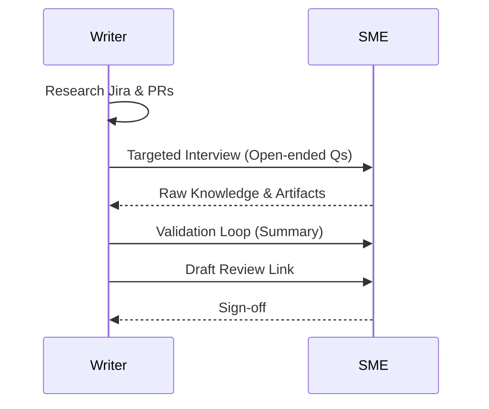

# SME interviewing techniques
*Collaborative research skills for gathering technical details from engineers and product owners*

---

Subject matter experts (SMEs), such as engineers, developers, or product managers, provide the technical details you need to write accurate documentation. SMEs are usually busy, so every interview should be a focused session rather than a casual chat.

When you use effective interviewing techniques, you can gather the information you need quickly and with fewer follow-up questions. This preparation helps you work more efficiently and demonstrates that you respect your teammates' time and expertise.

---

## SME identification

To identify the correct subject matter expert (SME), you must first determine which type of knowledge is missing from your research. Technical documentation is rarely a single-source effort; different stakeholders provide different layers of the information puzzle.

=== "Product manager"
    **Focus:** Business logic and [user persona](../technical-writing/audience-analysis.md).
    
    - **Ask them about:** The high-level purpose of the feature, the intended audience, and the specific problem the software solves.
    - **The goal is:** To establish the context, value proposition, and introduction of your document.

=== "Engineer"
    **Focus:** Implementation and architecture.
    
    - **Ask them about:** [API endpoints](../doc-stack/openapi.md), data schemas, installation steps, and system limitations.
    - **The goal is:** To extract technical reference data and step-by-step instructions.

=== "Quality assurance (QA)"
    **Focus:** Edge cases and error handling.
    
    - **Ask them about:** Common failure points, specific error messages, and what happens when a user provides invalid input.
    - **The goal is:** To build robust troubleshooting guides and "Warnings" for the documentation.

=== "UX designer"
    **Focus:** User journey and interface terminology.
    
    - **Ask them about:** The names of specific UI elements, the intended workflow, and any accessibility features.
    - **The goal is:** To ensure the terminology in the documentation matches the labels in the software interface.

=== "Customer support"
    **Focus:** Real-world pain points and common pitfalls.
    
    - **Ask them about:** The most frequent questions users asked during beta testing or common issues with similar existing features.
    - **The goal is:** To add "Pro-tips" and frequently asked questions (FAQs) that address actual user confusion.

---

## Pre-interview research

The fastest way to lose the respect of an SME is to ask a question that is already answered in existing documentation or public resources. Your goal is to be prepared before you start the interview. 

1.  **Audit existing artifacts:** Review [Jira](https://www.atlassian.com/software/jira){: target="_blank" rel="noopener" } tickets, pull request (PR) comments, and internal [Slack](https://slack.com/){: target="_blank" rel="noopener" } threads.
2.  **Read the code:** Even if you are not a developer, looking at code comments and function names can provide clues.
3.  **Identify searchable vs. proprietary:** Do not ask an SME how a standard protocol such as [OAuth](https://oauth.net/2/){: target="_blank" rel="noopener" } works; ask them how their specific implementation of OAuth differs from the standard.

!!! tip "The golden rule of SME time"
    Always aim to be 70% informed before the meeting begins. Use the interview to confirm your findings and fill the final 30% of high-complexity gaps.

---

## Question engineering

The quality of your documentation is directly proportional to the quality of the questions you ask. Avoid yes-or-no questions, which often lead to dead ends. Instead, use open-ended question engineering to acquire deep technical detail.

- **Edge case probe:** *"What is the most common mistake a user makes when configuring this module?"*
- **Logic probe:** *"If the database connection fails at this step, what is the expected system behavior?"*
- **Analogy probe:** *"How would you describe this architecture to a junior developer who has never used our platform?"*

---

## Strategic interview techniques

During the live session, your role is to facilitate a flow of information. Two specific techniques can help uncover details the SME might otherwise skip.

### 1. The silent technique

After an SME finishes an explanation, wait for an extra three to five seconds before responding. 

Human psychology hates a vacuum. During that brief silence, the SME will usually remember a critical "*Oh, I forgot to mention...*" detail or an edge case that was not in the original plan. This is frequently where the most important technical nuances are found.

### 2. Validation loops

Never leave a complex topic without a validation loop. Summarize the logic back to the SME immediately.

- **Example:** "*So, if I understand correctly, the API validates the token **before** it checks the user's permissions, right?*"
- **Logic:** This catches misunderstandings in real time, preventing you from writing an entire draft based on a false assumption.

---

## Artifact collection

An interview is not just about what is said but also about what is shown. Technical writers are artifact collectors. At the end of every session, ask for supplemental materials:

- **Whiteboard photos:** Raw logic flows sketched during brainstorming
- **Screen recordings:** A quick walkthrough of the UI or a CLI command in action
- **Log files:** Examples of successful (and failed) system outputs

---

## Relationship management: Closing the loop

The interview process is a recurring cycle. To ensure SMEs continue to make time for you, you must prove that their time was a productive investment.

**Value proof workflow:**

1.  **Validation:** Send a brief summary of the key takeaways within two hours.
2.  **Review invite:** When the first draft is ready, send a link specifically highlighting the sections they helped with.
3.  **Credit:** Acknowledge their contribution in the technical review metadata of the documentation.

---

## SME interview and validation workflow

This sequence diagram illustrates the collaborative process between the technical writer and the SME, moving from initial research through knowledge acquisition and final technical sign-off.

---

## SME engagement toolkit

-   :lucide-search: __Preparation__
    
    Never enter a meeting without a written list of at least five specific questions. Check Jira and [Confluence](https://www.atlassian.com/software/confluence){: target="_blank" rel="noopener" } first.

-   :lucide-mic-2: __Recording__
    
    Always ask: *"Is it okay if I record this for my notes?"* It allows you to focus on the conversation rather than frantic typing.

-   :lucide-help-circle: __Basic questions__
    
    Do not be afraid to ask the basic question. If you do not understand it, the user definitely will not. Be the user's proxy.

-   :lucide-check-circle: __Closure__
    
    Always end with: *"Who else should I talk to about this?"* and *"Is there anything I did not ask that I should have?"*

