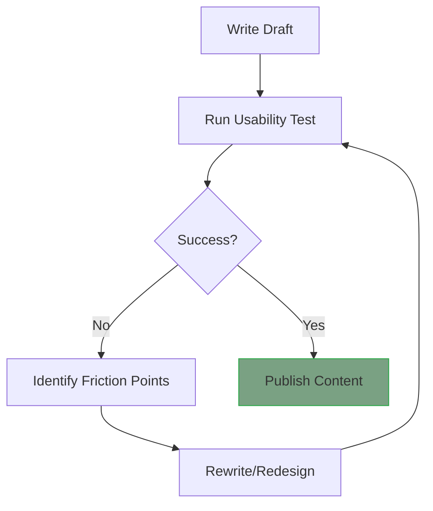

# Usability testing for documentation
*How to run tests to ensure your documentation actually solves user problems*

---

Technical documentation is essentially a user interface (UI) made of words. Just as developers test software for bugs, technical writers must test documentation for friction points, which are places where a user becomes confused, frustrated, or stuck. 

Usability testing for documentation moves beyond checking for typographical errors; it measures the effectiveness of the information. It answers the critical question: *Can a user actually perform the task using only the information provided?*

---

## The think-aloud protocol

One of the most powerful qualitative testing methods is the *think-aloud* protocol. In this session, you observe a user as they attempt to follow a tutorial or guide.

- **Process:** Ask the user to verbalize every thought, doubt, and frustration as they read.
- **What to look for:** Listen for statements such as *"I’m not sure what this button does."* or *"I think I missed a step."*
- **Goal:** Identify friction points, such as specific sentences or layout choices that interrupt the user's flow.

!!! tip "Observer rule"
    As the tester, you must remain silent. If the users gets stuck, do not help them. Note exactly where the documentation failed to provide the answer. This failure is your most valuable data point.

---

## The cloze test

The cloze test is a linguistic tool used to measure the [readability](../technical-writing/readability-scores.md) and predictability of your prose. 

- **Process:** Take a section of your documentation and replace every fifth or sixth word with a blank space. For example, "*Click the ___ button to ___ the file.*"
- **Test:** Ask a user to fill in the blanks.
- **Result:** If a user can correctly guess the missing words based on context, the writing is clear and follows a logical structure. If the user struggles, the prose is likely too dense or the terminology is inconsistent.

---

## Task-based testing

Task-based testing is quantitative. It measures the success rate of your documentation by giving a user a specific goal without any outside assistance.

**Example Task:** *"Using only the API Reference, successfully authenticate your account and retrieve a 'User Profile' object."*

**Metrics to track:**

1.  **Success and failure:** Did they complete the task?
2.  **Time on task:** How long did it take?
3.  **Error rate:** How many times did they try an incorrect command before finding the right one?

---

## Navigation and findability testing

A user can only benefit from an answer if they can find it. Findability testing focuses on the [information architecture (IA)](../references/ia-design.md) of your documentation site.

- **The 30-second rule:** A user should be able to find the answer to a specific question (for example, "What are the system requirements?") within 30 seconds of landing on your home page.
- **Method:** Ask a user to find a specific topic and observe their navigation path. Do they use the search bar immediately? Do they get lost in the sidebar? 

---

## Internal testing

Before documentation ever reaches a customer, it should undergo internal testing. This involves having your own engineers or support staff use the documentation to set up the product from scratch in a clean environment.

Internal users are effective at identifying *expert blindness*. They find gaps in instructions where a technical writer’s familiarity with the product has led them to omit essential details.

---

## Accessibility testing

Usability includes ensuring your content is [accessible](../references/accessibility.md) to all users, regardless of how they consume it.

- **Screen readers:** Use tools such as [NVDA](https://www.nvaccess.org/){: target="_blank" rel="noopener" } or [VoiceOver](https://www.apple.com/accessibility/vision/){: target="_blank" rel="noopener" } to ensure the reading order of your Markdown is logical and that your alt text accurately describes complex diagrams.
- **Keyboard navigation:** Can a user navigate your table of contents and **Next Page** buttons using only the ++tab++ key?
- **Color contrast:** Ensure that **Warning** and **Note** boxes are readable by users with color blindness.

---

## The iterative refinement loop

Usability testing is not a one-time event. It is a cycle of continuous improvement.

This flowchart illustrates the iterative cycle of usability testing and content improvement. 

The process begins when you write a draft and run a usability test. If the test reveals issues, you identify the specific friction points and rewrite or redesign the content. You then return to the testing phase to verify your changes. This cycle continues until the documentation succeeds, at which point you publish the content.

---

## Documentation testing toolkit

| Method | Target metric | Best for... |
| :--- | :--- | :--- |
| **Think-aloud** | Emotional and cognitive friction | Complex tutorials |
| **Cloze test** | Readability and context | Conceptual overviews |
| **Task-based** | Success rate and accuracy | API references and CLI guides |
| **30-second rule** | Findability and IA | Navigation menus and search |
| **Accessibility audit** | [WCAG](https://www.w3.org/WAI/standards-guidelines/wcag/){: target="_blank" rel="noopener" } compliance | Ensuring inclusivity |
| **Internal testing** | Technical accuracy | Installation and setup guides |

??? abstract "The usability mindset"
    The goal of testing is not to prove the documentation is good, but to find where it is bad. Every time a user fails a test, it is a gift to the technical writer. It provides a clear, data-driven instruction on exactly what needs to be fixed to improve the user experience.