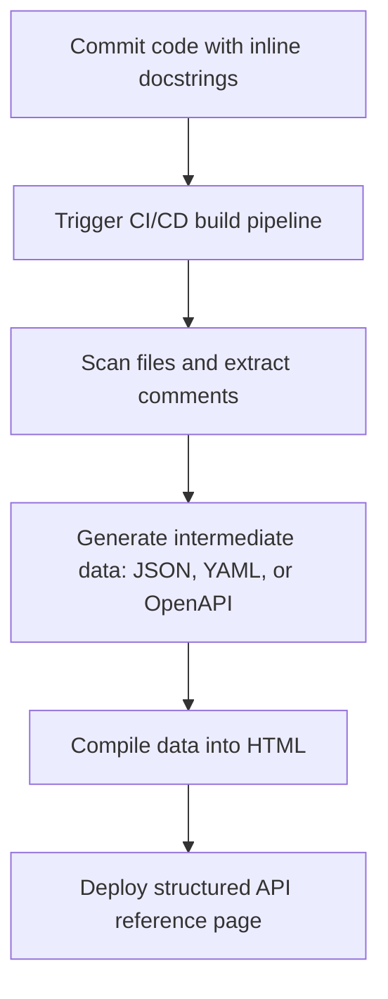

# Automated API reference generation

> *Synchronizing source code docstrings with your knowledge base*

---

Manual updates to API reference documentation are often inaccurate and struggle to keep pace with rapid code changes. This disconnect results in documentation drift and incorrect code examples, which decrease developer productivity.

The industry-standard solution is automated API reference generation. This process involves extracting structured comments (docstrings) from the source code, converting them into standard data formats, and compiling them into a public-facing knowledge base. 

Automation shifts the technical writer’s focus from performing manual transcription to managing [documentation architecture](../references/ia-design.md). In this capacity, you design docstring standards, configure parsers, and ensure that code comments compile into readable, well-formatted documentation.

---

## Extraction architecture

The technical process of synchronizing code comments with a documentation site involves a three-stage build pipeline. Instead of writing HTML or Markdown from scratch, the documentation is treated as structured data that flows from the codebase to the user's browser.



### 1. The code source (docstrings)
The [source of truth](../doc-stack/git.md#the-single-source-of-truth) is the codebase. Developers and technical writers write inline comments directly above functions, classes, or endpoints. These are written in structured formats such as [JSDoc](https://jsdoc.app/){: target="_blank" rel="noopener" } for JavaScript, [Sphinx](https://www.sphinx-doc.org/){: target="_blank" rel="noopener" } or [NumPy](https://numpydoc.readthedocs.io/en/latest/format.html){: target="_blank" rel="noopener" } for Python, or [Javadoc](https://www.oracle.com/technical-resources/articles/java/javadoc-tool.html){: target="_blank" rel="noopener" } for Java.

### 2. The extraction engine (parser)
When code is pushed to a [version control](../doc-stack/git.md) repository, the parser scans the source code. It ignores the executable program logic and extracts only the structured comment blocks, parsing their metadata tags, such as `@param` or `@returns`.

### 3. The compilation stage
The parser generates intermediate files, typically in [Markdown](../doc-stack/markup-languages.md#markdown-fundamentals), [JSON](../doc-stack/json-logic.md), or [OpenAPI specifications](../doc-stack/openapi.md). The publishing system, such as a [static site generator (SSG)](../doc-stack/ssg.md) or a [developer portal](../doc-stack/developer-portals.md), ingests these files and applies CSS themes, code syntax highlighting, and responsive navigation layouts.

---

## Standardize the docstring contract

For automation to succeed, technical writers must establish a strict syntax contract with engineering teams. The parser will fail to build if comments deviate from the expected structure. 

The following example describes a standardized, parseable docstring layout for an API controller that uses clear parameter metadata and return types:

```javascript hl_lines="2 4 5"
/**
 * Processes a workspace invite token to join a secure organization.
 * 
 * @param {string} inviteToken - The cryptographically signed base64 invitation token.
 * @param {boolean} [autoAccept=false] - Optional. If true, bypasses the confirmation screen.
 * @returns {Promise<object>} Returns a JSON payload containing the new membership record.
 * @throws {ValidationError} Thrown if the token is expired or malformed.
 */
async function acceptOrganizationInvite(inviteToken, autoAccept = false) {
  // ... execution logic
}
```

By enforcing this inline template, your parser can systematically map `{string} inviteToken` into a clean parameters table on the compiled documentation site.

---

## CI/CD build and synchronization workflow

To ensure documentation matches the production code, integrate reference generation into your [continuous integration and continuous deployment (CI/CD) pipeline](../doc-stack/cicd.md#the-pipeline-concept).

### Step 1: Trigger the push

When an engineer merges a feature branch into the main branch, the version control hosting platform triggers a build runner, such as [GitHub Actions](https://github.com/features/actions){: target="_blank" rel="noopener" } or [GitLab CI](https://docs.gitlab.com/ee/ci/){: target="_blank" rel="noopener" }.

### Step 2: Parse the code

The build runner starts a virtual container, pulls the latest code repository, and runs the parser over the codebase.

```bash
# Example parser command to generate intermediate Markdown from Python source code
sphinx-build -b markdown source/ docs/api/
```

### Step 3: Compile with an SSG

Move the generated Markdown or JSON files into the source directory of the SSG. This merges the API reference content with your conceptual guides.

### Step 4: Deploy

The final static HTML assets are compiled, optimized, and deployed to a web server or content delivery network (CDN). This updates the live documentation site.

---

## Manage code-to-doc friction points

Automating reference documentation introduces unique operational challenges. Since code comments are located in the codebase, technical writers must work closely with developers to maintain quality.

!!! warning "Issue: Missing or stale comments"
    Developers focused on shipping features might forget to update docstrings when refactoring code. 
    
    **Solution:** Configure **Git pre-commit hooks or pull request (PR) checks** that analyze code changes. If a developer alters a function signature but does not update its corresponding docstring parameters, the PR check fails. This prevents the code from being merged until the documentation is updated.

!!! tip "Issue: Navigation and context"
    Auto-generated documentation can be difficult to navigate. A list of 500 endpoint parameters offers little contextual guidance.
    
    **Solution:** Implement **mixed-mode architecture**. Use an automated tool to generate the technical specifications such as parameter tables, error codes, and schemas. Manually write high-level tutorials and use cases that link to those auto-generated resources.

---

## Automated docstring compliance rules

To maintain high editorial standards, technical writers can create automated validation rules. Using linting frameworks, you can automatically scan docstrings during code reviews to check for structural completeness.

??? "Example: Automated linting compliance rules"
    You can enforce quality check constraints inside your codebase using programmatic rules:
    
    - **Parameter match rule:** Every parameter declared in a function signature must have an identical `@param` declaration in the docstring.
    - **No empty descriptions:** Any `@returns` or `@throws` tag must contain descriptive text following the tag declaration.
    - **Style check:** Make sure descriptions inside docstrings begin with a capitalized letter and end with a period to maintain consistency in the final layout.

By treating docstrings with the same testing rigor as software, technical writers can scale documentation across millions of lines of code without sacrificing quality.