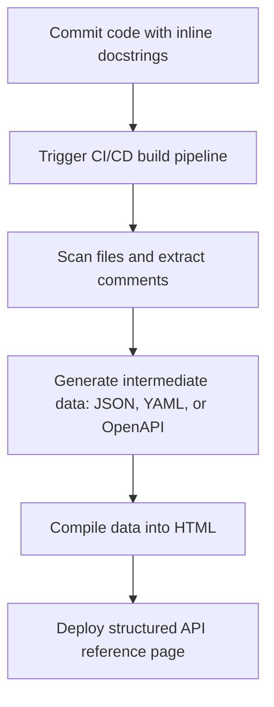

# Automated API reference generation

> *A documentation workflow that programmatically converts source code annotations and docstrings into structured, synchronized API reference guides*

---

Manual updates to API reference documentation are often inaccurate and struggle to keep pace with rapid code changes. This disconnect results in documentation drift, [content debt](../industry-terms/content-debt.md), and incorrect code examples, which increase support overhead and decrease developer productivity.

The industry-standard solution is automated API reference generation. This process involves extracting structured annotations and comments (docstrings) from the source code, converting them into standard data formats, and compiling them into a public-facing knowledge base. 

---

## Breaking the cycle of documentation lag

When an API change occurs, such as a data type update or a new authentication requirement, manually maintained documentation instantly becomes stale, forcing integration partners to rely on trial and error.

Automated reference generation eliminates this lag. Since documentation is compiled directly from code signatures and annotations, structural details such as endpoint paths, HTTP methods, and status codes stay permanently synchronized. As a result, technical writers are freed from manual transcription to focus on high-value work, such as designing interactive tutorials, usage guides, and architectural overviews.

### When to transition to automation

For small, static APIs, manual updates may be manageable. However, specific technical triggers suggest the need for automation:

- **Release velocity:** If you deploy updates continuously, manual documentation cannot keep pace with the deployment pipeline.
- **Scale and complexity:** APIs with dozens of endpoints and deeply nested [JSON schemas](../doc-stack/metadata-frontmatter.md#json-schema-example) are prone to human error when transcribed manually.
- **Validation needs:** Automated pipelines can enforce schema validation, ensuring that every endpoint includes mandatory fields, such as descriptions or example payloads, before the build passes.
- **Developer experience (DX or DevEx) metrics:** If the amount of time required for a developer to make a first successful request is too long due to 400-series errors caused by incorrect documentation, the manual process is a bottleneck.

---

## Extraction architecture and the generation pipeline

The technical process of synchronizing code comments with a documentation site involves a multi-stage build pipeline. Instead of writing HTML or Markdown from scratch, documentation is treated as structured data that flows from the codebase to the user's browser.


```mermaid
graph TD
    A[Commit code with inline docstrings] --> B[Trigger CI/CD build pipeline]
    B --> C[Scan files and extract comments]
    C --> D[Generate intermediate data: JSON, YAML, or OpenAPI]
    D --> E[Compile data into HTML]
    E --> F[Deploy structured API reference page]
```

### 1. The code source (docstrings and annotations)
The [source of truth](../doc-stack/git.md#the-single-source-of-truth) is the codebase. Developers and technical writers embed structured annotations, decorators, or inline comments directly above functions, classes, or endpoint handlers. These are written in standardized formats such as [JSDoc](https://jsdoc.app/){: target="_blank" rel="noopener" } for JavaScript, [reStructuredText (RST)](https://www.sphinx-doc.org/), [Google style](https://google.github.io/styleguide/pyguide.html#38-comments-and-docstrings), or [NumPy](https://numpydoc.readthedocs.io/en/latest/format.html){: target="_blank" rel="noopener" } for Python, or [Javadoc](https://www.oracle.com/technical-resources/articles/java/javadoc-tool.html){: target="_blank" rel="noopener" } for Java.

### 2. The extraction engine (parser)
When code is pushed to a [version control](../doc-stack/git.md) repository, specialized parsers that often use an abstract syntax tree (AST) or reflection scan the source code. These parsers ignore the executable program logic and extract only the structured comment blocks and metadata tags, such as `@param` or `@returns`.

### 3. Transformation and validation
The extracted metadata is transformed into an intermediate format, typically [Markdown](../doc-stack/markup-languages.md#markdown-fundamentals), [JSON](../doc-stack/json-logic.md), or an [OpenAPI Specification (OAS)](../doc-stack/openapi.md). This file is validated against schemas to catch missing types, invalid nesting, or incomplete endpoint definitions.

### 4. Compilation and rendering
The publishing system, such as a [static site generator (SSG)](../doc-stack/ssg.md) or a [developer portal](../doc-stack/developer-portals.md) like Redoc or Swagger UI, ingests these files, applies CSS themes, code syntax highlighting, and responsive navigation layouts to generate an interactive UI.

---

## Standardize the docstring contract

For automation to succeed, technical writers must establish a strict syntax contract with engineering teams. The parser will fail to build if comments deviate from the expected structure. 

The following example describes a standardized, parseable docstring layout for an API controller that uses clear parameter metadata and return types:

```javascript hl_lines="2 4 5"
/**
 * Processes a workspace invite token to join a secure organization.
 * 
 * @param {string} inviteToken - The cryptographically signed base64 invitation token.
 * @param {boolean} [autoAccept=false] - Optional. If true, bypasses the confirmation screen.
 * @returns {Promise<object>} Returns a JSON payload containing the new membership record.
 * @throws {ValidationError} Thrown if the token is expired or malformed.
 */
async function acceptOrganizationInvite(inviteToken, autoAccept = false) {
  // ... execution logic
}
```

By enforcing this inline template, the parser can systematically map `{string} inviteToken` into a clean parameters table on the compiled documentation site.

---

## Collaborative roles (RACI)

A successful pipeline requires clear ownership across engineering and content teams. The responsible, accountable, consulted, and informed (RACI) model defines these roles:

- **Responsible:** Software engineers write the code annotations and docstrings; technical writers define the documentation standards and maintain the rendering pipeline.
- **Accountable:** The DevOps/Release engineer or documentation lead ensures the automation runner executes correctly during [continuous integration and continuous deployment (CI/CD)](../doc-stack/cicd.md).
- **Consulted:** Product managers verify that parameter naming and public-facing descriptions align with product strategy.
- **Informed:** Quality assurance (QA) teams use the generated specification to synchronize automated test suites with the most recent API changes.

---

## CI/CD build, synchronization, and tooling

To ensure documentation matches production code, integrate reference generation into your CI/CD pipeline.

### Step 1: Trigger the push

When an engineer merges a feature branch into the main branch, version control hosting platforms trigger a build runner, such as [GitHub Actions](https://github.com/features/actions){: target="_blank" rel="noopener" } or [GitLab CI](https://docs.gitlab.com/ee/ci/){: target="_blank" rel="noopener" }.

### Step 2: Parse the code

The build runner starts a virtual container, pulls the latest code repository, and runs language-specific parsers and generator tools, such as Swashbuckle for .NET, `sphinx-apidoc` (with `autodoc`) for Python, or TypeDoc for TypeScript, over the codebase.

```bash
# Example command to generate intermediate API documentation stubs from Python source code
sphinx-apidoc -o source/ ../src/
```

### Step 3: Compile and validate

Move the generated Markdown or reStructuredText files into the source directory of your SSG or API renderer (such as Docusaurus, Hugo, or Redocly). 

!!! tip "Integration Best Practice"
    Incorporate a breaking change detector in your pipeline, such as `oasdiff`. This warns the team if a code change modifies an existing endpoint in a way that would break client integrations.

### Step 4: Deploy
The final static HTML assets are compiled, optimized, and deployed to a web server or content delivery network (CDN), updating the live documentation site.

---

## Manage code-to-doc friction points

Automating reference documentation introduces unique operational challenges. Since code comments live directly within the codebase, technical writers must work closely with developers to maintain quality and avoid pipeline breakage.

!!! warning "Issue: Missing or stale comments and parser failures"
    Developers focused on shipping features might forget to update docstrings when refactoring code, or syntax errors in comments can break the parser.
    
    **Solution:** Configure **Git pre-commit hooks, local validation, or pull request (PR) checks**. If a developer alters a function signature without updating its corresponding docstring parameters, or introduces syntax errors, the check fails to prevent broken builds.

!!! tip "Issue: Navigation and context"
    Auto-generated documentation can be difficult to navigate. A flat list of 500 endpoint parameters offers little contextual guidance.
    
    **Solution:** Implement **mixed-mode architecture**. Use automated tools to generate technical specifications, such as parameter tables, error codes, and schemas, while manually writing high-level tutorials and use cases that link to those auto-generated resources.

---

## Automated docstring compliance rules

To maintain high editorial standards, technical writers can create automated validation rules. Using linting frameworks, you can automatically scan docstrings during code reviews to check for structural completeness.

??? "Example: Automated linting compliance rules"
    You can enforce quality check constraints inside your codebase using programmatic rules:
    
    - **Parameter match rule:** Every parameter declared in a function signature must have an identical `@param` declaration in the docstring.
    - **No empty descriptions:** Any `@returns` or `@throws` tag must contain descriptive text following the tag declaration.
    - **Style check:** Make sure descriptions inside docstrings begin with a capitalized letter and end with a period to maintain consistency in the final layout.

By tracking build success rates and treating docstrings with the same testing rigor as software, technical writers can scale documentation across millions of lines of code without sacrificing quality.