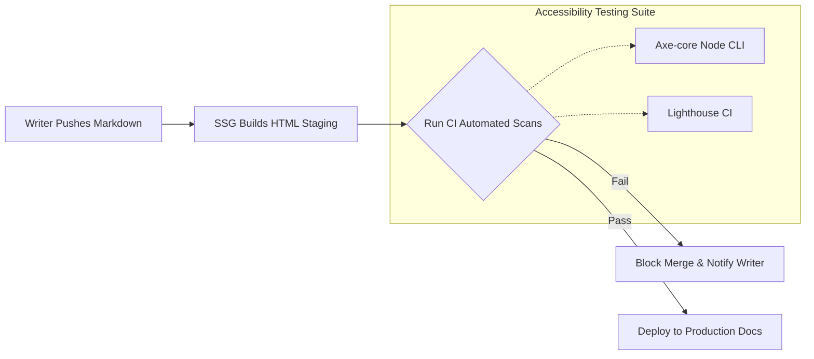

# Automated accessibility scans

> *How to run tools such as Lighthouse or Axe-core within your documentation pipeline*

---

When you manage documentation at scale, manually auditing every page for [accessibility (a11y)](../references/accessibility.md) compliance is an impossible task. In a modern [Docs as Code](../doc-stack/docs-as-code.md) workflow, where multiple writers and engineers continuously commit updates to a repository, accessibility must be treated like code quality. 

By integrating automated testing engines directly into your [documentation pipeline](../doc-stack/cicd.md#the-pipeline-concept), you can programmatically block noncompliant content, such as broken heading hierarchies, missing alternative text, or poor contrast, before it is compiled and deployed to production.

This guide details how to implement automated accessibility testing within your documentation continuous integration (CI) pipeline using industry-standard scanning engines.

---

## Continuous accessibility auditing

To maintain [Web Content Accessibility Guidelines (WCAG)](https://www.w3.org/WAI/standards-guidelines/wcag/){: target="_blank" rel="noopener" } compliance without slowing down your publishing velocity, integrate accessibility validation earlier in the development cycle. This means moving accessibility validation as close to the authoring stage as possible.

Instead of running a manual audit once every quarter, your automated pipeline should scan your static output files every time a writer opens a pull request or merges a branch. 



The automated workflow builds an HTML staging site whenever a writer pushes Markdown. The pipeline then runs Axe-core and Lighthouse CI scans, either blocking the merge if accessibility errors are found or deploying the documentation to production if the checks pass.

---

## Select your automation engines

Most documentation pipelines rely on a combination of two primary automated scanning engines. Instead of choosing one over the other, use them as complementary checks at different stages of your pipeline.

### Axe-core (local and pull request level)
[Axe-core](https://www.deque.com/axe/core-documentation/){: target="_blank" rel="noopener" } is a lightweight, highly accurate testing library developed by Deque. It is designed to be executed by using a command-line interface (CLI) or inside test runners. It is extremely fast, making it ideal for checking raw HTML output files immediately upon every [Git commit](../doc-stack/git.md#essential-git-concepts).

### Lighthouse CI (staging and deployment level)
Created by Google, [Lighthouse](https://developers.google.com/web/tools/lighthouse){: target="_blank" rel="noopener" } audits your fully rendered pages for performance, best practices, search engine optimization (SEO), and accessibility. Lighthouse runs in a headless Chrome browser, making it ideal for testing your staging environment to see how CSS, interactive menus, and search bars behave under real-world conditions.

---

## CI/CD integration: Configure your workflow

If you use a Docs as Code setup managed through GitHub, you can automate accessibility scans by using a workflow file. 

The following example describes how to configure a GitHub Actions workflow that automatically builds your static documentation site, serves it locally, and runs an Axe-core audit across the site.

Create a file in your repository at `.github/workflows/accessibility-scan.yml`:

```yaml hl_lines="17 26"
name: Documentation Accessibility Scan

on:
  pull_request:
    branches: [main]

jobs:
  build-and-test:
    runs-on: ubuntu-latest
    steps:
      - name: Checkout Repository
        uses: actions/checkout@v4

      - name: Set up Node.js
        uses: actions/setup-node@v4
        with:
          node-version: '20'

      - name: Build Static Site
        run: |
          npm install
          # Compiles markdown into the /site or /dist folder
          npm run build

      - name: Run Axe-core Accessibility Audit
        run: |
          npm install -g @axe-core/cli serve
          # Serve the static site on port 3000 in the background
          npx serve site -p 3000 &
          sleep 3
          axe http://localhost:3000 --exit
```

### Explanation of the execution commands
- `npx serve site -p 3000 &`: Starts a lightweight web server in the background to host your compiled output folder (adjust `site` to match your static site generator's output folder, such as `dist` or `build`).
- `axe http://localhost:3000`: Scans the running local site for accessibility issues using the Axe-core engine.
- `--exit`: Instructs the CLI to return a non-zero exit code if any accessibility failures are found, which fails the GitHub Action and prevents the [pull request](../doc-lifecycle/review-approval.md#the-pull-request-workflow) from merging until the issues are resolved.

---

## Manage scan exceptions and thresholds

When you integrate automated accessibility scans into a legacy documentation site, you might initially find hundreds of compliance failures. To prevent these failures from blocking critical publishing workflows while you remediate them, you can configure rule exclusions or bypass specific DOM elements.

??? note "Configuring scan exclusions and rule flags"
    Instead of turning off the linter completely, you can pass command-line options (or use an `axe` configuration file) to disable specific rules globally or exclude known legacy containers and third-party widgets using CSS selectors.
    
    **Example: Disabling rules and excluding elements via CLI**

    ```bash
    # Run the audit while skipping color-contrast checks and ignoring a legacy chat widget
    axe http://localhost:3000 --disable color-contrast --exclude "#third-party-chat-widget"
    ```

    **Example: Passing a custom axe configuration file (`axe-config.json`)**

    If you want to maintain a central configuration file for rule settings across team environments, you can define an `axe-core` options object:

    ```json
    {
      "rules": [
        { "id": "color-contrast", "enabled": false },
        { "id": "duplicate-id-active", "enabled": true }
      ]
    }
    ```

---

## Actionable defect triaging

Automated accessibility scanners are reliable, but they catch only approximately **30% to 50%** of total WCAG violations. These are primarily structural, programmatic failures such as missing labels, duplicate IDs, or basic contrast issues. 

!!! warning "The limits of automation"
    An automated accessibility scan cannot check whether your alternative text accurately describes the image or determine whether your tab order makes sense to a keyboard user. Always pair automation with manual keyboard testing and screen-reader reviews.

When an automated accessibility scan fails inside your pull request, categorize the results into three primary actionable priorities:

1.  **Blockers (immediate fix required):** Screen-reader traps, duplicate element IDs that break keyboard navigation, and missing form input labels. You must fix these before merging the code.
2.  **Linguistic violations:** Poor header nesting hierarchy (for example, jumping from an `H1` directly to an `H3`). Authors can often solve these immediately by modifying the Markdown file.
3.  **Color and contrast violations:** Contrast failures in code block highlights or link elements. These typically require a core CSS update to your site's stylesheet rather than changes to individual documentation files.