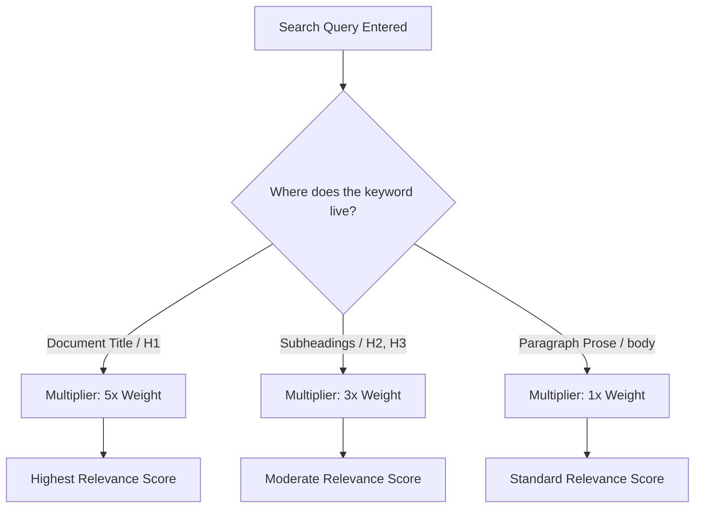

# Search relevance and the BM25 algorithm

> *How modern documentation search engines calculate relevance and how to structure content to help users find answers*

---

For users of technical documentation, the search bar is often the primary entry point. When engineers encounter an error code or configuration failure, they rarely navigate structural sidebars. Instead, they query the search index. 

Modern static site search tools and dedicated documentation search engines rely on a ranking algorithm called BM25 (Best Matching 25) to determine which pages appear at the top of search results.

While the underlying mechanics of the BM25 algorithm are mathematical, you do not need to learn complex formulas to use it. Instead, think of it as a set of logical rules that evaluate how focused, concise, and accurate your pages are. By [understanding how the search engine processes information](../doc-stack/seo-for-docs.md), you can structure your content to help users find exactly what they need.

---

## The three principles of search relevance

When a user enters a query into a documentation search bar, the BM25 algorithm evaluates every page against three core principles:

### 1. Term frequency and saturation

The search engine counts how often a search term appears on a page. If Page A mentions "webhook" five times and Page B mentions it once, the search engine assumes Page A is more relevant. 

However, the algorithm prevents keyword stuffing. Moving from zero mentions to one mention gives a page a significant score boost. Moving from one mention to two gives a smaller boost. By the time a word has been used 10 times, an eleventh use provides almost no additional value to the search score. This ensures that naturally written articles rank better than pages that repeat a keyword.

### 2. Keyword rarity (inverse document frequency)

The search engine looks at how common a search term is across the entire documentation site. 

- Common words, such as "configure," "install," or "setup," typically appear on almost every page. Since they are common, the search engine treats them as low-priority white noise.
- Rare words, such as "OAuth," "gRPC," or "telemetry," might only appear on a few pages. 

If a user searches for "configure OAuth," the search engine essentially ignores the word "configure" and heavily weights the rare word "OAuth," prioritizing the few pages that address that specific security protocol.

### 3. Document length normalization
A 10,000-word "everything guide" is more likely to contain a search term simply because of its volume. To keep search fair, BM25 compares the length of a specific page to the average length of all other pages on your site. 

If a 200-word troubleshooting article contains the term "error 403" twice, the search engine ranks it higher than a 5,000-word guide that also mentions "error 403" twice. The algorithm assumes that the shorter, more focused page provides a faster, more direct answer.

---

## How search engines weight Markdown structure

Search engines do not index all text on a page equally. They read the HTML structure and assign higher weight multipliers to specific tags. While the body text of a paragraph is indexed at face value, structural elements are given priority:



This diagram illustrates how search engines assign different levels of importance, or weights, to content based on its HTML structure. 

When a user enters a query, the search engine identifies where the search terms appear on a page and applies a multiplier to calculate the relevance score:

*   **Document titles (`<h1>`):** These receive the highest priority (5x weight) because they represent the primary topic of the page.
*   **Subheadings (`<h2>`, `<h3>`):** These receive moderate priority (3x weight) because they identify specific sections of content.
*   **Body text:** Standard paragraph prose receives the base priority (1x weight).

By using this weighting system, the algorithm ensures that a page titled "Webhook configuration" ranks higher for the term "webhook" than a page that only mentions the word once in a footer or a side note.

### Write search-optimized headings

Since headings carry significant weight in search engines, the way you write them matters:

- **Write concise headings:** Use "Active Directory configuration" instead of "How to set up your system to work with Active Directory."
- **Use nouns:** Users search for nouns, such as error codes, parameters, and tools, when they are stuck. Make sure your subheadings contain these key nouns.

---

## Adjust search settings

If you manage a documentation search configuration file, you will likely encounter two primary settings that control how BM25 behaves. You can think of these as settings that tune the user experience:

### Saturation setting

This setting controls how quickly the rule of diminishing returns takes effect. 

- If you set the value to low, repeating a keyword provides almost no benefit. This prevents long, repetitive articles from dominating search results.
- If you set the value to high, repeated terms continue to boost the page score. This is helpful if your documentation includes technical reference sheets where repeating specific terms is necessary.

### Length penalty setting

This setting controls how much the search engine penalizes long documents.

- If you turn off this setting, long manuals often win the top search spots because they contain the most words.
- If you turn the setting all the way up, the search engine favors short articles and might not show longer, conceptual guides in the search results.
- **The default setting** is usually balanced, favoring precise, medium-length articles.

---

## Content strategies for search-friendly documentation

Knowing how the algorithm evaluates writing allows you to make deliberate structural choices when [organizing a documentation repository](../doc-stack/kb-architecture.md#repository-organizational-models):

### 1. Write modular, topic-based pages

Avoid creating monolithic single-page user manuals because search engines penalize long documents. Instead, break your content into distinct, single-topic files. If a user searches for a specific API error code, they should land on a short, targeted troubleshooting page instead of a large guide where they must use `Ctrl+F` to find an answer.

### 2. Front-load important keywords

Use primary technical terms in the page title (`<h1>`), the first subheading (`<h2>`), and the first sentence of the introductory paragraph. This signals to the search engine what the primary topic of the page is.

### 3. Manage synonyms with metadata

Sometimes, users search for terms that do not match official terminology. For example, a product might use the term "directory," but Windows users might search for "folder." 

Instead of cluttering prose by writing "directories (also known as folders)," use page metadata or front matter to provide these synonyms to the search engine:

```yaml
---
title: Managing system directories
description: Learn how to create and organize system directories.
keywords: [folders, file paths, directory trees, storage]
---
```

This allows the search engine to index the word "folders" for the page without compromising editorial standards.