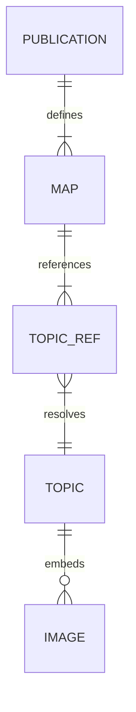

# Component content management systems

> *Managing high-volume documentation by using specialized database-driven tools outside of Git.*

---

A component content management system (CCMS) is a specialized, database-driven platform designed to manage documentation at the component or topic level rather than at the document level. Unlike standard content management systems (CMS) or [Git](../doc-stack/git.md) repositories that track entire files, a CCMS breaks down documentation into granular, reusable chunks of information such as a single procedure, a warning notice, or a technical specifications table. 

These individual chunks are stored in a centralized database, tagged with metadata, and dynamically assembled into multiple output formats. For enterprise technical writing teams managing massive, multi-version, and multi-language documentation suites, a CCMS provides the infrastructure required to scale [content reuse](../references/dita.md#content-reuse-and-single-sourcing) and reduce localization costs.

This guide explores the structural mechanics, workflow differences, and costs of adopting a CCMS infrastructure.

---

## Topic-based authoring

At the core of a CCMS is the philosophy of [topic-based authoring](../references/dita.md#core-philosophy-topic-based-authoring). Instead of writing a long-form manual from start to finish, you create independent, self-contained units of information. These units are typically categorized into three structural types:

- **Concepts:** Explanatory text defining what a feature or system is.
- **Tasks:** Sequential, numbered steps explaining how to perform a specific procedure.
- **References:** Highly structured data, such as API endpoints, physical dimensions, or specifications tables.

You assemble these individual topics into a master map or "bookmap" that defines the hierarchy and navigation of the final publication.

By separating the content generation (the topics) from the structural hierarchy (the map), you can write a single warning topic once and automatically reference it across hundreds of different manuals.

The following diagram illustrates the data architecture and relationships within a topic-based authoring model, which is the foundation of a CCMS:

??? note "Click to see diagram details"

    The diagram shows how a CCMS separates structure (maps) from content (topics), allowing writers to manage small, reusable chunks of information independently of the final document.

    Here is a breakdown of the relationships:

    - **PUBLICATION defines MAP:** A single publication (such as a PDF user guide or a help website) is defined by one or more maps. The map acts as the "table of contents" or skeleton for the final output.
    - **MAP references TOPIC_REF:** Instead of containing actual text, the map contains topic references. These are pointers that tell the system which pieces of content to pull in and in what order.
    - **TOPIC_REF resolves TOPIC:** This is the core of content reuse. Multiple topic references (across different maps or publications) can point to the same single topic. When you update that one topic, the changes propagate everywhere it is referenced.
    - **TOPIC embeds IMAGE:** The topic contains the actual narrative content. It can optionally include (embed) one or more graphic assets or images.

---

## Database versus Git

Many modern technical writing teams use Git-based [Docs as Code](../doc-stack/docs-as-code.md) workflows. Git works well for developer-centric software documentation, but it may lack the features needed to manage the scale, translations, and variant configurations required in large-scale hardware or enterprise software industries.

### Architectural differences

- **Granularity:** Git tracks changes at the file level. A CCMS tracks changes at the XML element or topic level. This allows you to lock and edit a single paragraph without affecting the rest of the document.
- **Database versus file system:** Git stores content in flat text files within a folder directory. A CCMS stores content in a relational or XML-native database. This enables complex metadata queries, such as *"Show me all topics updated in the last 30 days that reference 'Sensor Model B.'"*
- **Translation management:** Git does not have native translation tracking. A CCMS uses built-in translation memories and direct integrations with localization agencies to automatically send only modified components for translation. This prevents the re-translation of unchanged text.

---

## Content reuse and translation mathematics

The primary business justification for implementing a CCMS is the reduction in [translation and localization](../references/iso-standards.md#gilt-framework) costs. In a traditional file-based document workflow, even a tiny change to a single page requires you to re-analyze or re-translate the entire file. 

In a CCMS, the system tracks exactly which components have changed because content is single-sourced at the topic level. The translation cost formula for a localized documentation project is:

$$T_{\text{total}} = N \cdot C_{\text{word}} \cdot (1 - R)$$

Where:

- $T_{\text{total}}$ is the total translation cost.
- $N$ is the total word count of the publication.
- $C_{\text{word}}$ is the standard translation cost per word.
- $R$ is the content reuse percentage (represented as a decimal between $0$ and $1$).

As your reuse metric ($R$) increases through structured single-sourcing, your total translation expenditure ($T_{\text{total}}$) decreases. If your team achieves 60% content reuse ($R = 0.60$), you pay for only 40% of the translation cost compared to a traditional file-based model.

---

## Enterprise CCMS core features

To manage documentation at an enterprise scale, a CCMS relies on several specialized structural features:

- **Single-source publishing:** You author content in XML, such as [Darwin Information Typing Architecture (DITA)](../references/dita.md), and the system dynamically renders it into PDF, HTML5, ePUB, or printed formats using a specialized publishing engine.
- **Dynamic filtering (profiling):** You apply conditional processing attributes, such as `audience="administrator"` or `product="model_v2"`, directly to elements. During publishing, the engine filters out any components that do not match the target configuration.
- **Translation memory integration:** The system interfaces directly with translation memory databases to ensure that once a sentence is translated in one manual, it is never translated again in any other publication.
- **Granular locking and check-out:** This prevents edit conflicts by allowing you to "check out" and lock individual topics while leaving the rest of the publication open for other team members.

---

## CCMS migration checklist

Transitioning from flat files or Git-based directories to a database-driven CCMS is a complex infrastructure project. You can use this migration framework to organize your deployment:

- [ ] **Audit content:** Inventory your existing documentation set and identify redundant, outdated, or trivial (ROT) content.
- [ ] **Define the information model:** Standardize your [metadata taxonomy](../doc-stack/metadata-frontmatter.md#taxonomy-management), product attributes, and target output schemas.
- [ ] **Draft the topic strategy:** Break down legacy long-form manuals into concepts, tasks, and references.
- [ ] **Set up XML schemas:** Configure your XML validation rules (DITA, DocBook, or custom schemas) to enforce structural consistency.
- [ ] **Configure translation memory:** Import your organization's existing translation memories into the CCMS to prevent losing past localization work.
- [ ] **Run a pilot map:** Test the end-to-end authoring, review, translation, and publishing pipeline using a single, medium-sized documentation map.