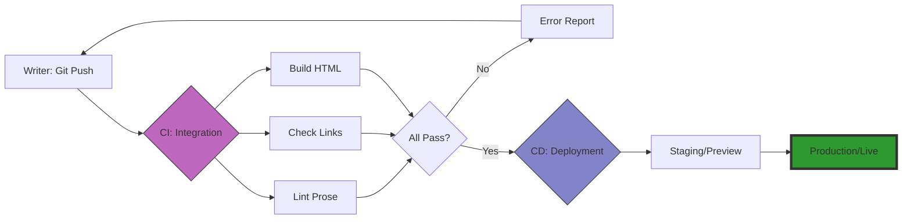

# Continuous integration and continuous delivery (CI/CD)
*Setting up CI/CD workflows to auto-deploy documentation sites*

---

In the [Docs as Code philosophy](../doc-stack/docs-as-code.md), CI/CD are the engines that automate the journey from [a text file to a live website](../doc-stack/ssg.md). 

By using CI/CD, technical writers can focus entirely on creating content. The pipeline handles the technical labor of testing for errors, building the site architecture, and deploying the files to a global audience.

---

## The pipeline concept

The pipeline is a series of automated steps that trigger whenever you make a change to your documentation repository.

- **Continuous integration (CI):** Focuses on the *Quality Gate*. It pulls your new content, runs tests such as [spellchecks and link validators](../doc-stack/prose-linting.md), and attempts to build the site to ensure no syntax errors were introduced.
- **Continuous delivery/deployment (CD):** Focuses on the *Release*. Once the CI tests pass, the pipeline automatically pushes the new build to your hosting provider, making the changes live for users.

**Documentation pipeline workflow**



---

## Build triggers

A pipeline starts with a trigger. In a documentation environment, these are usually [Git-based](../doc-stack/git.md) events:

- **Pull request trigger:** When you submit a pull request (PR), the CI runs to determine if your changes are safe to merge.
- **Merge/Push trigger:** When you merge a PR into the main branch, the CD runs to update the live website.
- **Scheduled trigger:** You can configure a pipeline to run at a specific time, such as every night, to check for broken external links that might have gone down.

---

## Automated testing

The primary value of CI is that it catches human errors before they reach the customer. Automated gatekeepers act as a robotic peer-review team:

- **Link checkers** scan every URL in your documentation to ensure no 404 errors exist.
- **Image validators** ensure all images have required alt text for [accessibility](../references/accessibility.md).
- **Prose linters** run tools such as [Vale](https://vale.sh/){: target="_blank" rel="noopener" } to ensure your writing follows the company style guide (for example, avoiding passive voice or banned words).
- **Syntax validation** ensures your [Markdown](../doc-stack/markup-languages.md) or [YAML frontmatter](../doc-stack/metadata-frontmatter.md) is valid, which prevents the site build from breaking.

---

## Staging and preview environments

One of the most powerful features of modern CD is the deploy preview. 

When you open a pull request, the pipeline creates a temporary, private version of your website, often called a staging site. This gives you a unique URL that you can send to [subject matter experts (SMEs)](../doc-lifecycle/sme-interviewing.md) so they can see exactly how the documentation looks and behaves in the browser before you make it public.

!!! tip "Stakeholder sign-off"
    Using staging environments significantly reduces the fear of publishing. It allows for a final visual check of diagrams and layout that you cannot get by looking at a raw text file.

---

## GitHub Actions for writers

[GitHub Actions](https://github.com/features/actions){: target="_blank" rel="noopener" } is currently the most popular tool for automating documentation. It uses [YAML](https://yaml.org/){: target="_blank" rel="noopener" } files stored in your `.github/workflows/` folder to define the instructions for the pipeline.

Even for a non-developer, the syntax is readable. You define:

1.  **When** to run (for example, `on: push`).
2.  **Where** to run (for example, `runs-on: ubuntu-latest`).
3.  **What** to do (for example, `run: npm run build`).

---

## Asset optimization

During the build process, the pipeline can perform improvements to your site that would be too tedious to do manually:

- **Image compression** automatically shrinks large PNG files to speed up page load times.
- **CSS/JS minification** strips out unnecessary spaces in code files to reduce the overall site weight.
- **Search indexing** generates the JSON index that powers your site's search bar.

---

## Atomic deploys

An atomic deploy ensures that your documentation site never goes down or shows a half-broken page during an update. 

The pipeline builds the entire new version of the site in a background folder. The server points users to the new version only when the build is 100% complete. If the build fails at any point, the old version stays live, ensuring a zero-downtime experience for your users.

---

### Documentation workflow file

This annotated example shows what a typical GitHub Action looks like for a documentation site. Understanding this structure allows you to troubleshoot your own deployment pipeline.

```yaml
name: Deploy Documentation      # The name shown in the GitHub UI
on:
  push:
    branches:
      - main                    # Only trigger when changes hit 'main'

jobs:
  build-and-deploy:
    runs-on: ubuntu-latest      # Use a fresh Linux virtual machine
    steps:
      - name: Checkout code
        uses: actions/checkout@v4 # Pull your code into the VM

      - name: Install dependencies
        run: npm install        # Install the SSG engine

      - name: Run Prose Linter
        run: vale content/      # Check for style guide errors

      - name: Build Site
        run: npm run build      # Convert Markdown to HTML

      - name: Deploy to Production
        uses: peaceiris/actions-gh-pages@v3
        with:
          github_token: ${{ secrets.GITHUB_TOKEN }}
          publish_dir: ./public # Only upload the final 'public' folder
```

---

### CI/CD status legend

When working in a repository, you will see small icons next to your commits. Here is how to interpret the icons:

| Icon | Status | Meaning |
| :--- | :--- | :--- |
| :lucide-refresh-cw: | **In Progress** | The pipeline is currently running tests or building the site. |
| :lucide-check-circle: | **Passed** | All tests passed and the site is ready or deployed. |
| :lucide-x-circle: | **Failed** | A test failed or the build broke. **Action required:** Check the logs. |
| :lucide-alert-circle: | **Action Required** | The pipeline finished but needs a manual approval to deploy. |

!!! danger "Don't ignore the red X"
    A failed CI build usually means your site architecture is broken. Never merge a pull request if the check has failed because it will likely break the live site for all users.