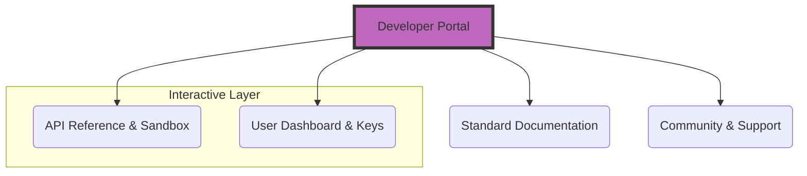

# Developer portal architecture
> *Understanding the shift from simple documentation sites to interactive portals with "Try It Out" consoles*

---

A developer portal is the evolution of traditional documentation. While a standard documentation site is a passive reading experience, a developer portal is a dynamic, interactive application designed to help developers succeed with a product as quickly as possible. 

Modern portal architecture focuses on *self-service*, providing not just instructions, but the tools, sandboxes, and community updates required to build, test, and deploy software.

---

## Sites versus portals

The fundamental shift in portal architecture is moving from a *reading experience* to an *application experience*.

- **Documentation sites:** Focus on content delivery. They are often linear, text-heavy, and siloed from the actual product.
- **Developer portals:** Integrate the content with functionality. A developer portal acts as a "single pane of glass" where developers can manage API keys, view usage analytics, and test endpoints in real-time.

This diagram describes the multi-dimensional nature of a developer portal. Unlike a standalone documentation site, a developer portal serves as a central hub that bridges static content with an interactive layer, allowing users to manage credentials and test live code within the documentation environment.

---

## Discovery journey and environment setup

The most important part of a developer portal is the *discovery journey*. Before a developer can write a single line of code, they must understand the environment prerequisites. 

Documentation must clearly define the hardware and software requirements. For example, if your product is a library, the developer portal should explicitly state the required version of the [Java Development Kit (JDK)](https://www.oracle.com/java/technologies/downloads/){: target="_blank" rel="noopener" } for compilation or the [Java Runtime Environment (JRE)](https://www.ibm.com/think/topics/jre){: target="_blank" rel="noopener" } needed for execution. Failing to clarify these prerequisites is the primary cause of early-stage friction.

!!! NOTE "JDK versus JRE"
    Always specify if a user needs the full JDK (to develop) or just the JRE (to run the application). Providing links to the correct version (for example, LTS versus Current) is a staple of a high-quality developer portal.

---

## Unified search and RSS integration

A professional developer portal breaks down information silos. Search should not just look at your [Markdown](../doc-stack/markup-languages.md) files; it should index API references, community forums, and even external blogs.

Furthermore, the portal should keep developers updated through [Really Simple Syndication (RSS)](https://www.rssboard.org/rss-specification){: target="_blank" rel="noopener" } feeds. By integrating RSS feeds for changelogs or system status updates, you ensure the portal is a living resource. Developers can subscribe to these feeds to get automated alerts whenever a breaking change or a new feature is released.

---

## The getting started experience

The goal of a developer portal is to minimize the [Time to Hello World (TTHW)](https://en.wikipedia.org/wiki/Hello,_world#Time_to_Hello_World){: target="_blank" rel="noopener" }. 

High-impact "Quickstarts" are architected to give the user a small, tangible win immediately. These guides should be stripped of all "fluff" and architectural theory, focusing entirely on a 5-minute path from account creation to a successful API response.

---

## User-specific content (RBAC)

For enterprise-level documentation, a one size fits all approach is often ineffective. Developer portals use Role-Based Access Control (RBAC) to personalize the content experience.

- **Contextual visibility:** An "Admin" user might see documentation for billing and seat management, while a "Developer" user sees only API keys and technical tutorials.
- **Version control:** RBAC can also be used to show documentation for Beta features only to specific users, preventing confusion for the general public.

!!! info 
    Implementing RBAC allows you to maintain a single knowledge base while providing a highly tailored experience for different user personas such as DevOps, Security, and Frontend.

---

## Interactive tooling and dark mode

A developer portal is a workspace, and its UI should reflect the preferences of its primary audience: developers.

- **API explorers:** Built-in consoles, such as [Swagger](https://swagger.io/){: target="_blank" rel="noopener" } or [Redoc](https://redocly.com/redoc/){: target="_blank" rel="noopener" }, allow users to test live API calls without leaving the browser.
- **"Copy Code" buttons:** Every code block must have a one-click copy button to reduce manual errors.
- **Dark mode:** Since many developers work in IDEs with dark themes, offering a native Dark Mode in the portal reduces eye strain when switching between the code and the documentation.

---

## Feedback loops and sentiment

To improve the developer portal, you must treat documentation as a product. This requires *feedback loops*.

- **Sentiment widgets:** "Was this page helpful?" buttons provide immediate, qualitative data.
- **Analytics:** Tracking which search terms return "zero results" tells the technical writer exactly which articles need to be written next.
- **Data-driven IA:** If data shows users are jumping from "Authentication" to "Billing" frequently, the [information architecture (IA)](../references/ia-design.md) should be updated to link those two sections more prominently.

---

### DevPortal implementation checklist

To successfully transition from a static site to an interactive portal, ensure the following architectural elements are in place:

- [ ] **Omni-search:** Is the search bar indexing API documentation, tutorials, and community posts?
- [ ] **Prerequisite clarity:** Are the JDK/JRE or other environment requirements clearly listed on the homepage?
- [ ] **RSS capability:** Can users subscribe to a changelog feed?
- [ ] **Sandbox integration:** Is there a "Try it Out" button for your most popular API endpoints?
- [ ] **UI preference:** Does the site support high-contrast/dark mode?
- [ ] **Sentiment tracking:** Is there a way for users to provide feedback on every page?
- [ ] **Asset accessibility:** Are all diagrams, such as Mermaid.js, version-controlled and searchable?
- [ ] **Identity management:** Is there a login system to manage API keys and RBAC permissions?

---

### Reference architecture (three-tier portal)

| Tier | Component | Purpose |
| :--- | :--- | :--- |
| **I. Library** | Guides & Tutorials | Conceptual understanding and "The Why." |
| **II. Lab** | API Explorers & Sandboxes | Interactive testing and "The How." |
| **III. Hub** | Community & RSS | Real-time updates and "The Who." |

!!! tip "Final goal"
    A successful developer portal does not just explain how the product works. It makes the product work better for the developer.