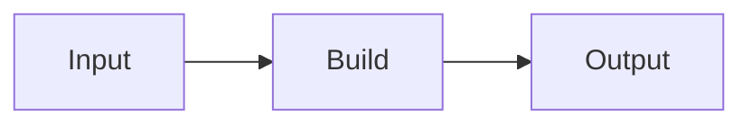

# Diagrams as Code (DaC)
*Utilizing text-based tools to generate flowcharts, sequence diagrams, and state maps*

---

In traditional documentation, diagrams are often the first components to go out of date. When a system architecture changes, the technical writer must find the original source file, such as a Microsoft Visio or Adobe Photoshop (.psd) file, edit it, export a new PNG file, and re-upload it to the website. 

This process is brittle and often leads to *image rot*. In these instances, the text describes one functionality, but the diagram displays another.

DaC solves this by allowing technical writers to define visuals using simple text strings. The documentation engine then renders these strings into crisp, professional graphics during the build process.

---

## The maintenance problem

The maintenance gap occurs because static images are disconnected from the [version control](../doc-stack/git.md) system of the documentation. 

- **Lost source files:** If the technical writer who created the original diagram leaves the company, the source often disappears with that person.
- **No "diff" visibility:** You cannot see what changed in an image during a Git pull request. You only see that a binary file was replaced.
- **Scaling issues:** Updating 50 static flowcharts across a large knowledge base can take days. With DaC, it only takes minutes.

---

## Text-to-visual syntax

DaC relies on domain-specific languages (DSLs) that describe relationships rather than coordinates. The two most common standards are:

- **[Mermaid.js](https://mermaid.js.org/){: target="_blank" rel="noopener" }:** This is the de facto standard for web-based documentation and [static site generators (SSGs)](../doc-stack/ssg.md). Mermaid.js uses a syntax similar to Markdown and renders directly in the browser.
- **[PlantUML](https://plantuml.com/){: target="_blank" rel="noopener" }:** This is a more robust, Java-based engine capable of handling complex enterprise architectures and class diagrams. PlantUML is ideal for large-scale modeling.

---

## Flowcharts and logic

Flowcharts are the most common use case for DaC. They allow technical writers to map out decision trees, user onboarding journeys, and troubleshooting logic using a graph syntax.

**Example Flowchart**

=== "Visual Diagram"
    ```mermaid
    graph TD
        A[User enters email] --> B{Email exists?}
        B -- No --> C[Show 'Create Account' page]
        B -- Yes --> D[Show 'Password' field]
        D --> E{Password Correct?}
        E -- No --> F[Trigger Password Reset]
        E -- Yes --> G[Grant Access]
    ```

=== "Source Code"
    ````markdown
    ```mermaid
    graph TD
        A[User enters email] --> B{Email exists?}
        B -- No --> C[Show 'Create Account' page]
        B -- Yes --> D[Show 'Password' field]
        D --> E{Password Correct?}
        E -- No --> F[Trigger Password Reset]
        E -- Yes --> G[Grant Access]
    ```
    ````

!!! TIP
    **Direction matters!** 
    Use `graph TD` for top-down flow, or `graph LR` for left-to-right flow depending on the complexity of your logic.

---

## Sequence diagrams

Sequence diagrams are essential for [API documentation](../doc-stack/openapi.md). They visualize how different actors, such as users, microservices, and databases, interact over time. 

By using text to define these interactions, you can easily update a handshake process or a token validation flow without redrawing every arrow and box.

!!! note 
    *Sequence diagrams tell the story of an API call.* They show the request, the internal processing, and the final response in a vertical timeline.

**Example: Authentication Handshake**

=== "Visual Diagram"
    ```mermaid
    sequenceDiagram
        autonumber
        Client->>Server: Request Token
        Server->>Database: Validate
        Database-->>Server: Authorized
        Server-->>Client: Return JWT
    ```

=== "Source Code"
    ````markdown
    ```mermaid
    sequenceDiagram
        autonumber
        Client->>Server: Request Token
        Server->>Database: Validate
        Database-->>Server: Authorized
        Server-->>Client: Return JWT
    ```
    ````

!!! tip "Readability Tip"
    The `autonumber` command adds step numbers to the diagram, making it easier to reference specific steps in your documentation text.

---

## Version controlling visuals

The diagram lives inside your [Markdown](../doc-stack/markup-languages.md) file as a block of text, which provides the following benefits for collaboration:

- **Git diffs:** When you change a relationship in a diagram, Git shows the exact line of text that changed.
- **Single source of truth:** The diagram and the explanatory text are in the same file. They are versioned, branched, and merged together.
- **Global search:** You can search for text inside a diagram using the "Search in Files" feature of your code editor.

---

## Web accessibility

Static images are often black boxes for screen readers. If the alt text is missing or vague, the information is lost to visually impaired users.

- **Search engine optimization (SEO):** Search engines can index the text inside a rendered Mermaid diagram, which improves the findability of your technical content.
- **Screen reader support:** Since the diagram is generated from code, many modern rendering engines can expose the underlying text to assistive technologies. This makes the logic accessible to everyone.

---

## Integration with SSGs

Most modern SSGs use [SuperFences](https://facelessuser.github.io/pymdown-extensions/extensions/superfences/){: target="_blank" rel="noopener" } or specialized plugins to handle DaC. You simply wrap your text in a code fence with the `mermaid` identifier.

**Example integration:**

~~~markdown

~~~

---

### Syntax blueprint: Mermaid.js essentials

Use this quick-start guide to build the three most common diagram types in your documentation.

#### I. Flowchart (logic and decisions)
- **Syntax:** `graph [Direction]`
- **Nodes:** `[ID](Label)`
- **Connections:** `-->` (Arrow), `-.->` (Dotted), `==>` (Thick)
- **Shapes:** `[ ]` (Square), `( )` (Rounded), `{ }` (Decision/Diamond)

#### II. Sequence diagram (API and system flow)
- **Syntax:** `sequenceDiagram`
- **Actors:** `participant [Name]`
- **Actions:** `->>` (Solid arrow), `-->>` (Dotted arrow)
- **Notes:** `Note right of [Actor]: [Text]`

#### III. State diagram (status and life cycles)
- **Syntax:** `stateDiagram-v2`
- **States:** `state "Description" as State1`
- **Transitions:** `[*] --> State1` (Start), `State1 --> [*]` (End)

---

### Implementation checklist

- [ ] **Choose your engine.** Use Mermaid.js for web-first documentation and PlantUML for complex PDF or enterprise manuals.
- [ ] **Establish a style.** Decide on a standard direction; for example, all flowcharts should be `LR`.
- [ ] **Add to style guide.** Define colors and *classes* for different node types within your [automated prose linting](../doc-stack/prose-linting.md) rules.
- [ ] **Validate accessibility:** Ensure your rendering plugin includes `aria-labels` for the generated Scalable Vector Graphics (SVG) files.
- [ ] **Enable local preview.** Install an extension, such as "Mermaid Editor" for [Visual Studio Code](https://code.visualstudio.com/){: target="_blank" rel="noopener" }, so you can see the visual change as you type the code.