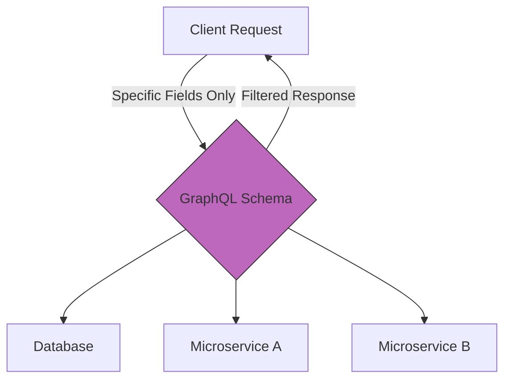

# Emerging API Architectures
*Moving beyond REST to understand the documentation needs of GraphQL, gRPC, and webhooks*

---

While [Representational State Transfer (REST)](https://en.wikipedia.org/wiki/REST){: target="_blank" rel="noopener" } is still the most common architectural style for web services, the demands of modern software, such as real-time updates, high-performance data fetching, and mobile-first efficiency, have led to the rise of new API patterns.

For technical writers, these emerging architectures require a shift in documentation strategy. Technical writers must move away from documenting simple endpoints and begin documenting graphs, event streams, and language-specific libraries.

---

## Beyond the REST paradigm

REST relies on a fixed set of endpoints that return fixed data structures. In contrast, emerging architectures are often more flexible or specialized.

- **GraphQL:** Instead of the server deciding what data to return, the client "asks" for exactly what it needs.
- **Event-driven (webhooks):** The server pushes data to the client when a specific event occurs rather than waiting for a request. [Webhooks](https://en.wikipedia.org/wiki/Webhook){: target="_blank" rel="noopener" } are a common implementation of this pattern.
- **Voice user interface (VUI):** As hands-free documentation becomes a standard for field technicians and [accessibility](../references/accessibility.md), technical writers must optimize content for conversational retrieval. This requires writing documentation as short, modular answers that a VUI agent can read aloud without losing context.

---

## The GraphQL schema

In [GraphQL](https://graphql.org/){: target="_blank" rel="noopener" }, the [schema](../doc-stack/metadata-frontmatter.md) is the single source of truth. Since a single endpoint handles every interaction, you do not document URLs. Instead, you document the types and fields available in the graph.

- **Queries:** This defines how the user fetches data during a read operation.
- **Mutations:** This defines how the user changes data during a write or update operation.
- **Introspection:** This is a unique feature where the API can be queried for its own schema. This allows for "self-documenting" APIs, but it places a high burden on the technical writer to provide excellent descriptions directly within the schema code.



This diagram illustrates the declarative nature of GraphQL. The schema acts as a single interface that mediates between the client's specific data request and multiple backend sources, ensuring the user receives exactly the fields they requested and nothing more.

---

## Event-driven architecture (webhooks)

Webhooks are "reverse APIs." Instead of the user calling you, your system calls the user's system. Documentation for webhooks must be extremely clear about the payload structure.

- **Triggers:** Clearly define when the webhook is sent (for example, `order.completed` or `user.deleted`).
- **MIME types:** Specify the [Multipurpose Internet Mail Extensions (MIME)](https://developer.mozilla.org/en-US/docs/Web/HTTP/Basics_of_HTTP/MIME_types){: target="_blank" rel="noopener" } type of the payload. Most modern webhooks use `application/json`, but legacy systems might require `application/xml` or `text/plain`.
- **Endpoint requirements:** Inform the user about the type of server they must build to receive your data. *'Your endpoint must return an HTTP 200 within 5 seconds.'*

---

## Retry logic and security

Event-driven systems happen behind the scenes, so documentation must address what happens when things go wrong.

- **Retry policies:** If the user's server is down, how many times will your system try to send the data? Document the *exponential backoff* schedule (for example, retrying after 1, 5, and 30 minutes).
- **HMAC security:** To prevent spoofing, webhooks often include a [hash-based message authentication code (HMAC)](https://en.wikipedia.org/wiki/HMAC){: target="_blank" rel="noopener" } in the header. You must provide a step-by-step guide and code snippets on how the user can verify this signature to ensure the data actually came from your system.

---

## Documenting SDKs

Many companies provide [software development kits (SDKs)](https://en.wikipedia.org/wiki/Software_development_kit){: target="_blank" rel="noopener" }. These are language-specific libraries in Python, Java, or JavaScript that wrap around their API. 

Documentation for SDKs should focus on the language idioms of that specific community. Instead of showing a raw `CURL` command, use tabs to show how to use the official library in the preferred language of the user.

=== "Python SDK"
    ```python
    import our_library
    client = our_library.Client(api_key="your_key")
    user = client.get_user(id="123")
    ```

=== "Node.js SDK"
    ```javascript
    const { Client } = require('our-library');
    const client = new Client({ apiKey: 'your_key' });
    const user = await client.getUser('123');
    ```

---

## Real-time documentation (WebSockets)

[WebSockets](https://developer.mozilla.org/en-US/docs/Web/API/WebSockets_API){: target="_blank" rel="noopener" } provide a persistent, bi-directional "pipe" between the client and the server, whereas REST opens and closes a connection for every request.

- **Connection lifecycle:** Document how to open the connection, keep it alive through heartbeats, and handle clean closures.
- **Message types:** Clearly define the events that can be sent over the pipe. 
- **Streaming data:** If you are providing a live data feed, such as stock prices or chat messages, provide a live console where the user can see the messages flowing in real-time.

!!! note "Documentation challenge"
    Documenting real-time systems is difficult because the state is always changing. Use [sequence diagrams](../doc-stack/diagrams-as-code.md) to describe how the connection persists over time.

---

### Architecture selection guide

Use the following comparison to determine which documentation patterns and tools are required based on the architecture of the API you are documenting.

<div class="grid cards" markdown>

-   ### **RESTful APIs**
    **Doc Focus:** Endpoints and Verbs
    - **Standard:** OpenAPI (OAS)
    - **Tooling:** Redoc / Swagger
    - **Visuals:** Table of Endpoints

-   ### **GraphQL APIs**
    **Doc Focus:** Types and Relationships
    - **Standard:** GraphQL Schema
    - **Tooling:** GraphiQL / Apollo
    - **Visuals:** Schema Diagrams

-   ### **Event-Driven (Webhooks)**
    **Doc Focus:** Payloads and Triggers
    - **Standard:** AsyncAPI
    - **Tooling:** Event Catalog
    - **Visuals:** Sequence Diagrams

-   ### **Real-time (WebSockets)**
    **Doc Focus:** Events and Streams
    - **Standard:** AsyncAPI / Custom
    - **Tooling:** Postman / Insomnia
    - **Visuals:** State Machine Maps

</div>

!!! tip "The Multi-Architecture Reality"
    Most modern platforms use a mix of these. For example, a fintech app might use REST for user setup, GraphQL for dashboard data, and webhooks for payment notifications. Ensure your [developer portal](../doc-stack/developer-portals.md) links these together in a single, cohesive journey.