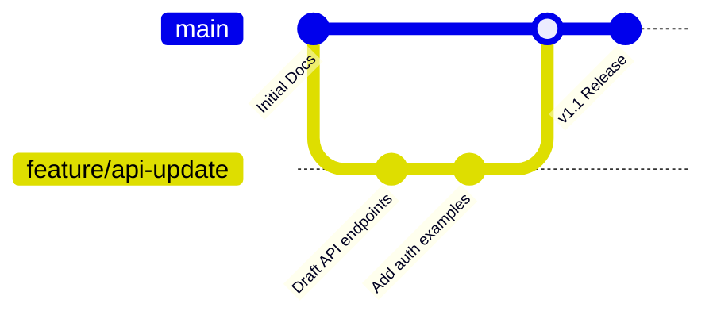

# Version control systems
*Why managing documentation in repositories is crucial for modern collaborative environments*

---

In the modern software development lifecycle, documentation is no longer an afterthought. It is a core component of the product. Version control systems (VCS), specifically [Git](https://git-scm.com/){: target="_blank" rel="noopener" }, allow technical writers to manage documentation with the same rigor, transparency, and collaborative efficiency as engineers.

By [treating documentation like code](../doc-stack/docs-as-code.md), teams ensure that the *story* of the software evolves in lockstep with the software itself.

---

## The single source of truth

The most significant advantage of using Git for documentation is the establishment of a *single source of truth*. When documentation lives in the same repository as the source code:

- **Synchronization:** Documentation updates can be part of the same commit as the code change, which ensures the UI and the docs never drift apart.
- **Auditability:** Every change is timestamped and attributed to an author. You can *blame* a file to see exactly who wrote a specific sentence and why.
- **Release alignment:** Using Git tags, you can maintain different versions of documentation for different versions of the software (for example, v1.0 docs versus v2.0 docs).

---

## Essential Git concepts

Git is a distributed version control system. For a writer, the workflow generally revolves around moving content through three states:

1.  **Staging area (`git add`):** Selecting which files are ready to be saved.
2.  **Commit (`git commit`):** Taking a *snapshot* of the staged changes.
3.  **Push (`git push`):** Sending your local snapshots to the central server, such as [GitHub](https://github.com/){: target="_blank" rel="noopener" } or [GitLab](https://about.gitlab.com/){: target="_blank" rel="noopener" }.

!!! tip "Meaningful commit messages"
    A good commit message follows the imperative mood: *"Add installation steps for Linux"* instead of *"I added some stuff."* This practice makes the project history searchable and professional.

---

## Branching strategies

Writers use branching to work on multiple tasks simultaneously without affecting the live documentation site.

- **Main/Production branch:** The *live version* of the documentation that users see.
- **Feature branches:** Private workspaces where you draft new content.

---

## The pull request workflow

The pull request (PR) is the heart of collaborative technical writing. It is a formal request to merge your feature branch into the main branch. 

- **Peer review:** Other writers check for style, grammar, and voice. See our guide on [review and approval workflows](../doc-lifecycle/review-approval.md) for details.
- **Technical review:** Engineers review the PR to ensure the technical instructions are accurate.
- **Automated checks:** Many repositories run [linters](../doc-stack/prose-linting.md) on the PR to check for broken links or formatting errors before the *Merge* button is enabled.

---

## Conflict resolution

A merge conflict occurs when two people edit the same line of the same file simultaneously. While intimidating to beginners, conflicts in Markdown are generally easier to solve than in code.

!!! warning "Handling conflicts"
    When Git detects a conflict, it marks the file with `<<<<<<< HEAD` and `>>>>>>>`. You must manually choose which version of the text to keep, remove the Git markers, and re-commit the file.

---

## Git etiquette for writers

To keep a repository healthy, professional writers follow specific etiquette:

- **Atomic commits:** Keep commits small and focused on one topic.
- **Squashing:** If you have 20 *typo fix* commits, squash them into one clean commit before merging to keep the history readable.
- **Rebasing:** Use `git rebase` to pull in the latest changes from the main branch so your work is always based on the most current version of the project.

---

## Beyond the terminal

While the command-line interface (CLI) offers the most power, many writers prefer graphical user interface (GUI) tools to visualize their changes.

- **IDE integrations:** Editors such as [Visual Studio Code](https://code.visualstudio.com/){: target="_blank" rel="noopener" } have built-in Git sidebars that show *diffs* (side-by-side comparisons of what changed).
- **Desktop clients:** [GitHub Desktop](https://desktop.github.com/){: target="_blank" rel="noopener" } or [Sourcetree](https://www.sourcetreeapp.com/){: target="_blank" rel="noopener" } provide a visual map of branches and commit histories, making complex operations such as stashing much more intuitive.

---

## Git quick reference for technical writers

This reference guide covers the most common commands you will use in a typical [documentation sprint](../doc-lifecycle/agile-workflows.md).

| Action | Command | Purpose |
| :--- | :--- | :--- |
| **Download** | `#!bash git clone [url]` | Copy a remote repository to your local machine. |
| **Update** | `#!bash git pull` | Fetch the latest changes from the team. |
| **Create** | `#!bash git checkout -b [name]` | Create a new branch for your draft. |
| **Save** | `#!bash git commit -m "message"` | Snapshot your changes with a description. |
| **Upload** | `#!bash git push origin [name]` | Send your branch to the server for review. |
| **Status** | `#!bash git status` | See which files are modified or staged. |
| **History** | `#!bash git log --oneline` | View a simplified list of past commits. |

## Technical writing daily workflow checklist
- [ ] **Pull** the latest changes from `main`.
- [ ] **Create** a new feature branch for the specific task.
- [ ] **Write** and edit your Markdown files.
- [ ] **Add** and **Commit** changes frequently.
- [ ] **Push** to the remote repository.
- [ ] **Open** a pull request for peer and technical review.
- [ ] **Merge** once all comments are resolved.