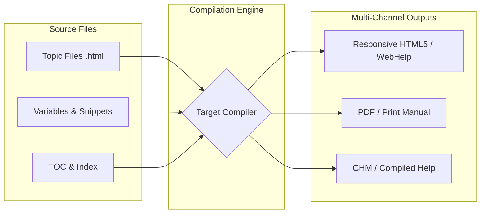

# Help authoring tools

> *Understanding the legacy and current state of proprietary publishing software*

---

A help authoring tool (HAT) is software designed specifically to allow technical writers to create, compile, and publish user help files, manuals, and software documentation. 

Help authoring tools emerged in the early 1990s during the growth of consumer desktop software as the primary tools for creating the help menus bundled with operating systems. Unlike standard word processors, help authoring tools introduced the technical writing industry to single-source publishing, variables, conditional text, and automated index generation. 

While modern software development has increasingly shifted toward open-source, markup-based [Docs as Code](../doc-stack/docs-as-code.md) workflows, proprietary help authoring tools are still used heavily in enterprise, medical, and defense sectors that require highly managed print and digital publishing pipelines.

This guide explores the historical evolution, compilation architectures, and current state of help authoring tools.

---

## Evolution of help formats

To understand the architecture of help authoring tools, you must understand the output formats they were designed to generate. Help formats have evolved alongside web and desktop technologies since their introduction in the early 1990s.

- **WinHelp (.hlp):** WinHelp was a proprietary, binary-based format introduced with Windows 3.0. It relied on Rich Text Format (.rtf) files compiled with strict footnote-based mapping to generate hyperlinks and search indexes.
- **Compiled HTML Help (.chm):** Compiled HTML Help (CHM) was released with Windows 98. It revolutionized help delivery by wrapping standard HTML pages, CSS styles, and JavaScript into a single, highly compressed binary file. It remains the standard three-pane desktop help window (table of contents on the left, content on the right).
- **WebHelp and responsive HTML5:** The modern standard. WebHelp is not a single file, but a generated package of standard HTML5 pages, CSS, and search index files designed to be hosted on a web server or accessed locally in a browser.

---

## Multi-channel compilation model

The defining technical advantage of a help authoring tool is its single-source compilation engine. Instead of writing different documents for web portals, print PDFs, and desktop help screens, technical writers author standard, semantically structured topics once. 

During the compilation phase, the HAT engine combines these source topics with a specific target configuration to generate different outputs.



This compilation model ensures that if an installation step changes, the technical writer updates the source topic file once and recompiles. All targets (web, PDF, and CHM) are then updated.

---

## Core features of proprietary HATs

To handle complex documentation suites, modern help authoring tools rely on a suite of proprietary single-sourcing features:

### Variables and snippets

- **Variables:** Small, flat strings of text, such as product names or version numbers, that you can insert inline. If the product name changes, updating the variable value updates the entire project.
- **Snippets:** Reusable blocks of formatted content such as a warning notice or an installation table. Unlike variables, snippets can contain complex HTML formatting, images, and nested lists.

### Conditional tag expressions

Technical writers use conditional tags to show or hide content based on the target output. This conditional filtering can be represented mathematically as a boolean logic filter:

$$\text{Output} = A \land \neg B$$

Where $A$ is the target-specific tag (for example, `Platform:macOS`) and $B$ is the excluded target tag (for example, `Audience:InternalOnly`). This logic allows a single topic file to contain instructions for both macOS and Windows, outputting only the relevant steps during target compilation.

---

## Proprietary HATs versus Docs as Code

As [Git](../doc-stack/git.md) and [lightweight markup languages](../doc-stack/markup-languages.md), such as Markdown and AsciiDoc, gained mainstream adoption, the technical writing community divided into two primary camps: proprietary HAT traditionalists and Docs as Code advocates.

| Feature | Help authoring tools | Docs as Code |
| :--- | :--- | :--- |
| **User interface** | WYSIWYG visual editor | Text editor (such as VS Code) |
| **Source files** | Proprietary XML or XHTML schemas | Lightweight markup (Markdown, AsciiDoc) |
| **Version control** | Proprietary database locks or Apache Subversion (SVN) | Distributed version control (Git) |
| **Styling engine** | Custom visual stylesheet editors | Standard CSS, Tailwind, or Syntactically Awesome Style Sheets (Sass) |
| **Best suited for** | Print-heavy, complex PDF and web outputs | Developer documentation, API portals |

While Docs as Code provides agility for software development teams, proprietary help authoring tools remain dominant in regulated industries because of their superior visual PDF generation engines, which can handle complex print pagination, margins, and indexes.

---

## Security and the retirement of legacy formats

Teams migrating legacy files to modern systems must understand why older help formats were retired. Security vulnerabilities were the primary driver of this industry-wide shift.

### Security risks of the CHM format

CHM files became a significant security vulnerability because they use the Windows HTML rendering engine to display content within the high-privilege Local Machine Zone (LMZ). 

This architectural flaw allowed scripts within a help file to bypass typical browser sandboxing and invoke system-level ActiveX controls, which could run malicious commands with the user's local administrative permissions. 

### Transition to modern standards

To mitigate these security exploits, Microsoft restricted CHM execution over networks. Modern operating systems now block local CHM files by default unless a user explicitly unblocks them in the system properties. These security restrictions forced the industry to move away from legacy binary formats and adopt WebHelp and Responsive HTML5 as the new standards for documentation delivery.

---

## Standard publishing commands

Documentation teams use the command-line interface (CLI) to automate builds and integrate HAT projects into [continuous integration and continuous delivery (CI/CD) pipelines](../doc-stack/cicd.md#the-pipeline-concept). Most compilers follow a standard syntax to run headless builds.

Common CLI operations include the following:

**Run a build for a specific target**

Use this command to generate a specific output, such as a web portal or a PDF manual.

```cmd
<compiler_name>.exe -project "C:\projects\HelpDocs.<project_extension>" -target "WebHelp_HTML5"
```

**Clean the output directory before building**

Use a "clean" flag to remove stale files from previous builds before generating new content.

```cmd
<compiler_name>.exe -project "C:\projects\HelpDocs.<project_extension>" -target "WebHelp_HTML5" -force-clean
```

**Override variables during the build**

You can pass new values for variables, such as version numbers or release dates, directly through the CLI without modifying the source files.

```cmd
<compiler_name>.exe -project "C:\projects\HelpDocs.<project_extension>" -target "WebHelp_HTML5" -variable "ProductVersion=2.5.0"
```

After you run the command, the compiler processes the source directories, applies the target conditional tags, generates the search index, and saves the completed package into your distribution directory.
