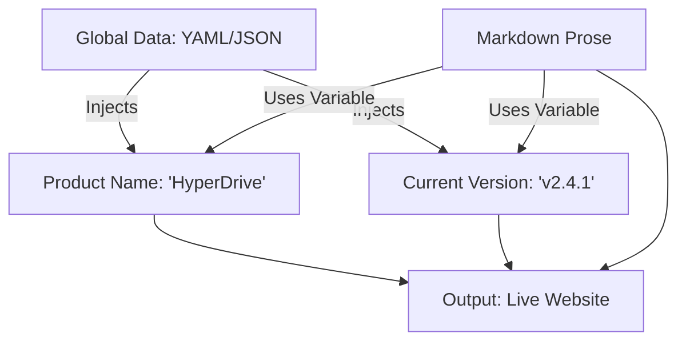

# Knowledge base architecture
*Strategic planning for folder structures, internal linking, and content hierarchy to ensure long-term document findability*

---

While [information architecture (IA)](../references/ia-design.md) focuses on the user’s experience and how they navigate content, knowledge base (KB) architecture focuses on the technical writer’s management of files, data, and assets. A well-architected KB ensures that as your documentation grows from 50 pages to 5,000, the system remains scalable, maintainable, and free of technical debt.

---

## Strategic alignment and governance

The structural integrity of a KB depends on clear ownership and a deep understanding of what the user actually needs. This is the "blueprint" phase of the architecture.

- **Knowledge needs analysis (K-Needs):** Before creating folders, identify information gaps. Use support ticket trends, search queries from your existing site, and [subject matter expert (SME) interviews](../doc-lifecycle/sme-interviewing.md) to determine what content is missing.
- **Defining management roles:**
    - **Knowledge manager:** Oversees the entire structure and style standards.
    - **Content creators:** SMEs or writers who draft the raw material.
    - **Editors:** Ensure the content meets the [seven Cs](../technical-writing/7-cs.md) and [linguistic standards](../technical-writing/plain-language.md).
- **Knowledge champions:** Identify high-performing SMEs within engineering or product teams who can validate technical accuracy and advocate for a "documentation-first" culture.

---

## Repository organizational models

How you organize your files in your version control system such as [Git](https://git-scm.com/){: target="_blank" rel="noopener" } dictates how easily your team can find and edit content.

- **Modular (pillar-based) structure:** This is the standard for large KBs. It mirrors your top-level navigation (e.g., `/api-reference`, `/tutorials`, `/troubleshooting`) and makes permissions management and file discovery intuitive. Refer to [structured authoring frameworks](../references/structured-authoring.md) for information about modular design.
- **The [PARA Method](https://fortelabs.com/blog/para/){: target="_blank" rel="noopener" }:** A productivity-focused model where content is sorted by actionability:
    1.  **Projects:** Active tasks with a deadline
    2.  **Areas:** Ongoing responsibilities (for example, "Product X Release Notes")
    3.  **Resources:** General interests or research
    4.  **Archives:** Completed or legacy items
- **Intermediate packets:** Instead of trying to write a massive guide in one go, architect your knowledge base to store *packets*. These are discrete units of work, such as research notes or meeting transcripts, that you can later assemble into a polished article.

---

## File and asset management

Standardizing the plumbing of your repository prevents the two biggest KB killers: broken links and cluttered folders.

- **Human-readable slugs:** Always use kebab-case for filenames and URLs (for example, `user-authentication-guide.md`). Avoid spaces, underscores, or capital letters, which can cause issues in different server environments.
- **Asset architecture:** 
    - **Global assets:** Keep shared icons or company logos in a root `/assets/images` folder.
    - **Contextual assets:** For screenshots unique to a single article, keep the image in the same folder as the `.md` file. This makes it easier to delete or move the article without leaving "orphaned" images behind.

---

## Content engineering and decoupling

Content engineering involves separating the data (the what) from the prose (the how). This allows you to update a single value in one place and have it reflect across the entire KB.

- **Global variables:** Store repetitive strings such as product names, support emails, or version numbers in a central data file using [YAML](https://yaml.org/){: target="_blank" rel="noopener" } or [JSON](https://www.json.org/){: target="_blank" rel="noopener" }.
- **Snippets and partials:** If you have a "Warning" about electrical safety that appears on 20 different pages, create one `safety-warning.md` snippet. Include that snippet on those 20 pages so that a single edit updates them all.
- **Frontmatter standardization:** Use mandatory [YAML frontmatter](../doc-stack/metadata-frontmatter.md) at the top of every file to track `author`, `last_updated`, and `status: (draft/review/published)`.

---

## Findability and internal linking

Architecture must facilitate *pathing*, which refers to the ease with which a user moves between related concepts. Ensure your [internal linking](../references/ia-design.md) strategy supports this movement.

- **Relative versus absolute paths:** 
    - Use **relative paths** (`../folder/file.md`) within your repository so that the links work even if the entire project is moved or previewed locally.
- **Navigational aids:** 
    - **Breadcrumbs:** `Home > Security > Encryption`
    - **Redirection mapping:** If you move a page from `/setup` to `/install`, create a redirect so that old bookmarks do not result in a 404 error.

---

## Writing standards for the KB

Prose in a KB should be architected for digital-first consumption. Users do not read KBs like novels; they scan them for answers.

- **The answer-first principle:** Place the solution or the summary at the very top. Do not make users read 500 words of history before getting to the command they need to run.
- **Action-oriented titling:** Use strong verbs. 
    - *Bad:* "Password Information"
    - *Good:* "How to Reset Your Password"
- **Skimmability:** Use highlighting for key terms, H2/H3 headers for hierarchy, and bulleted lists for sequences.

---

## Maintenance and lifecycle

A KB is a living organism. Without a maintenance architecture, it will succumb to content rot.

!!! danger "Warning: Content Rot"
    Content rot occurs when documentation becomes inaccurate, orphaned (unlinked), or redundant. This destroys user trust faster than having no documentation at all.

- **Link rot scanning:** Use automated tools to check for broken external URLs monthly.
- **Orphaned file audits:** Regularly search for Markdown files that exist in your folder but are not linked in any navigation menu.
- **Measuring effectiveness:** Use sentiment widgets ("Was this helpful?") to identify which articles are failing to solve user problems and to calculate your [documentation return on investment (ROI)](../doc-lifecycle/roi.md).

---

### Structural audit matrix

Use this matrix to identify legacy patterns in your current documentation and the architected solutions required to modernize them.

| System Element | Legacy Pattern (Brittle) | Architected Solution (Scalable) |
| :--- | :--- | :--- |
| **File naming** | *"Setup Guide Final v2.docx"* | `initial-setup-guide.md` (Versioned via Git) |
| **Images** | Pasted directly into the documentation | Stored in `/assets` with descriptive alt text |
| **Repeated text** | Copied and pasted across 10 pages | Created as a *snippet* and "included" |
| **Product names** | Hard-coded into every sentence | Managed via *global variables* |
| **Organization** | One giant folder with 100 files | *Modular* folders based on user goals |
| **Navigation** | Manually typed links on a "Home" page | Automated *sidebars* and *breadcrumbs* |
| **Updates** | *"When someone remembers"* | Scheduled *content certifications* |

???+ tip "Architecture pro-tip: The 'last updated' rule"
    Do not rely on the file system date for your "Last Updated" stamp. Use Git-based metadata or explicit frontmatter. This ensures that a simple formatting fix does not trick users into thinking the technical content was recently verified.