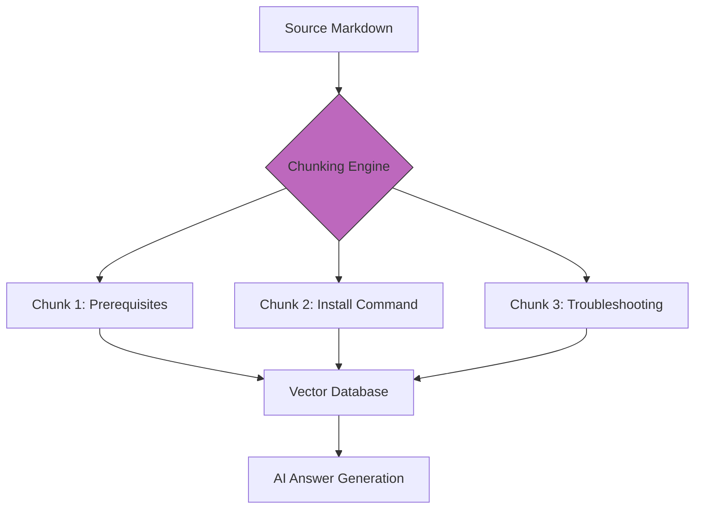

# Machine-Readable Content Standards
*How to structure documentation for AI scrapers, RAG systems, and LLM context windows*

---

In the current technological landscape, human eyes no longer exclusively consume documentation. Content now serves as the primary training data and knowledge source for artificial intelligence. 

Whether through Large Language Models (LLMs) or Retrieval-Augmented Generation (RAG) systems, you must optimize your documentation for machine readability to ensure AI-generated answers are accurate, relevant, and helpful.

---

## Semantic structure and hierarchy

For an AI scraper or an LLM, the hierarchy of a page provides a contextual map of the content. A flat document with poor heading usage is difficult for a machine to parse.

- **Header integrity (H1–H4):** AI models use headers to understand the relationship between concepts. An H2 header defines a major topic, while an H3 header represents a subset of that topic. 
- **Predictable flow:** Maintain a logical sequence. Do not skip header levels, for example, jumping from H1 to H3, as this confuses the parent-child relationship logic used by indexing algorithms.
- **Descriptive titling:** Use noun-heavy, descriptive headers. Instead of *Introduction*, use *Introduction to API Authentication via OAuth2*. This provides the AI with immediate keyword context.

---

## Chunking strategy for RAG

RAG systems work by breaking documentation into small pieces, or *chunks*, which are then converted into mathematical vectors. When a user asks a question, the AI retrieves the most relevant chunks to generate an answer.

- **Atomic content:** Write in atoms of information. Each section under an H2 or H3 header should be able to stand alone. If a section requires context from five pages away to be understood, the AI will likely struggle to provide a complete answer.
- **Chunk size optimization:** Keep paragraphs focused on a single idea. Long, rambling sections are harder for RAG systems to index effectively, which leads to diluted search results.



This flowchart illustrates the RAG pipeline: source documentation is decomposed into discrete topical chunks, indexed in a vector database, and retrieved as specific context for AI-generated responses.

---

## Structured data

While [Markdown](../doc-stack/markup-languages.md) is great for humans, [JavaScript Object Notation for Linked Data (JSON-LD)](https://json-ld.org/){: target="_blank" rel="noopener" } is the native language of web crawlers and AI. By embedding [Schema.org vocabularies](https://schema.org/docs/schemas.html){: target="_blank" rel="noopener" }, you provide the machine with explicit hints about your content type.

- **How-to schema:** This identifies the steps, tools, and required time for a task.
- **FAQ schema:** This maps questions to answers, which allows AI to bypass prose and move straight to the solution.
- **SoftwareApplication schema:** This provides metadata about versions, requirements, and download links.

---

## Markdown hygiene and UTF encoding

LLMs process text in tokens. Messy Markdown or non-standard characters waste the context window of the AI. This refers to the limited amount of information the model can process at one time.

- **Utf-8 encoding:** Ensure all files use Unicode Transformation Format (UTF). Non-standard encoding can lead to hallucinated characters that break the AI’s understanding of your code snippets.
- **Noise reduction:** Strip out fluff language. Words such as "basically," "actually," and "simply" add no value to the machine and waste token space that could be used for actual technical data. Using [plain language](../technical-writing/plain-language.md) improves both human and machine comprehension.
- **Clean code fences:** Always specify the language in code blocks, for example, ` ```python `. This helps the AI identify syntax versus prose.

---

## Eliminating hallucination

AI hallucination, which occurs when an LLM provides incorrect facts, is often the result of poor-quality input data. As a technical writer, you are the data quality engineer for the AI.

!!! danger "Garbage In, Garbage Out"
    If your documentation contains conflicting instructions, outdated parameters, or ambiguous descriptions, the AI will reflect those errors in its answers. High-quality, verified documentation is the only cure for AI hallucination.

---

## AI-friendly metadata

[Metadata](../doc-stack/metadata-frontmatter.md) provides the provenance or the truth score for your content. In a RAG system, metadata filters help the AI prioritize the right information.

- **`last-updated`:** This helps the AI ignore legacy content in favor of newer versions.
- **`product-version`:** This is crucial for preventing the AI from giving a user *Version 1* instructions for a *Version 3* product.
- **`audience-level`:** This helps the AI adjust its tone (for example, explaining a concept simply for a *Beginner* tag versus being brief for an *Architect* tag).

---

## Feedback for improvement

You can use the AI as a tool to improve the machine readability of your own site. By analyzing the content gaps identified by AI search logs, you can see what users are asking that your documentation has not yet answered.

!!! tip "AI content audit"
    Ask an LLM: *"Based on this page, what are three common follow-up questions a developer might have that are NOT answered in the text?"* Use the response to create new chunks of information.

---

### Machine-ready blueprint: JSON-LD for FAQ

To help AI scrapers index your troubleshooting sections quickly, embed a structured data block such as the example below. The data block explicitly defines the question-answer relationship in a way that search engines and LLMs can consume instantly.

```html
<script type="application/ld+json">
{
  "@context": "https://schema.org",
  "@type": "FAQPage",
  "mainEntity": [{
    "@type": "Question",
    "name": "How do I reset my API token?",
    "acceptedAnswer": {
      "@type": "Answer",
      "text": "Navigate to Settings > Security and click the 'Rotate Token' button."
    }
  }]
}
</script>
```

---

### Implementation checklist: AI-optimization

- **Semantic check:** All pages have exactly one H1 header and follow a logical H2, H3, and H4 hierarchy.
- **Encoding check:** All `.md` files are verified as UTF-8 encoded.
- **Metadata check:** The `last_updated` and `version` fields are included in every frontmatter block.
- **Syntax check:** Every code block has a language identifier (for example, `#!bash`).
- **Visual check:** All images and diagrams have descriptive [alt text](../references/accessibility.md) or a text-based equivalent, such as [Mermaid.js diagrams](../doc-stack/diagrams-as-code.md), for the AI to read.
- **Noise check:** Remove filler words to maximize token efficiency in the LLM context window.