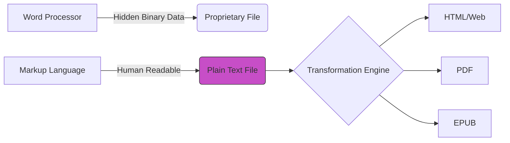

# Lightweight markup languages
*Understanding Markdown and other text-based formats for consistent content creation*

---

Lightweight markup languages are the backbone of modern technical documentation. Unlike traditional word processors that use proprietary binary formats (such as `.docx`), lightweight markup uses simple, human-readable plain text. This shift allows technical writers to use the same workflows as developers because they can treat documentation as code.

---

## The rise of plain text

For decades, technical writers were tethered to *what you see is what you get* (WYSIWYG) editors. However, as the industry moved toward [Docs as Code](../doc-stack/docs-as-code.md), plain text became the gold standard for several reasons:

- **Version control mastery:** Plain-text files allow for granular "diffs" in [Git](../doc-stack/git.md). You can see exactly which word was changed in a pull request.
- **Longevity:** Plain text is not dependent on a specific software version. A [Markdown](../doc-stack/markup-languages.md#markdown-fundamentals) file created today will still be readable in 50 years.
- **Automation:** Text files are easily processed by scripts, allowing for automated spell-checking, link validation, and site generation.



---

## Markdown fundamentals

Markdown is the most popular lightweight markup language because of its extreme simplicity. However, because the original 2004 specification was loose, several flavors emerged.

- **[CommonMark](https://commonmark.org/){: target="_blank" rel="noopener" }:** The highly standardized, rigorous version of Markdown used to ensure consistency across different platforms.
- **[GitHub Flavored Markdown](https://github.github.com/gfm/){: target="_blank" rel="noopener" } (GFM):** An extension of CommonMark that adds support for tables, task lists, and autolinks. It is now the de facto standard for developers.

### Common syntax

```markdown
# H1 Header
## H2 Header

1. Ordered list item
- Unordered list item

[Link Text](https://example.com)
**Bold Text** and *Italic Text*
```

---

## AsciiDoc

While Markdown is excellent for simple README files, many enterprise-level documentation projects choose [AsciiDoc](https://asciidoc.org/){: target="_blank" rel="noopener" }. It was designed specifically for technical writing and offers out-of-the-box features that Markdown requires plugins to achieve.

!!! info "Why Choose AsciiDoc?"
    AsciiDoc supports **Include Directives**, which allow you to write a chapter in one file and *pull* it into a master manual. It also handles complex tables, cross-references, and footnotes with native syntax.

---

## Syntax for structure

Structure drives the navigation and [information architecture (IA)](../references/ia-design.md) of your documentation site. 

- **Headers:** Use `#` for H1 (Title) and `##` for H2 (subsections). [Transformation engines](../doc-stack/tech-stack.md#transformation-engines-and-api-documentation) use these to auto-generate the table of contents (TOC).
- **Lists:** Use `-` for bullets. For task lists, use `- [ ]` or `- [x]`.
- **Tables:** Use pipes (`|`) and dashes (`-`) to create data structures.

??? note "Click to see table syntax"
    ```markdown
    | Feature | Markdown | AsciiDoc |
    | :--- | :---: | :---: |
    | Ease of Use | High | Medium |
    | Complexity | Low | High |
    | Standard | GFM | Asciidoctor |
    ```

---

## Extending markup: Admonitions

Technical documentation often needs to highlight specific types of information. Admonitions provide a visual shorthand for these callouts.

!!! tip "Tip"
    Use these for *pro tips* or shortcuts that help the user.

!!! warning "Warning"
    Use these for critical information that could lead to errors or data loss.

!!! danger "Danger"
    Use these only for high-stakes warnings, such as hardware damage or security breaches.

---

## Code fences and highlighting

For developer-centric documentation, code must be formatted properly. Code fences (triple backticks) wrap code snippets. Adding a language identifier (such as `#!python` or `#!json`) triggers syntax highlighting.

````
```python hl_lines="2"
def calculate_pi():
    print("This line is highlighted for emphasis")
    return 3.14159
```
````

**Rendered code block**

```python hl_lines="2"
def calculate_pi():
    print("This line is highlighted for emphasis")
    return 3.14159
```

---

## Portability and conversion

One of the greatest strengths of lightweight markup is its portability. You are never locked in to a format.

The industry standard for conversion is [Pandoc](https://pandoc.org/){: target="_blank" rel="noopener" }, which is often called the Swiss Army Knife of document conversion. With a single command, you can convert a Markdown file into a Word document, a PDF, or even a slide deck.

**Example command:**
`pandoc input.md -o output.pdf`

---

## Syntax comparison cheat sheet

Use the tabs below to compare how the two most common languages handle the same structural elements.

=== "Headings"
    **Markdown:**
    ```markdown
    # Title
    ## Section
    ### Sub-section
    ```
    
    **AsciiDoc:**
    ```asciidoc
    = Title
    == Section
    === Sub-section
    ```

=== "Links and Images"
    **Markdown:**
    ```markdown
    [Label](https://url.com)
    
    ```
    
    **AsciiDoc:**
    ```asciidoc
    https://url.com[Label]
    image::image.png[Alt text]
    ```

=== "Callouts/Admonitions"
    **Markdown (Extended):**
    ```markdown
    !!! note
        This is a note.
    ```
    
    **AsciiDoc (Native):**
    ```asciidoc
    [NOTE]
    ====
    This is a note.
    ====
    ```

=== "Key combos"
    **Markdown (Extended):**
    ```markdown
    Press ++ctrl+c++
    ```
    
    **AsciiDoc (Native):**
    ```asciidoc
    kbd:[Ctrl+C]
    ```