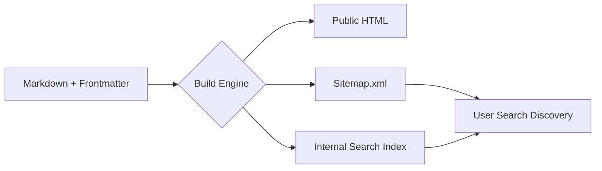

# Metadata schema and frontmatter
*Using YAML and other data structures to organize and optimize content for search engines*

---

Every Markdown file in a modern [documentation stack](../doc-stack/tech-stack.md) is more than just prose; it is a data object. While the body of the file contains the instructions for the human reader, the frontmatter provides the instructions for the machine. 

By using standardized metadata schemas, technical writers can automate site navigation, improve search engine rankings, and prepare their content for sophisticated AI-driven discovery.

---

## What is frontmatter?

Frontmatter is a block of structured data positioned at the top of a Markdown file. It is traditionally written in [YAML](https://yaml.org/){: target="_blank" rel="noopener" }, but [JSON](https://www.json.org/){: target="_blank" rel="noopener" } or [TOML](https://toml.io/){: target="_blank" rel="noopener" } are sometimes used. This block is fenced by triple dashes (`---`) and acts as the "identity card" for the document.

The [transformation engine](../doc-stack/tech-stack.md#transformation-engines-and-api-documentation) reads this data before processing the Markdown content. It uses the data to determine how the page should be styled, where it should appear in the navigation, and what metadata should be injected into the HTML `<head>`.

**Example YAML frontmatter**

```yaml
---
title: How to Configure API Keys
description: A step-by-step guide to generating and rotating your production API keys.
author: Jane Doe
date: 2026-05-20
status: published
tags: [security, api, setup]
---
```

---

## Standard metadata fields

A well-architected [documentation site](../doc-stack/ssg.md) or [knowledge base](../doc-stack/kb-architecture.md) relies on a consistent schema, which is a predefined list of keys that every technical writer must fill out. 

- **`title`:** This represents the primary heading of the page. It is often used for the browser tab title and the main H1.
- **`description`:** This provides a 150–160 character summary. This is crucial for the site’s internal search results and external search engine optimization (SEO).
- **`author`:** This tracks content ownership and is often used to generate "Written by" bylines.
- **`icon` / `image`:** They specify which visual asset should represent the page in card layouts or social media previews.

---

## Search engine optimization

Metadata is the primary tool for communicating with search engine crawlers. By explicitly defining SEO fields in the frontmatter, you ensure your documentation is the first result for user queries.

- **Meta-descriptions:** By defining a custom `description`, you prevent Google from grabbing random snippets of text that might not be helpful to the user.
- **Canonical URLs:** Use a `canonical` field when the same content exists in multiple places. For example, a "Getting Started" guide might appear in two different product sections. This tells search engines which version is the original, which prevents duplicate content penalties.
- **OpenGraph tags:** Metadata such as `og:title` and `og:image` ensures that when a link to your documentation is shared on Slack, LinkedIn, or X, it appears as a rich, professional preview card.

---

## Taxonomy management

Taxonomy is the science of classification. In a knowledge base, technical writers manage this by using `tags` and `categories`.

- **Site-wide filtering.** If a user clicks a tag labeled "Security," the transformation engine can instantly generate a list of every other page in the knowledge base that shares that tag.
- **Related articles.** Metadata allows the system to calculate relevance. If a user is reading about *encryption*, the system can look for other pages in the same category and suggest them at the bottom of the page.

---

## Conditional rendering

One of the most powerful uses of metadata is driving conditional text. This allows a single source file to serve different audiences.

For example, you might use a `role` or `platform` metadata key. During the build process, the transformation engine can check this data and choose to show or hide specific sections of the document.

!!! tip "Example: Multi-platform documentation"
    If your frontmatter has `platform: macos`, the build engine can automatically hide all "Windows-only" instructions in the body of the article to provide a cleaner experience for the user.

---

## Search engine crawlability

Metadata automation ensures that search engines can map your site efficiently.

- **Sitemaps:** Most static site generators (SSGs) use the metadata from your files to automatically generate a `sitemap.xml`.
- **Robots logic:** You can use a field such as `index: false` or `draft: true` to tell search engines to ignore specific pages, such as internal-only documentation or *Work in Progress* articles.

The following diagram illustrates the automated pipeline where metadata and frontmatter drive content discoverability. 



During the build phase, the engine processes your source files to generate the public HTML, a `sitemap.xml` for external search engines, and an internal search index, ensuring users can find relevant information by using either local or global search channels.

---

## AI context and freshness

With the rise of [Large Language Models (LLMs) and Retrieval-Augmented Generation (RAG)](../doc-stack/machine-readable-content.md) systems, metadata is more important than ever.

When an AI reads your documentation to answer a user's question, it uses metadata to determine relevance and freshness. A field such as `last-updated: 2026-01-10` tells the AI that this information is more reliable than an article from 2022. This metadata layer helps AI models provide more accurate, up-to-date answers to technical queries.

---

### Metadata schema blueprint

Below is a reference for the recommended *Mandatory* versus *Optional* fields to include in the frontmatter of your documentation.

| Key | Type | Requirement | Usage |
| :--- | :--- | :--- | :--- |
| `title` | String | **Mandatory** | Site navigation and H1 header |
| `description` | String | **Mandatory** | SEO and search result snippets |
| `author` | String | **Recommended** | Content ownership and contact |
| `date` | YYYY-MM-DD | **Recommended** | Sorts *Latest News* or *Recent Updates* |
| `tags` | List | **Optional** | Powers site-wide filtering and search |
| `status` | String | **Optional** | Used for build-time exclusions (for example, `draft`) |
| `canonical` | URL | **Optional** | Prevents duplicate content SEO issues |
| `version` | String | **Optional** | Supports multi-version documentation |

---

### JSON schema example

If you are using a tool that requires a strict JSON structure for metadata, your metadata header might look like this:

```json
{
  "document_meta": {
    "uid": "SEC-001",
    "title": "Encryption at Rest",
    "seo": {
      "keywords": ["AES-256", "security", "database"],
      "index": true
    },
    "lifecycle": {
      "created": "2025-12-01",
      "review_due": "2026-06-01"
    }
  }
}
```

!!! note "The 'DRY' principle"
    Do not repeat yourself. If a piece of metadata, such as the author's name, is the same for 100 files, consider setting it globally in your site configuration file rather than manually adding it to every single Markdown file.