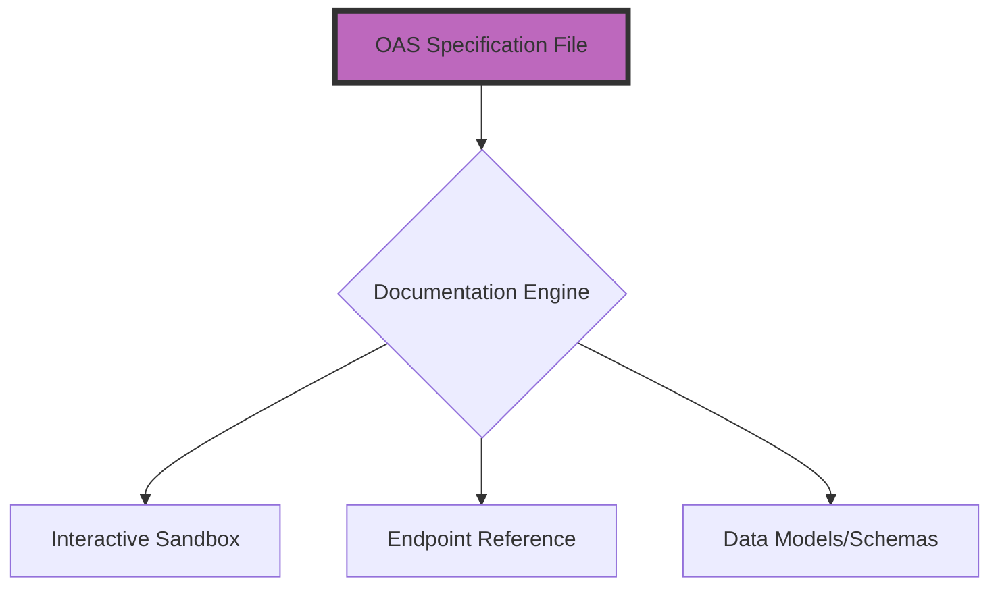

# OpenAPI Specification (OAS)
*A deep dive into the schema used to document RESTful API endpoints and parameters*

---

The [OpenAPI Specification (OAS)](https://www.openapis.org/){: target="_blank" rel="noopener" } is the industry-standard framework for describing RESTful APIs. OAS (formerly known as the Swagger Specification) acts as a universal language for describing APIs. It allows both humans and computers to understand what a service can do without needing to read the actual source code or know which programming language was used to build it.

For technical writers, using OAS is essential for moving from hand-crafted 'how-to' guides to the automated, interactive API documentation required by modern development teams.

---

## Industry standard: OAS as an IDL

In the modern web ecosystem, APIs act as the formal contracts between different software systems. To ensure these systems communicate effectively, they rely on what is known as an *interface definition language* (IDL).

An IDL is a standardized format used to describe a software's interface (its inputs, outputs, and behaviors) independently of the programming language used to build it. As a globally recognized IDL, the OpenAPI Specification provides a universal schema that allows you to:

- **Generate interactive documentation:** Automatically transform raw technical specifications into user-friendly, searchable websites.
- **Create Client SDKs:** Generate software development kits (pre-built code libraries) in dozens of programming languages, allowing developers to integrate your API in minutes rather than hours.
- **Automate testing:** Use the specification as a single source of truth to programmatically verify that the API's behavior matches the documentation’s promise.

---

## Human-readable versus machine-readable

OAS files are commonly written in [YAML](https://yaml.org/){: target="_blank" rel="noopener" } or [JSON](https://www.json.org/){: target="_blank" rel="noopener" }. Using these text-based formats allows teams to manage API definitions using the same version control and automation tools found in a standard [Docs as Code](../doc-stack/docs-as-code.md) workflow.

- **Machine-readable:** Computers can parse the file to build "Try it Out" consoles and mock servers.
- **Human-readable:** Since YAML uses indentation and clear keys, a technical writer can read and edit the specification directly in a code editor, versioning it in [Git](../doc-stack/git.md) alongside the engineering team's code.

---

## Core OAS components

A standard OpenAPI file is organized into several mandatory sections that define the surface area of the API.

- **`info`:** Metadata about the API (title, version, description, license).
- **`servers`:** The base URLs where the API can be accessed (for example, `production` or `staging`).
- **`paths`:** The endpoints of the API (for example, `/users` or `/orders`).
- **`methods`:** The HTTP verbs used to interact with paths (GET, POST, PUT, DELETE).
- **`parameters`:** The inputs required for an API call (Header, Query, or Path parameters).
- **`responses`:** What the user gets back (HTTP status codes such as `200 OK` or `404 Not Found`).

---

## Modeling data with schemas

API documentation is only as good as its description of the data. OAS uses schemas to describe the structure of JSON request and response payloads.

Instead of writing *"The response is a list of users"* for every single endpoint, you define a `User` schema in the `components` section once. You then reference that schema throughout the document. This ensures that if the `User` object changes (for example, adding a `phone_number` field), you only have to update it in one place.



This diagram illustrates the *single source of truth workflow*: a single OAS file is processed by a documentation engine to simultaneously generate the interactive testing tools, endpoint reference, and the standardized data schemas described above.

---

## Authentication schemes

Security is the most complex part of API documentation. OAS provides a structured `securitySchemes` section to document how users must prove their identity.

- **API keys:** Passing a unique string in the header.
- **Bearer tokens:** Using a temporary JSON Web Token (JWT) for session-based access.
- **OAuth2:** This includes complex authorization flows, such as "Login with Google." [OAuth 2.0](https://oauth.net/2/){: target="_blank" rel="noopener" } is the industry standard for these flows.

!!! tip "Clarity in security"
    Always provide a concrete example of the authorization header. Many developers struggle with the difference between `Authorization: [key]` and `Authorization: Bearer [token]`.

---

## Interactive reference docs

The most visible benefit of OAS is the creation of [interactive reference docs](../doc-stack/developer-portals.md). Tools such as [Swagger UI](https://swagger.io/tools/swagger-ui/){: target="_blank" rel="noopener" } or [Redoc](https://github.com/Redocly/redoc){: target="_blank" rel="noopener" } consume the OAS file and render a website where users can do the following:

1.  Read the descriptions of each endpoint.
2.  See the required data structures.
3.  Make a real or mocked API call ("Try it Out") directly from the browser to see the live response.

---

## Single sourcing: Spec-driven development

In a spec-driven workflow, the OAS file is created before the code is written. This allows the technical writer to design the developer experience (DX) alongside the architect.

Once the specification is finalized, it acts as the *single source of truth*. Engineers write code to match the specification, and the documentation is generated automatically from that same file. This ensures that the documentation and the actual API are never out of sync.

---

### Anatomy of an endpoint definition

This annotated YAML block demonstrates how a single GET request is structured within the OpenAPI schema.

```yaml
openapi: 3.0.0
info:
  title: User API
  version: 1.0.0

paths:
  /users/{userId}:           # The resource location
    get:                     # The HTTP method
      summary: Get User Profile
      description: Returns a single user's profile data based on their ID.
      parameters:
        - name: userId       # Path parameter definition
          in: path
          required: true     # Path parameters must always be required
          schema:
            type: string
      responses:
        '200':               # Success status code
          description: A successful response
          content:
            application/json:
              schema:
                $ref: '#/components/schemas/User' # Reference to the data model below
        '404':               # Error status code
          description: User not found

components:
  schemas:
    User:                    # This is the "User" model referenced above
      type: object
      properties:
        id:
          type: string
        name:
          type: string
        email:
          type: string
```

---

### API documentation readiness checklist

To ensure your OpenAPI file provides a top-tier developer experience, verify that you have included the following:

- [ ] **Clear summaries:** Do your endpoints have short, verb-based summaries such as "Create Order"?
- [ ] **Detailed descriptions:** Does every parameter explain what it is and why it is needed?
- [ ] **Realistic examples:** Did you provide sample JSON payloads for both requests and responses?
- [ ] **Error objects:** Did you document what the error response looks like, such as a `400 Bad Request` with an error message?
- [ ] **Server URLs:** Did you include the base URLs for production and sandbox environments?
- [ ] **Contact info:** Is there a `contact` object so developers know where to ask questions?