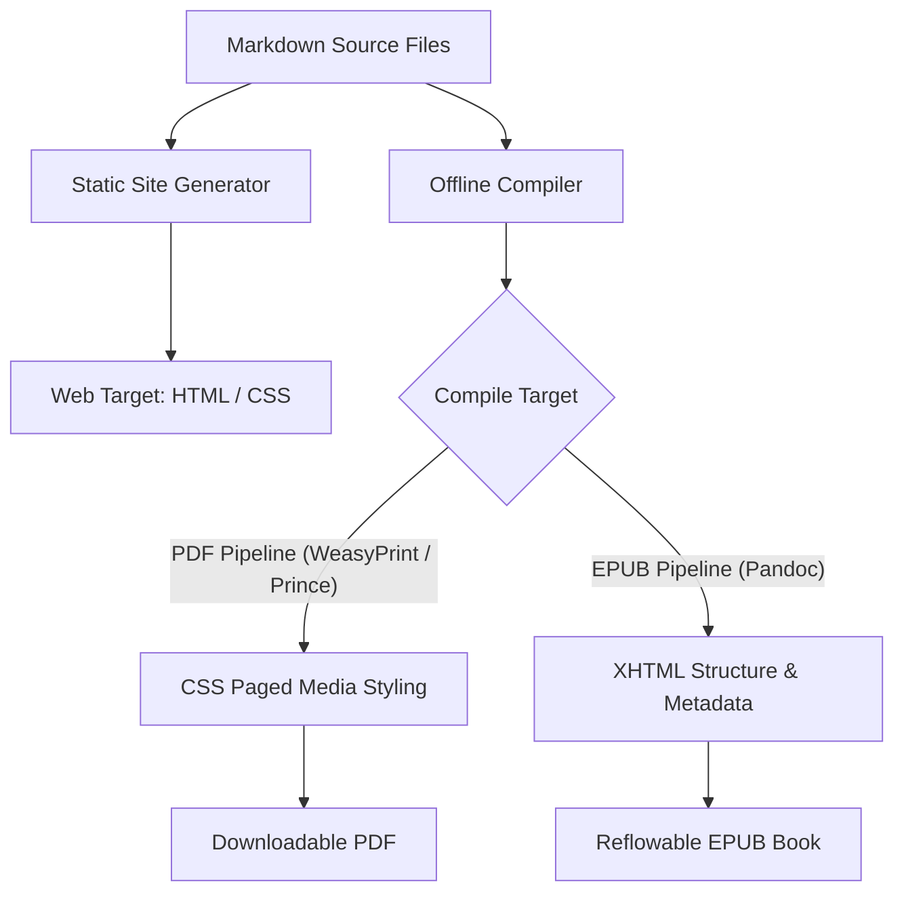

# Automated PDF and EPUB generation

> *Setting up your static site generator to export professional offline document versions*

---

While web-based documentation sites are the primary choice for modern software, many users still need offline access to technical information. Whether they work in highly secure offline environments, use reference-heavy hardware manuals, or read documentation on planes and tablets, providing high-quality PDF and EPUB manuals improves documentation usability.

In a [Docs as Code (DaC)](../doc-stack/docs-as-code.md) environment, you do not need to manually copy content into desktop publishing suites to create these files. Instead, you can configure your [static site generator (SSG)](../doc-stack/ssg.md) and [continuous integration (CI) pipelines](../doc-stack/cicd.md#the-pipeline-concept) to compile, style, and export professional offline documents automatically from your Markdown source.

By treating offline formats as build targets, you make sure that your PDF and EPUB guides are always synchronized with your web documentation without duplicating your writing efforts.

---

## The offline publishing pipeline

To automate compilation, your build system must treat [Markdown](../doc-stack/markup-languages.md#markdown-fundamentals) as a [single source of truth](../doc-stack/git.md#the-single-source-of-truth). When you push a documentation update, your web server builds the HTML pages while a parallel pipeline processes those same Markdown files into structured PDFs and reflowable EPUB books.



---

## CSS paged media: Styling professional PDFs

When converting HTML to PDF, many web-oriented layout techniques, such as infinite scrolling, flexible grids, and viewport-dependent positioning, must be adapted for paged output.

Modern technical pipelines use the W3C **CSS Paged Media Module** specification, which allows you to write standard CSS stylesheets that define print-specific elements such as page margins, custom headers, footers, and page numbers.

Most PDF rendering engines parse these specialized print stylesheets to determine exactly how content flows across physical page boundaries.

```css hl_lines="1 10"
@page {
  size: A4;
  margin: 20mm 15mm 20mm 15mm;

  @top-right {
    content: "User Reference Manual";
    font-family: sans-serif;
    font-size: 9pt;
  }

  @bottom-center {
    content: "Page " counter(page) " of " counter(pages);
    font-family: sans-serif;
    font-size: 9pt;
  }
}
```

### Page break controls

To prevent a heading from being stranded at the bottom of a page while its body paragraph starts on the next, use strict page-break controls in your print stylesheet. 

Modern browsers and PDF engines prefer the `break-before`, `break-after`, and `break-inside` properties, although many still support the legacy `page-break-*` properties for compatibility.

```css
/* Ensure H1 and H2 elements always start on a fresh page */
h1, h2 {
  break-before: page;
}

/* Prevent a page break immediately following a heading */
h1, h2, h3 {
  break-after: avoid;
}

/* Prevent code blocks and tables from splitting across pages when possible */
pre, table {
  break-inside: avoid;
}
```

??? tip "Control widows and orphans in CSS"
    An **orphan** is a single line of a paragraph left at the bottom of a page. A **widow** is a single line left at the top of a new page. You can control these typographic anomalies using standard CSS properties:
    
    ```css
    p {
      widows: 3;  /* Minimum of 3 lines forced to top of page */
      orphans: 3; /* Minimum of 3 lines forced to stay at bottom */
    }
    ```

---

## PDF versus EPUB architectures

Designing for PDF is different from designing for EPUB. The format you choose determines how you structure your build styles and compilation targets.

=== "PDF: Fixed layouts"
    
    - **Design philosophy:** Exact typographic control. Every page has fixed dimensions regardless of the viewing device.
    - **Visual controls:** Uses CSS paged media (`@page`) to define strict margins, header zones, and fixed print boundaries.
    - **Best use case:** Highly structured reference sheets, API catalogs, hardware assembly schematics, and desktop printing.
    - **Compilers:** HTML-to-PDF engines ([WeasyPrint](https://weasyprint.org/){: target="_blank" rel="noopener" }, [Prince](https://www.princexml.com/){: target="_blank" rel="noopener" }, or [Headless Chrome](https://developer.chrome.com/docs/chromium/headless){: target="_blank" rel="noopener" } using [Puppeteer](https://pptr.dev/){: target="_blank" rel="noopener" }).

=== "EPUB: Reflowable layouts"
    
    - **Design philosophy:** Fluid, reader-controlled layouts. The text reflows based on the user's font size, screen orientation, and device size.
    - **Visual controls:** Uses semantic XHTML and standard CSS stylesheets. Avoid absolute positioning and fixed container heights.
    - **Best use case:** Long-form narrative guides, conceptual tutorials, and textbooks read on e-readers, tablets, and mobile devices.
    - **Compilers:** [Pandoc](https://pandoc.org/){: target="_blank" rel="noopener" }, [Calibre](https://calibre-ebook.com/){: target="_blank" rel="noopener" } command-line tools, or other EPUB generation utilities.

---

## Select your compilation toolchain

Your pipeline's reliability depends on the engine you choose to process your source files. For technical writers managing large documentation sites, three primary toolchains are commonly used:

| Toolchain | Input formats | Ideal for | Pros | Cons |
| :--- | :--- | :--- | :--- | :--- |
| **WeasyPrint** | HTML and CSS | High-precision PDFs | Native CSS paged media support, open-source | Limited support for complex JavaScript execution |
| **Prince** | HTML and CSS | Commercial-grade PDFs | Industry-standard printing, handles large manuals | High cost for commercial licenses |
| **Pandoc** | Markdown | Multi-format (EPUB and PDF) | Versatile, highly scriptable, open-source | May require LaTeX or other engines for PDF generation |

If you already have an SSG rendering your Markdown to HTML, using **WeasyPrint** is one of the fastest paths to producing high-quality PDFs. It converts the generated HTML output into a PDF while applying your print stylesheet.

---

## Configure a headless PDF compilation script

You can integrate the following platform-agnostic Bash script into your local build environment or CI/CD workflow (such as [GitHub Actions](https://github.com/features/actions){: target="_blank" rel="noopener" }). The script invokes your static site generator to build the documentation site, converts the generated HTML into a PDF, and generates an EPUB from the Markdown source.

For larger documentation projects, it is common to generate a dedicated single-page HTML document specifically for PDF export so that all chapters appear in one continuous manual.

```bash
#!/bin/bash

# Exit immediately if a command exits with a non-zero status
set -e

echo "Starting offline document compilation..."

# Step 1: Build your static site generator's latest HTML files
npm run build-site

# Step 2: Convert the generated HTML into a PDF using WeasyPrint
weasyprint site-dist/index.html exports/user-guide.pdf \
  -s stylesheets/print-paged-media.css

# Step 3: Convert Markdown source files into a reflowable EPUB
# (Requires a shell that supports recursive glob expansion.)
pandoc source/**/*.md \
  -o exports/user-manual.epub \
  --toc \
  --metadata title="Technical User Manual" \
  --css=stylesheets/epub-reader-styles.css

echo "Compilation successful! PDFs and EPUBs exported to the /exports directory."
```

---

## Verification and quality checks

Before releasing compiled documents to your users, complete these verification steps:

* [ ] **Table of contents resolution:** Check whether all hyperlinks in the generated PDF table of contents point to the correct pages and whether page numbers update correctly.
* [ ] **Image boundary check:** Make sure that figures and graphics do not overflow page margins or become clipped during pagination.
* [ ] **Syntax highlight contrast:** Make sure that code block formatting and syntax highlighting remain legible on a white print background.
* [ ] **EPUB validation:** Run the generated EPUB through a validation tool such as `epubcheck` to verify compliance with EPUB, XML, and XHTML specifications.
