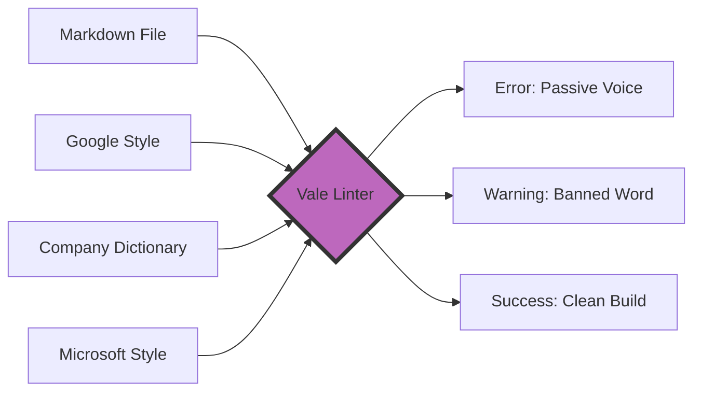

# Automated Prose Linting
*Implementing programmatic checks to maintain voice, tone, and grammar across large document sets*

---

In software development, linting refers to the process of running a program that analyzes code for potential errors and stylistic inconsistencies. Automated prose linting applies this same concept to the English language.

To complement their manual editorial process, technical writers use tools to enforce style guides programmatically, catching common issues such as split infinitives and passive voice. This ensures that the documentation maintains a consistent voice, tone, and professional standard across thousands of pages and dozens of contributors.

---

## The style guide as code

Traditionally, a company’s style guide was a static document, such as a PDF or a wiki page, that technical writers were expected to memorize and follow. In a modern documentation stack, the style guide is treated as code.

This involves translating the rules of established standards, such as the [Google Developer Documentation Style Guide](https://developers.google.com/style){: target="_blank" rel="noopener" }, the [Microsoft Writing Style Guide](https://learn.microsoft.com/en-us/style-guide/welcome/){: target="_blank" rel="noopener" }, or academic standards such as the [Modern Language Association (MLA)](https://www.mla.org/){: target="_blank" rel="noopener" }, into machine-readable configuration files. These files are commonly written in YAML. 

- **Programmatic rules:** If the style guide says to always use title case for headers, the linter checks every H1 and H2.
- **Version control:** Style rules are stored in [Git](../doc-stack/git.md). If the brand voice changes and you update the rule file, the change is immediately enforced across the entire repository.

---

## Introduction to Vale

[Vale](https://vale.sh/){: target="_blank" rel="noopener" } is the industry standard for prose linting in a [Docs as Code](../doc-stack/docs-as-code.md) workflow. Unlike basic spellcheckers, Vale is syntax-aware. It understands the difference between a code block, which it should ignore, and a paragraph of text, which it should analyze.

Vale works by breaking down your text into tokens and comparing it against styles. A style is a collection of individual rules that define what is acceptable. Since Vale is highly extensible, you can mix and match different styles (for example, use the Google rules for grammar, but add your company's specific product terminology).



This diagram illustrates the Vale processing pipeline: a Markdown file is analyzed against multiple style guides and custom dictionaries simultaneously to generate specific editorial feedback or a successful validation.

---

## Enforcing consistency

Consistency is the hallmark of professional documentation. Automated linting eliminates the subjective nature of editing by enforcing strict rules on the following:

- **Title case versus sentence case:** Ensure all headers are formatted identically.
- **Active voice:** Flag sentences that use passive structures and suggest [active voice](../technical-writing/active-passive.md) alternatives.
- **Banned words:** Filter out filler words that add no value, such as "simply," "just," "easy," or "basically."
- **Acronyms:** Check that every acronym is defined on its first use.

---

## Inclusive language

Modern documentation must be accessible and inclusive. Manual reviews often miss subtle biases or non-inclusive terminology. You can configure prose linters to scan for several elements.

- **Gendered language:** Suggest "they" or "the user" rather than "he" or "she."
- **Ableist language:** Identify terms that may be exclusionary to users with disabilities.
- **Technical bias:** Flag legacy terms and suggest modern alternatives based on [inclusive design principles](../references/accessibility.md).

---

## IDE integration

To be effective, linting must happen where the technical writer works. By integrating Vale into an integrated development environment (IDE) such as [Visual Studio Code](https://code.visualstudio.com/){: target="_blank" rel="noopener" }, technical writers receive real-time feedback.

As you type, the linter highlights errors with red squiggly lines in the same way a compiler does for a programmer. Hovering over the error reveals the specific style guide rule that is being violated. Oftentimes, the tool offers a "Quick Fix" to correct the text automatically.

!!! tip "Shift left"
    Providing feedback in the IDE is a *shift left* strategy. It moves quality control earlier in the process, which allows technical writers to fix mistakes before they submit their work for review.

---

## CI/CD gatekeeping

Automated linting is most effective when integrated into a [continuous integration (CI)](../doc-stack/cicd.md) pipeline. When a technical writer submits a pull request to a [GitHub](https://github.com/){: target="_blank" rel="noopener" } or [GitLab](https://about.gitlab.com/){: target="_blank" rel="noopener" } repository, the CI runner executes the linter.

If the prose contains error-level violations, such as a banned word or a broken style rule, the CI build fails. This prevents the documentation from being merged into the production site until the errors are resolved.

!!! danger "Warning"
    While CI/CD linting is powerful, use warning levels for subjective rules. Only use error levels for non-negotiable standards, such as legal disclaimers or brand names, to avoid frustrating your contributors.

---

## Reducing editor burden

Automated linting does not replace human editors. Instead, it empowers them. By automating the low-level checks, such as grammar, spelling, and style consistency, the human editor is freed from being a "comma hunter."

This allows the editor to focus on high-level content quality:

- **Accuracy:** Does this instruction actually work?
- **Structure:** Is the information presented in a logical order?
- **Empathy:** Does this guide solve the user's specific problem?

---

## Vale configuration blueprint

Below is a conceptual example of a `.vale.ini` configuration file. This file tells the linter which styles to apply and which files to ignore.

```ini
# Core Configuration
StylesPath = styles
MinAlertLevel = suggestion

# List the packages you want to use
Packages = Google, Microsoft, proselint

[*.md]
# Apply these styles to all Markdown files
BasedOnStyles = Vale, Google, MyCompanyRules

# Define specific rule overrides
Google.PassiveVoice = error
Google.FirstPerson = warning
MyCompanyRules.BannedWords = error
```

---

## Style enforcement comparison

The following table demonstrates how a linter transforms common technical writing anti-patterns into professional, style-compliant prose based on industry standards.

| Issue Category | Input (Non-Compliant) | Automated Suggestion | Style Goal |
| :--- | :--- | :--- | :--- |
| **Voice** | "*The database will be updated by the script.*" | "*The script updates the database.*" | **Active Voice** |
| **Fillers** | "*Simply click the button to start.*" | "*Click the button to start.*" | **Conciseness** |
| **Inclusivity** | "*Ask the developer for his credentials.*" | "*Ask the developer for their credentials.*" | **Gender Neutrality** |
| **Complexity** | "*This facilitates the utilization of...*" | "*This helps use...*" | **Plain Language** |
| **Clarity** | "*Refer to the FAQ for more info.*" | "*See the Frequently Asked Questions (FAQ) for more information.*" | **Professionalism** |
| **UI Reference** | "*Select the save icon.*" | "*Select the Save icon.*" | **Formatting Consistency** |

!!! quote "Key Insight"
    *"Consistency is the silent engine of user trust; automation is how we keep that engine running."*