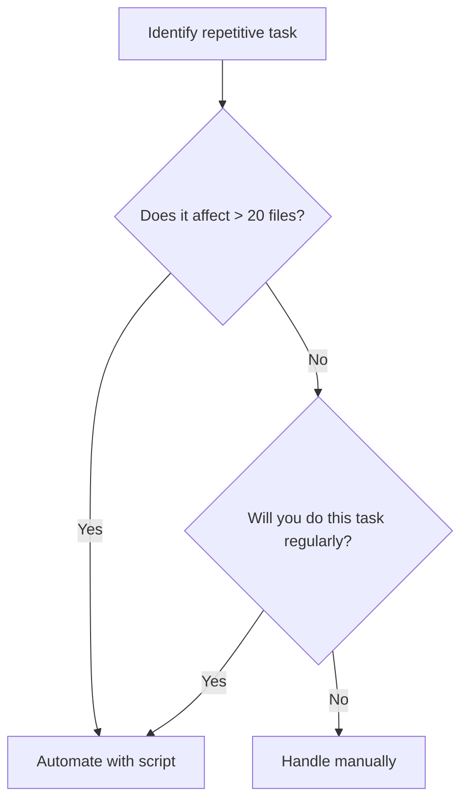

# Python for content automation

> *Using Python scripts to automate repetitive editing, metadata cleanup, and data parsing tasks*

---

As documentation repositories grow to hundreds or thousands of files, manual maintenance becomes difficult to scale. If you are tasked with updating copyright dates, restructuring nested folder paths, or standardizing front matter across entire directories, relying on manual search-and-replace is likely to introduce errors.

Writing small, targeted Python scripts shifts your workflow from repetitive tasks to scalable automation, which allows you to focus on high-value [content development](../doc-lifecycle/ddlc.md#phase-3-content-development).

This guide provides five practical, production-ready automation scripts designed to handle common document maintenance and data translation challenges.

---

## Determine your automation strategy

Before you write code, determine if a task is worth automating. Writing, testing, and debugging a script requires an upfront time investment. Use the **Rule of Three**: if you must perform a manual formatting or cleanup task more than three times, or if the task spans more than 20 files, it is a high-priority candidate for automation.



!!! note 
    The following examples are intentionally lightweight so that you can understand and adapt them easily. They illustrate common automation tasks for documentation teams rather than serving as complete replacements for dedicated tooling.

    The scripts progress naturally from content transformation (scripts 1–2), to quality assurance (scripts 3–4), and finally to workflow automation (script 5). This progression demonstrates that Python is not just for content automation; it can support the entire [documentation lifecycle](../doc-lifecycle/ddlc.md).

---

## 1. Bulk front matter and metadata modification

In a [Docs as Code](../doc-stack/docs-as-code.md) environment, updating [metadata headers (front matter)](../doc-stack/metadata-frontmatter.md#what-is-frontmatter) for hundreds of files is often difficult and time-consuming. If your platform introduces a new taxonomy or requires a `status: active` field on every page, manual updates are inefficient.

This script adds a missing `status: active` field to every [Markdown](../doc-stack/markup-languages.md#markdown-fundamentals) file in a folder that does not already have it, and can be configured to add any key-value pair.

```python
from pathlib import Path

# Configure the target directory
DOCS_DIR = Path("./docs")

def inject_metadata_tag(file_path, key, value):
    content = file_path.read_text(encoding="utf-8")

    if not content.startswith("---"):
        return  # No front matter block — skip this file

    parts = content.split("---", 2)

    if len(parts) >= 3:
        front_matter = parts[1]
        body = parts[2]

        # Check for the key at the start of a line, not just anywhere in the string
        key_exists = any(line.strip().startswith(f"{key}:") for line in front_matter.splitlines())

        if not key_exists:
            updated_front_matter = front_matter.strip() + f"\n{key}: {value}\n"
            updated_content = f"---\n{updated_front_matter}---\n{body}"
            file_path.write_text(updated_content, encoding="utf-8")
            print(f"Updated: {file_path.name}")

for md_file in DOCS_DIR.rglob("*.md"):
    inject_metadata_tag(md_file, "status", "active")
```

### Use the script

1. **Check requirements**: Make sure that Python is installed by running `python --version` in your terminal.
2. **Setup**: Save the code as `metadata_updater.py` in your project root.
3. **Configure**: Update `DOCS_DIR` to point to your documentation folder.
4. **Run**: Run `python metadata_updater.py` in your terminal.
5. **Verify**: Open a Markdown file to verify the `status: active` line exists in the YAML front matter.

---

## 2. Parse structured data (JSON to Markdown tables)

Technical writers often receive raw data, such as API parameters, in [JSON format](../doc-stack/json-logic.md). This script converts that data into a Markdown table.

```python
import json

raw_json_data = """
[
  {
    "parameter": "api_port",
    "type": "Integer",
    "default": "8080",
    "description": "The port the gateway listens on."
  },
  {
    "parameter": "enable_ssl",
    "type": "Boolean",
    "default": "true",
    "description": "Enforces HTTPS connections globally."
  }
]
"""

def json_to_markdown_table(json_string):
    data = json.loads(json_string)
    headers = [
        "Parameter", "Data Type", "Default Value", "Description"
    ]
    markdown_lines = [
        "| " + " | ".join(headers) + " |",
        "| :--- | :--- | :--- | :--- |"
    ]

    for item in data:
        # Escape pipes so cell content cannot break the table
        description = item["description"].replace("|", "\\|")
        row = [
            f"`{item['parameter']}`",
            item["type"],
            f"`{item['default']}`",
            description
        ]
        markdown_lines.append("| " + " | ".join(row) + " |")

    return "\n".join(markdown_lines)

print(json_to_markdown_table(raw_json_data))
```

### Use the script

1. **Setup**: Save the code as `json_to_table.py` in your project root.
2. **Input**: Replace the `raw_json_data` string with the JSON data provided by your engineering team.
3. **Run**: Run `python json_to_table.py` in your terminal.
4. **Output**: The script prints a formatted table to the terminal.
5. **Integrate**: Copy the terminal output and paste it into your `.md` file.

---

## 3. Broken internal link checker

As files move, internal cross-references often break. This script scans all Markdown files for internal links and verifies that the target files exist.

```python
import re
import sys
from pathlib import Path

DOCS_DIR = Path("./docs").resolve()

# Matches internal Markdown links, ignores external URLs, allows optional #anchor
LINK_REGEX = re.compile(
    r'\[.*?\]\((?![a-zA-Z][a-zA-Z0-9+.-]*:)([^)#]+?\.md)(?:#[^)]*)?\)'
)

def check_links():
    broken_found = False

    for md_file in DOCS_DIR.rglob("*.md"):
        content = md_file.read_text(encoding="utf-8")

        for link in LINK_REGEX.findall(content):
            # Resolve the link relative to the current Markdown file
            target = (md_file.parent / Path(link)).resolve()

            if not target.exists() or not target.is_file():
                relative_source = md_file.relative_to(DOCS_DIR)
                print(
                    f"Broken link in '{relative_source}': "
                    f"Target '{link}' not found."
                )
                broken_found = True

    return broken_found


if __name__ == "__main__":
    sys.exit(1 if check_links() else 0)
```

### Use the script

1. **Setup**: Save the code as `link_checker.py` in a `scripts/` folder in your project root.
2. **Configure**: Update `DOCS_DIR` to point to your documentation folder.
3. **Run**: Run `python link_checker.py` in your terminal.
4. **Review**: The script scans all Markdown files for internal links, resolves each link relative to the document that contains it, and reports any links whose target files cannot be found. It exits with status `1` if any broken links are detected.
5. **Fix**: Update the reported links or restore the missing target files, then rerun the script until no broken links are reported.

---

## 4. Unused image asset auditor

Over time, documentation image folders can become bloated with screenshots that are no longer referenced. This script identifies "orphan" images that you can delete.

```python
import re
from pathlib import Path

DOCS_DIR = Path("./docs").resolve()
IMG_DIR = (DOCS_DIR / "images").resolve()

VALID_EXTENSIONS = {".png", ".jpg", ".jpeg", ".gif", ".svg", ".webp"}

# Markdown images: 
MARKDOWN_IMAGE_REGEX = re.compile(
    r'!\[.*?\]\(([^)\s]+)(?:\s+"[^"]*")?\)'
)

# HTML images: 
HTML_IMAGE_REGEX = re.compile(
    r']*\bsrc=["\']([^"\']+)["\']',
    re.IGNORECASE,
)


def normalize(path: Path) -> Path:
    """Return a normalized absolute path."""
    return path.resolve()


def extract_image_paths(content: str):
    """Extract image paths from Markdown and HTML."""
    paths = []

    paths.extend(MARKDOWN_IMAGE_REGEX.findall(content))
    paths.extend(HTML_IMAGE_REGEX.findall(content))

    return paths


def find_unused_images():
    images = {
        normalize(img): img.relative_to(DOCS_DIR)
        for img in IMG_DIR.rglob("*")
        if img.is_file() and img.suffix.lower() in VALID_EXTENSIONS
    }

    used_images = set()

    for md_file in DOCS_DIR.rglob("*.md"):
        content = md_file.read_text(encoding="utf-8")

        for image_ref in extract_image_paths(content):
            # Ignore remote images
            if re.match(r"^[a-zA-Z][a-zA-Z0-9+.-]*://", image_ref):
                continue

            # Remove optional URL fragment/query
            clean_ref = image_ref.split("#", 1)[0].split("?", 1)[0]

            resolved = normalize(md_file.parent / clean_ref)

            if resolved in images:
                used_images.add(resolved)

    unused = sorted(set(images) - used_images)

    for orphan in unused:
        print(f"Unused image found: {images[orphan]}")


if __name__ == "__main__":
    find_unused_images()
```

### Use the script

1. **Setup**: Save the code as `image_audit.py` in your project root.
2. **Configure**: Update `DOCS_DIR` to point to your documentation folder. By default, `IMG_DIR` is set to the `images/` subdirectory inside `DOCS_DIR`; modify it if your image assets are stored elsewhere.
3. **Run**: Run `python image_audit.py` in your terminal.
4. **Review**: The script scans all Markdown files for Markdown image syntax (``) and HTML `` tags, resolves image paths relative to each document, and prints any image files that are not referenced.
5. **Verify**: Before deleting any reported files, confirm that they are not referenced outside of Markdown (for example, in CSS, JavaScript, HTML, templates, or other documentation formats that the script does not scan).

---

## 5. Automated Git hook validation

To prevent errors from reaching the main branch, you can automate your scripts to run every time someone attempts a commit. This script uses a Git pre-commit hook.

```bash
#!/bin/sh
# .git/hooks/pre-commit

echo "Validating documentation integrity..."

# Run the link checker and capture both stdout and stderr
python scripts/link_checker.py > /tmp/link_audit.log 2>&1

# Check the exit status of the previous command
if [ $? -ne 0 ]; then
    echo "ERROR: Broken links detected. Commit aborted."
    cat /tmp/link_audit.log
    exit 1
fi

echo "All checks passed!"
exit 0
```

!!! tip "Why this step uses bash instead of Python"
    Git hooks are executed directly by the operating system by using a shebang line, not by Python. Because of this, `sh`/`bash` is the standard, most portable choice for this kind of file. It avoids issues with `python` vs. `python3` paths across different machines. This hook does not do any of the actual checking itself; it simply calls your `link_checker.py` script and acts on its exit code.

### Use the script

1. **Location**: Go to the `.git/hooks/` directory in your project.
2. **Create**: Create a new file named `pre-commit` with no file extension.
3. **Paste**: Copy the script above and paste it into the file you created.
4. **Verify path**: Check whether `link_checker.py` is saved at `scripts/link_checker.py` relative to your project root. This hook calls the script at that exact path, so it will fail if the file is located elsewhere.
5. **Permissions**: Run `chmod +x .git/hooks/pre-commit` in your terminal to make the file executable.
6. **Test**: Try to commit a file with a known broken link. Git blocks the commit until the link is fixed.

---

## Content automation best practices

1.  **Read-only dry runs**: Always write scripts with a "dry run" flag. This prints the changes to the terminal without saving them, which helps you catch errors early.
2.  **Explicit file encoding**: Always declare `encoding="utf-8"`. Windows and macOS handle line endings and Unicode differently; specifying the encoding prevents cross-platform file corruption.
3.  **Version control first**: Never run a bulk-write script on a "dirty" Git tree. Commit your manual work first so you can use `git reset --hard` if the script produces unexpected results.