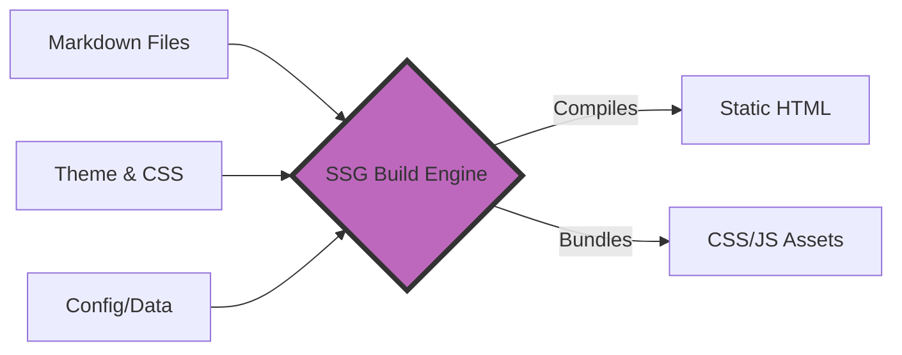

# Static site generators (SSGs)
*An overview of how SSGs turn text files into high-performance documentation websites*

---

An SSG is the engine that powers the modern [Docs as Code](../doc-stack/docs-as-code.md) workflow. Instead of relying on a heavy database to assemble pages every time a user requests them, an SSG pre-builds the entire website into flat HTML, CSS, and JavaScript files. 

For technical writers, this means you can write in plain text while the SSG handles the complex web architecture.

---

## Advantages of using SSGs

Documentation was traditionally hosted on dynamic content management systems (CMS), such as [WordPress](https://wordpress.org/){: target="_blank" rel="noopener" } or [Drupal](https://www.drupal.org/){: target="_blank" rel="noopener" }. Moving to an SSG provides three massive architectural advantages:

1.  **Blistering speed:** Servers do not have to query a database because the pages are pre-built flat files. The content is served instantly through a content delivery network (CDN).
2.  **Impenetrable security:** No databases are hacked and no login portals are exploited. A static site is simply a collection of read-only text files.
3.  **Low cost:** Hosting static files requires negligible server power.

---

## The build process

The core function of an SSG is the build process. This is the moment the software takes your raw documentation and *compiles* it into a website.

The end user's browser does not have to execute heavy JavaScript to construct the Document Object Model (DOM) on the fly because the SSG pre-renders the HTML. The DOM is ready to be painted to the screen the moment the page loads, which is why SSG documentation sites feel so snappy.



---

## Templating and layouts

How does a plain Markdown file get a header, a footer, and a sidebar? 

The SSG uses a templating engine, such as [Liquid](https://shopify.github.io/liquid/){: target="_blank" rel="noopener" }, [Jinja](https://jinja.palletsprojects.com/){: target="_blank" rel="noopener" }, or [Nunjucks](https://mozilla.github.io/nunjucks/){: target="_blank" rel="noopener" }.

Instead of writing the HTML shell for every page, you write it once in a layout file. Then, you use variables to inject the unique content. 

??? note "Click to see a templating example"
    If your template has `<h1>{{ page.title }}</h1>`, the SSG will look at your Markdown file, find the title, and automatically inject it into the HTML during the build process. If you want to change the layout, you edit one template file, and the SSG updates thousands of pages instantly.

---

## Navigation logic

In a traditional CMS, you have to manually build menus and link pages together. An SSG automates this [information architecture](../references/ia-design.md).

- **Auto-sidebars:** The SSG reads your folder structure (for example, a folder named `/api-guides/`) and automatically generates a nested sidebar menu.
- **Breadcrumbs:** The SSG calculates the path (`Home > API Guides > Authentication`) so users never get lost.
- **Pagination:** The SSG automatically injects **Next** and **Previous** buttons at the bottom of articles based on the file order.

---

## Data-driven content

Sometimes, technical writers need to manage repetitive and structured data such as a [glossary](../references/glossary.md), a list of error codes, or a directory of software tools. Writing these out in Markdown can be tedious and error-prone.

SSGs allow you to separate the data from the design. You can store your information in a lightweight JSON or YAML file. The SSG will loop through that data to generate a perfectly formatted table or list on the website.

---

## Theming and customization

While the SSG handles the structure, CSS handles the visual brand. Writing maintainable CSS is crucial because documentation sites can grow to thousands of pages.

Modern SSG themes often employ the [Block Element Modifier (BEM)](https://getbem.com/){: target="_blank" rel="noopener" } methodology. BEM is a naming convention that makes CSS highly predictable. 

- **Block:** The standalone entity (for example, `.sidebar`)
- **Element:** A part of the block (for example, `.sidebar__link`)
- **Modifier:** A specific state (for example, `.sidebar__link--active`)

By using BEM, UI developers ensure that changing the color of an active link in the sidebar does not accidentally change the links in the main text body.

---

## SSG project anatomy (local preview)

Before pushing changes to the live website, technical writers run a *local server* on their own computer. This allows for *hot reloading*. Every time you hit **Save** in your Markdown file, the browser refreshes instantly to show your changes.

To understand how an SSG manages this, look at the standard directory structure of an SSG project below. The tabs show the difference between what the technical writer edits (Input) and what the SSG builds (Output).

=== "Technical Writer's View (Input)"
    ```text
    my-docs-project/
    ├── config.yml           # Site title, navigation, plugins
    ├── data/
    │   └── glossary.json    # Data files for looping
    ├── layouts/
    │   └── default.html     # The HTML shell with Variables
    └── content/
        ├── index.md         # The homepage text
        └── installation.md  # A guide written in Markdown
    ```
    This is the clean, human-readable workspace where technical writers spend their time.

=== "Server's View (Output)"
    ```text
    my-docs-project/
    └── public/              # The auto-generated build folder
        ├── index.html       # Combined template + markdown
        ├── installation/
        │   └── index.html   # Transformed into web pages
        ├── css/
        │   └── style.css    # Minified styles
        └── js/
            └── search.js    # Bundled scripts
    ```
    This folder is generated purely by the SSG. This is what is sent to the web host. The technical writer never manually edits the files in this folder.

!!! tip "The golden rule of SSGs"
    **Never edit the `public/` or `build/` folder.** Any manual changes made to the generated HTML will be completely erased the next time the SSG runs a build!