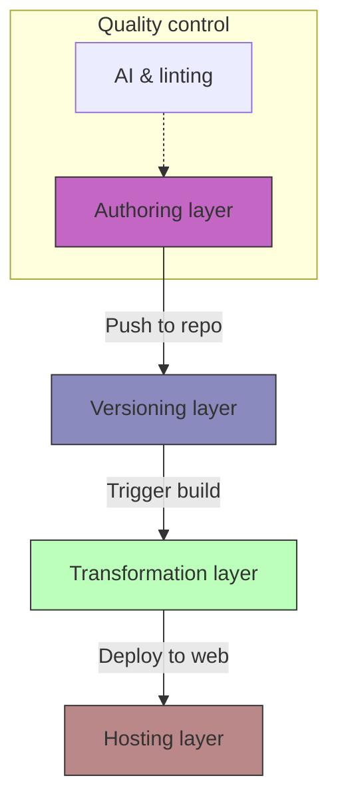

# Documentation tech stack directory
*A comprehensive look at the categories of software used in modern documentation pipelines*

---

The modern documentation pipeline is no longer a static repository of files; it's a dynamic knowledge management system (KMS). In today’s [Docs as Code](../doc-stack/docs-as-code.md) environment, a tech stack is an integrated ecosystem designed to manage the content lifecycle from the first keystroke in an editor to the delivery of a website.

This directory explores the layers of the modern documentation tech stack, categorized by their function within the professional workflow.

---

## Anatomy of a modern stack

To build a scalable documentation system, technical writers must think like engineers. A professional stack is generally composed of four distinct layers that work in sequence.

- **Authoring:** The environment where content is drafted (Markdown, XML, or structured text)
- **Versioning:** The system that manages history, branching, and peer review (Git)
- **Transformation:** The engine that converts raw files into HTML, PDF, or API consoles
- **Hosting:** The infrastructure that serves the content to the end user

---

## Authoring environments and internal wikis

The choice of an authoring tool is often dictated by the proximity of the technical writer to the code.

=== "Developer-centric"
    - **Integrated development environments (IDEs):** Tools such as [Visual Studio Code](https://code.visualstudio.com/){: target="_blank" rel="noopener" } and [Cursor](https://www.cursor.com/){: target="_blank" rel="noopener" } are the industry standard for Docs as Code. Using an IDE allows technical writers to use the same environment as developers, which facilitates collaboration and enables extensions for Markdown linting and Git integration.
    - **[Mintlify](https://mintlify.com/){: target="_blank" rel="noopener" } and [GitBook](https://www.gitbook.com/){: target="_blank" rel="noopener" }:** These hybrid platforms provide a browser-based editing experience while staying synced with a Git repository. These platforms are popular for API-first companies that require polished, modern interfaces.
    - **[Swimm](https://swimm.io/){: target="_blank" rel="noopener" }:** This tool couples documentation directly to code snippets. When the underlying code changes, Swimm alerts the technical writer that the documentation is potentially stale, which resolves the issue of out-of-sync documentation.

=== "Internal wikis"
    - **[Notion](https://www.notion.so/){: target="_blank" rel="noopener" }:** This platform is ideal for startups and fast-moving teams. It treats documentation as databases, allowing for complex tagging, project tracking, and easy internal sharing.
    - **[Confluence](https://www.atlassian.com/software/confluence){: target="_blank" rel="noopener" }:** This tool is the enterprise benchmark. If your engineering team uses [Jira](https://www.atlassian.com/software/jira){: target="_blank" rel="noopener" }, Confluence is the natural choice for internal specifications, meeting notes, and project requirements.
    - **[MS SharePoint](https://www.microsoft.com/en-us/microsoft-365/sharepoint/collaboration){: target="_blank" rel="noopener" } and [Viva](https://www.microsoft.com/en-us/microsoft-viva){: target="_blank" rel="noopener" }:** These are the standards for corporate environments heavily invested in the [Microsoft 365](https://www.microsoft.com/en-us/microsoft-365){: target="_blank" rel="noopener" } ecosystem.

=== "HATs and CCMS"
    - **[MadCap Flare](https://www.madcapsoftware.com/products/flare/){: target="_blank" rel="noopener" }:** This tool is designed for *single-source publishing*. One set of content can be exported to multiple formats, such as web, PDF, and print, with high variable control.
    - **[Paligo](https://paligo.net/){: target="_blank" rel="noopener" }:** This is a cloud-based *component content management system* (CCMS). It focuses on *content reuse*, which allows a single paragraph to be updated in one place and reflected across hundreds of different manuals.
    - **[Adobe RoboHelp](https://www.adobe.com/products/robohelp.html){: target="_blank" rel="noopener" }:** This legacy tool is used primarily for creating large help systems and professional policy manuals.

---

## Version control and collaboration

Modern documentation relies on Git-based platforms to verify transparency and accuracy. By using [version control](../doc-stack/git.md), writers can follow the same *definition of done* as the software they are documenting.

- **[GitHub](https://github.com/){: target="_blank" rel="noopener" }, [GitLab](https://about.gitlab.com/){: target="_blank" rel="noopener" }, and [Bitbucket](https://bitbucket.org/){: target="_blank" rel="noopener" }:** These platforms manage the *source of truth*. They facilitate **pull requests (PRs)**, where writers can tag engineers to review content for technical accuracy before the content is published.

- **Branching strategy:** Writers can create *draft branches* to work on unreleased features without affecting the live production documentation.

---

## Transformation engines and API documentation

Transformation engines are the compilers of the documentation world. They take flat text files and transform them into searchable, high-performance websites.

- **Static site generators (SSGs):**

    - **[MkDocs](https://www.mkdocs.org/){: target="_blank" rel="noopener" }:** This is a Python-based generator that is fast and easy to configure.
    - **[Docusaurus](https://docusaurus.io/){: target="_blank" rel="noopener" }:** This is a React-based engine built by Meta. It is ideal for large-scale documentation projects that require highly customizable interfaces and versioning support.

- **API documentation:**

    - **[Swagger](https://swagger.io/){: target="_blank" rel="noopener" } and [Redocly](https://redocly.com/){: target="_blank" rel="noopener" }:** These tools consume *OpenAPI specifications* (YAML/JSON) and render them into interactive consoles where developers can test API calls directly in the browser.
    - **[Levo.ai](https://www.levo.ai/){: target="_blank" rel="noopener" }:** This platform uses AI to discover and document APIs by observing production traffic. This ensures the documentation reflects how the API is used rather than just how it was designed.

---

## Content quality and AI automation

In the current landscape, manual editing is supplemented by automated gatekeepers that confirm every line of text meets brand standards.

!!! tip "Automated linting"
    Use **[Vale](https://vale.sh/){: target="_blank" rel="noopener" }**, an open-source prose linter, to enforce your company’s style guide automatically. Vale can check for passive voice, forbidden words, or complex sentence structures every time you save a file.

- **AI agents ([Ferndesk](https://buildwithfern.com/){: target="_blank" rel="noopener" }):** These agents monitor support tickets and GitHub commits. If a new feature is merged or a common user complaint arises, the AI drafts a documentation update for the writer to review.
- **[Guidde](https://www.guidde.com/){: target="_blank" rel="noopener" }:** This AI platform records your screen and generates a *how-to* video, complete with voiceovers and synchronized captions, which reduces the time spent on visual tutorials.

---

## Visual and asset management

Visuals are no longer just attachments; they are managed as code or automated captures.

- **Process capture:** **[Scribe](https://scribe.com/){: target="_blank" rel="noopener" }** and **[Tango](https://www.tango.us/){: target="_blank" rel="noopener" }** act as digital shadows. As you perform a task in your browser, they capture every click and generate a step-by-step guide with cropped, annotated screenshots.
- **Diagrams as code:** **[Mermaid.js](https://mermaid.js.org/){: target="_blank" rel="noopener" }** and **[Eraser](https://www.eraser.io/){: target="_blank" rel="noopener" }** allow you to write text to generate a flowchart. This ensures diagrams are version-controlled and easy to update.
- **[Loom](https://www.loom.com/){: target="_blank" rel="noopener" }:** This is the standard for *asynchronous video*. It uses AI to generate transcripts, summaries, and clickable chapters so users can jump to the information they need.

---

## The hosting and delivery layer

The final step is getting the content to the user. This is handled by specialized deployment platforms that offer global speed through content delivery networks (CDNs).

- **Git to deploy:** **[Netlify](https://www.netlify.com/){: target="_blank" rel="noopener" }**, **[Vercel](https://vercel.com/){: target="_blank" rel="noopener" }**, and **[Cloudflare Pages](https://pages.cloudflare.com/){: target="_blank" rel="noopener" }** connect directly to your GitHub repository. Every time you merge a PR, the site is automatically rebuilt and deployed in seconds.
- **Enterprise infrastructure:** **[AWS](https://aws.amazon.com/){: target="_blank" rel="noopener" } ([S3](https://aws.amazon.com/s3/){: target="_blank" rel="noopener" }/[CloudFront](https://aws.amazon.com/cloudfront/){: target="_blank" rel="noopener" })** and **[Azure](https://azure.microsoft.com/){: target="_blank" rel="noopener" }** provide the security and custom configuration required by large corporations with strict compliance needs.

---

## Choosing your stack

Use the following checklist to determine which toolset fits your current project requirements.

  

- ### :lucide-code: The developer stack
    **Ideal for:** API documentation and SaaS

    - **Editor:** VS Code
    - **SSG:** Docusaurus
    - **Host:** Vercel
    - **API:** Redocly
        
- ### :lucide-building: The enterprise stack
    **Ideal for:** large organizations and compliance

    - **Editor:** MadCap Flare
    - **CCMS:** Paligo
    - **Host:** AWS and S3
    - **API:** Swagger
        
- ### :lucide-users: The internal stack
    **Ideal for:** HR, operations, and startups
    
    - **Wiki:** Notion and Confluence
    - **Video:** Loom 
    - **Capture:** Scribe
    - **Search:** [Glean](https://www.glean.com/){: target="_blank" rel="noopener" }
        

!!! note "The golden rule of tooling"
    Always choose the tool that reduces friction between the subject matter expert (SME) and the documentation. If your developers live in GitHub, your documentation should live there too.