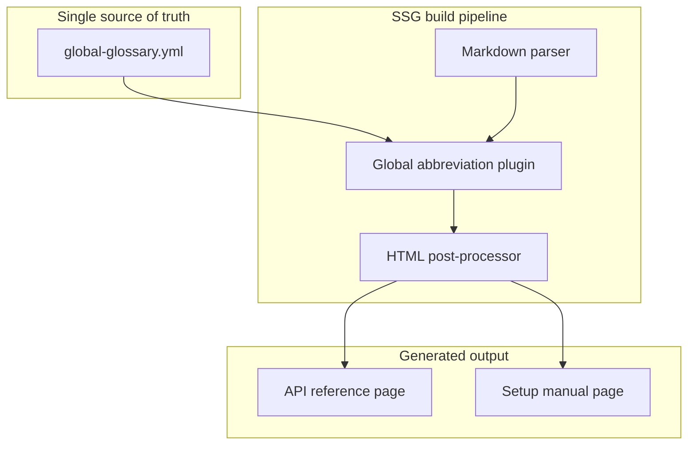

# Global terminology tooltips

> *Implementing standardized jargon by using hover tooltips across a large documentation site*

---

Managing specialized terminology, complex acronyms, and company-specific jargon is a persistent challenge for technical writing teams. If you assume your reader knows every term, you might alienate beginners. If you define every acronym inline, you clutter the prose for experienced users. 

Global terminology tooltips solve this dilemma by displaying definitions only when a user interacts with a highlighted term. When you implement tooltips at the build level, you can maintain a single centralized glossary database while automatically injecting interactive definitions across thousands of documentation pages.

This guide explores the system architecture, optimization rules, and [accessibility (a11y) requirements](../technical-writing/audience-analysis.md#accessibility-a11y-requirements) for implementing a global tooltip infrastructure.

---

## Compilation pipeline: Syntax to markup

Most modern [static site generators (SSGs)](../doc-stack/ssg.md) and documentation platforms support an abbreviation syntax by using [Markdown](../doc-stack/markup-languages.md#markdown-fundamentals) extensions. This syntax lets you declare terms and definitions at the bottom of a file, which the Markdown parser automatically compiles into semantic HTML.

### Source Markdown syntax

```markdown
The server expects a payload formatted in JSON.

*[JSON]: JavaScript Object Notation
```

During the build process, the Markdown engine parses this syntax and compiles it into a standard HTML `<abbr>` (abbreviation) element. The browser then displays the `title` text as a native tooltip when a user hovers over the word with a dotted underline.

### Compiled HTML output
```html
<p>The server expects a payload formatted in <abbr title="JavaScript Object Notation">JSON</abbr>.</p>
```

---

## System architecture for global abbreviations

While local abbreviations work well for single pages, pasting an abbreviation list at the bottom of every Markdown file is difficult to maintain. If a definition changes, you would have to edit hundreds of files.

To prevent this, implement a [single source of truth](../doc-stack/git.md#the-single-source-of-truth) using a global terminology file.



In this architecture, writers edit only `global-glossary.yml`. During the build pipeline, the custom compiler plugin reads the glossary file, scans every parsed HTML page, and wraps matching terms in the `<abbr>` tag before compiling the final public site.

---

## Designing for web accessibility

Tooltips can present accessibility barriers if implemented poorly. Screen reader users, keyboard-only navigators, and mobile users often cannot trigger standard mouse-hover states.

To ensure your tooltips are compliant with [Web Content Accessibility Guidelines (WCAG)](https://www.w3.org/TR/WCAG21/){: target="_blank" rel="noopener" } standards, apply the following markup rules:

*   **Keyboard focus:** Ensure all abbreviation tags can receive focus by adding a `tabindex="0"` attribute. This lets keyboard navigators focus on the term using the **Tab** key.
*   **Semantic tooltip signaling:** Use ARIA attributes to indicate to assistive technologies that a definition popup exists.

```html
<!-- Accessible custom tooltip element -->
<abbr tabindex="0" 
      aria-haspopup="dialog" 
      aria-describedby="tooltip-desc-json" 
      class="doc-tooltip">
  JSON
</abbr>

<span id="tooltip-desc-json" role="tooltip" class="tooltip-content">
  JavaScript Object Notation - A lightweight data-interchange format.
</span>
```

---

## Preventing tooltip fatigue: The first-occurrence rule

If your global glossary automatically converts every occurrence of a term into a tooltip, your pages will quickly become difficult to read. A page containing the word "API" 30 times would result in 30 dotted underlines, causing visual noise and cognitive overload.

To prevent this, configure your build-time post-processor script to enforce the **first-occurrence rule**: only convert the *first* instance of a matched term within a page's body text into an interactive tooltip.

### Defining tooltip density

You can measure and audit your site's visual noise by calculating your active tooltip density ($D$):

$$D = \frac{T_{\text{tooltips}}}{W_{\text{total}}} \times 100$$

Where:

- $D$ is the visual tooltip density percentage.
- $T_{\text{tooltips}}$ is the total number of compiled, active tooltips on a specific page.
- $W_{\text{total}}$ is the total word count of the page.

To maintain readability, your build pipeline's automated linter should flag any page where the tooltip density ($D$) exceeds **2%**.

---

## Architectural choices: Native versus JavaScript

When implementing tooltips, technical writing teams must choose between native browser rendering and JavaScript-powered rendering.

=== "Native HTML `<abbr>` tags"

    - **Pros:** Zero asset weight, instantly rendered by the browser's native engine, and excellent default accessibility.
    - **Cons:** Visual styling is limited and varies across operating systems. These tags cannot display rich text, such as links or images, inside the tooltip.

=== "JavaScript libraries"

    *(Examples include Tippy.js and Popper)*

    - **Pros:** Complete CSS styling control, support for custom animations, and the ability to include HTML formatting, code blocks, or links inside the tooltip box.
    - **Cons:** These libraries add JavaScript bundle weight to your site's load time and require client-side hydration (the process of attaching JavaScript logic to static HTML to make it interactive). This process can delay initial page interaction.

For standard technical documentation sites where load performance and search engine optimization (SEO) are crucial, native HTML `<abbr>` tags styled with lightweight, global CSS transitions are the recommended architectural path.