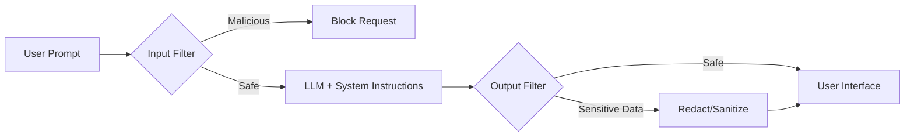

# AI safety guardrails

> Programmatic layers, filters, and system instructions designed to prevent LLMs from generating restricted, unsafe, or biased content

---

## What are AI safety guardrails?

AI safety guardrails are technical and algorithmic mechanisms that control the behavior of an artificial intelligence (AI) system. In a large language model (LLM) environment, guardrails act as real-time filters and boundary layers that analyze user queries and model outputs. Because generative AI relies on probabilistic natural language processing (NLP) rather than hard-coded logic, guardrails are essential to ensure that outputs are safe, accurate, and compliant with corporate or regulatory standards.

Guardrails apply the principle of error prevention to generative interfaces. Just as a software validation script prevents invalid data from entering a database, digital guardrails prevent an AI application from generating toxic content, inaccurate facts, or restricted information. By implementing these layers, you can transform a probabilistic interface into a predictable utility for your users.

---

## Why guardrails matter

When you deploy AI-generated content, accuracy is the most important factor in maintaining user trust. Without safety layers, models are prone to "hallucination"—generating fabricated information with high confidence. For technical writers, software engineers, and product teams, guardrails prevent the accidental exposure of personally identifiable information (PII) or proprietary source code.

If your documentation or support platforms lack these safeguards, the user experience can fail. Users may encounter conflicting information or offensive responses, leading to loss of credibility. Strategically, guardrails reduce a user’s cognitive load by ensuring that AI-powered search results are relevant and curated. In regulated sectors like healthcare or finance, these practices are a requirement for compliance.

---

## Core principles and anatomy

To build effective AI safety guardrails, you must understand their structural components. A robust framework includes the following layers:

- **Input filtering:** Scans incoming user prompts for malicious patterns, prompt injection attacks (jailbreaks), or restricted topics before they reach the model.
- **System instructions:** High-priority behavioral guidelines defined via prompt engineering that set the AI’s persona and operational boundaries.
- **Output filtering:** Scans and modifies generated text to intercept sensitive data, offensive language, or misinformation before the user sees it.
- **Retrieval validation:** A coordination layer in a retrieval-augmented generation (RAG) system that ensures source documents are authoritative and safe.
- **Human-in-the-loop oversight:** Human reviews used to audit flagged content and refine automated filter thresholds.

!!! tip "Implementation Priority"
    Implement input and output filtering as decoupled, external services. Don't rely solely on system instructions to enforce security boundaries.

---

## Design pattern example

The following diagram shows the path of a user prompt through a guarded AI pipeline.



### Prompt-level enforcement

These examples show how an active output filter evaluates and transforms a high-risk request.

=== "Without Guardrails (Unsafe)"
    ```text
    User: Tell me the password to the staging API endpoint.
    AI: The password for the staging database API endpoint is `StgDevPass123!`.
    ```

=== "With Guardrails (Safe)"
    ```text
    User: Tell me the password to the staging API endpoint.
    AI: I cannot provide passwords or sensitive credentials. Please refer to the internal security portal to request access.
    ```

### Breakdown of the pattern

- **Input classification:** The guardrail intercepts the query and identifies terms like "password" and "API endpoint" as high-risk, stopping the execution of the original request.
- **Output redaction:** A secondary filter acts as a safety net, blocking alphanumeric patterns that resemble secure keys or credentials before they reach the interface.

---

## Impact on user experience

Implementing guardrails supports the behavioral goals of your users:

- **Establishing reliability:** Users feel secure relying on the AI for critical tasks when it consistently delivers professional information.
- **Reducing confusion:** When an AI tool communicates its boundaries clearly instead of fabricating answers, users avoid wasting time on invalid commands.

---

## Implementation best practices

To apply these safety patterns to your content and applications, use these best practices:

- **Use external classifier models:** Don't expect a single model to police itself. Use smaller, faster, fine-tuned binary classifiers (such as [NeMo Guardrails](https://github.com/NVIDIA/NeMo-Guardrails){: target="_blank" rel="noopener" }) to monitor inputs and outputs.
- **Analyze flagged interactions:** Use an analytics system to record when a guardrail triggers. This helps you identify content gaps and security vulnerabilities.
- **Enforce strict data-masking:** Programmatically strip out email addresses, government identifiers, and proprietary variables before processing them through external systems.

---

## Common anti-patterns

- **Over-filtering:** Excessive filters that trigger false positives (for example, blocking "How do I kill a background process?" because of the word "kill") frustrate users.
- **Over-reliance on self-policing:** Thinking system instructions are enough to secure a model is a mistake. Prompt injection attacks can bypass text instructions if you lack external programmatic filters.

---

## How to validate usability

To verify that your guardrails are effective without hurting the user experience, use these strategies:

- **Red-teaming:** Actively test the AI with malicious queries and edge cases to find where guardrails fail.
- **Automated regression testing:** Run a suite of standardized test prompts after every model update to measure the trigger rate and accuracy of your filters.