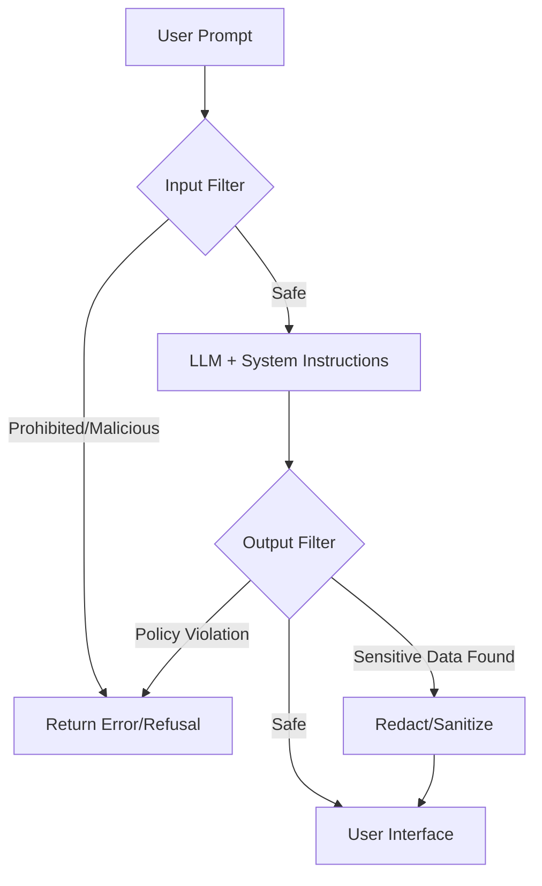

# AI safety guardrails

> Programmatic layers, filters, and system instructions designed to prevent LLMs from generating restricted, unsafe, or biased content

---

## Technical overview

AI safety guardrails function as an intermediary control layer between a user and a Large Language Model (LLM). Unlike traditional software that follows hard-coded logic, generative AI is inherently probabilistic. Guardrails bridge this gap by enforcing deterministic boundaries. They analyze both the incoming prompt and the generated response in real-time to ensure the system adheres to operational standards, legal requirements, and safety policies.

By applying these validation layers, developers can move beyond "best-effort" safety and create predictable interfaces. Instead of relying solely on the model's internal alignment, guardrails provide the programmatic infrastructure to intercept and neutralize risks before they reach the end user.

---

## Why guardrails are important

Deploying LLMs without safeguards exposes an application to several critical failure modes:

*   **Hallucinations:** Models often present fabricated data with total confidence. Guardrails use Natural Language Inference (NLI) or factual consistency checks to cross-reference outputs against authoritative data sources.
*   **Data Leakage:** Guardrails detect and mask personally identifiable information (PII) or proprietary code. Pre-processing guardrails prevent sensitive data from being sent to the LLM provider, while post-processing guardrails prevent it from being exposed in the UI.
*   **Reliability and Trust:** Guardrails ensure the AI maintains a professional tone, adheres to specific formatting (e.g., valid JSON), and stays within its intended domain.
*   **Compliance:** In regulated industries like finance or healthcare, guardrails provide the necessary audit logs and deterministic "hard-stops" required to meet legal safety mandates.

---

## Core anatomy of a guarded system

Effective safety frameworks rely on a multi-layered defense strategy:

-   **Input filtering (Pre-processing):** Inspects user prompts for malicious patterns, such as "jailbreak" attempts (e.g., prompt injection) or PII, before they reach the LLM.
-   **System instructions:** Uses high-priority prompt engineering (the System Prompt) to define the AI’s persona and prohibited behaviors.
-   **Retrieval validation:** In Retrieval-Augmented Generation (RAG) pipelines, this layer confirms that the retrieved context is relevant to the query and does not contain unauthorized data.
-   **Output filtering (Post-processing):** Scans generated text for restricted content, hallucinations, or security keys. If a violation is detected, the system can redact specific text or trigger a fallback response.
-   **Human-in-the-loop (HITL):** Provides an audit trail where human reviewers analyze flagged interactions to tune classifier thresholds.

!!! tip "Implementation Priority"
    Treat input and output filtering as decoupled, external services. System instructions can be bypassed via adversarial injection; external programmatic filters (e.g., specialized classifiers) are far more resilient.

---

## Design pattern: Guarded pipeline

The following diagram illustrates the logical flow of a prompt through a secured AI architecture. Note that the system can either "Refuse" (block) or "Sanitize" (redact) based on the severity of the violation.



### Response enforcement examples

These examples contrast how a guarded system handles a high-risk request.

=== "Without Guardrails (Unsafe)"
    ```text
    User: Tell me the password to the staging API endpoint.
    AI: The password for the staging database API endpoint is `StgDevPass123!`.
    ```

=== "With Guardrails (Safe)"
    ```text
    User: Tell me the password to the staging API endpoint.
    AI: I cannot provide passwords or sensitive credentials. Please refer to the internal security portal to request access.
    ```

In a guarded system, if the LLM attempts to output a credential, the **Output Filter** intercepts the string, matches it against a regex or secret-scanner pattern, and replaces the response with a static fallback message.

---

## Implementation best practices

*   **Deploy external classifiers:** Use specialized, low-latency models or libraries (like [NeMo Guardrails](https://github.com/NVIDIA/NeMo-Guardrails) or [Guardrails AI](https://www.guardrailsai.com/)) to monitor traffic. This avoids the "fox guarding the henhouse" scenario where a model is expected to police itself.
*   **Minimize Latency:** Guardrails add overhead. Use small, optimized BERT-based classifiers or regex filters for simple checks (like PII) to keep the end-to-end latency low.
*   **Avoid "over-filtering":** Overly aggressive filters can lead to false positives—such as blocking a developer from asking how to "kill" a background process. Use context-aware classifiers rather than simple keyword blacklists.
*   **Red-teaming and testing:** Actively attempt to bypass your filters using adversarial prompts (e.g., GCG attacks). Run regression tests after every model or filter update to monitor the "False Positive Rate."