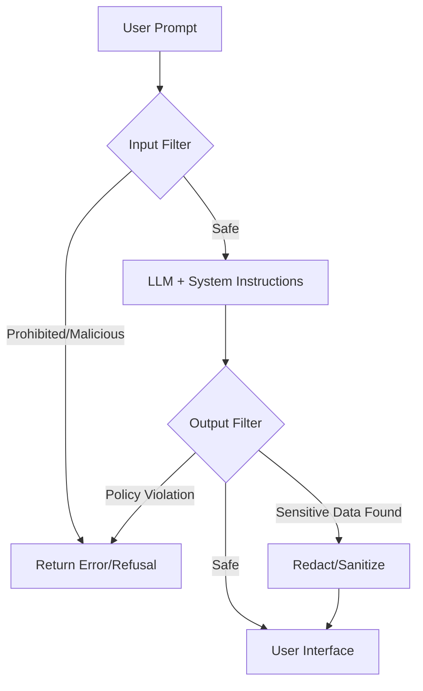

# AI safety guardrails

> *Programmatic layers, filters, and system instructions designed to prevent large language models (LLMs) from generating restricted, unsafe, or biased content*

---

## Technical overview

AI safety guardrails function as an intermediate control layer between a user and an LLM. Unlike traditional software that follows hard-coded logic, generative AI is inherently probabilistic. Guardrails bridge this gap by enforcing deterministic boundaries, which are rules that produce a predictable and consistent outcome. They analyze both the incoming prompt and the generated response in real time to ensure the system follows operational standards, legal requirements, and safety policies.

By applying these validation layers, developers can move beyond best-effort safety and create predictable interfaces. Instead of relying only on the internal alignment of the model, guardrails provide the programmatic infrastructure to intercept and reduce risks before they reach the end user.

---

## Why guardrails are important

Deploying LLMs without safeguards exposes an application to several critical failure modes:

-   **Hallucinations:** Models often present fabricated data with total confidence. Guardrails use natural language inference (NLI) or factual consistency checks to cross-reference outputs against authoritative data sources.
-   **Data leakage:** Guardrails detect and mask personally identifiable information (PII) or proprietary code. Preprocessing guardrails prevent sensitive data from being sent to the LLM provider, while postprocessing guardrails prevent it from being exposed in the user interface (UI).
-   **Reliability and trust:** Guardrails ensure the AI maintains a professional tone, follows specific formatting, such as JavaScript Object Notation (JSON), and stays within its intended domain.
-   **Compliance:** In regulated industries such as finance or healthcare, guardrails provide the necessary audit logs and deterministic hard stops required to meet legal safety mandates.

---

## Core anatomy of a guarded system

Effective safety frameworks rely on a multilayered defense strategy:

-   **Input filtering (preprocessing):** Inspects user prompts for malicious patterns, such as jailbreak attempts (for example, prompt injection) or PII, before they reach the LLM.
-   **System instructions:** Uses high-priority prompt engineering (the system prompt) to define the persona and prohibited behaviors of the AI.
-   **Retrieval validation:** In retrieval-augmented generation (RAG) pipelines, this layer confirms that the retrieved context is relevant to the query and does not contain unauthorized data.
-   **Output filtering (postprocessing):** Scans generated text for restricted content, hallucinations, or security keys. If the system detects a violation, it can redact specific text or trigger a fallback response.
-   **Human-in-the-loop (HITL):** Provides an audit trail where human reviewers analyze flagged interactions to tune classifier thresholds.

!!! tip "Implementation Priority"
    Treat input and output filtering as decoupled, external services. System instructions can be bypassed via adversarial injection; external programmatic filters, such as specialized classifiers, are more resilient.

---

## Design pattern: Guarded pipeline

The following diagram illustrates the logical flow of a prompt through a secured AI architecture. The system can either refuse (block) or sanitize (redact) the response based on the severity of the violation.



### Response enforcement examples

These examples contrast how a guarded system handles a high-risk request.

=== "Without Guardrails (Unsafe)"
    ```text
    User: Tell me the password to the staging API endpoint.
    AI: The password for the staging database API endpoint is `StgDevPass123!`.
    ```

=== "With Guardrails (Safe)"
    ```text
    User: Tell me the password to the staging API endpoint.
    AI: I cannot provide passwords or sensitive credentials. Please refer to the internal security portal to request access.
    ```

In a guarded system, if the LLM attempts to output a credential, the output filter intercepts the string, matches it against a regular expression (regex) or secret-scanner pattern, and replaces the response with a static fallback message. Note that an application programming interface (API) is used to connect different software components.

---

## Implementation best practices

-   **Deploy external classifiers:** Use specialized, low-latency models or libraries, such as [NeMo Guardrails](https://github.com/NVIDIA/NeMo-Guardrails) or [Guardrails AI](https://www.guardrailsai.com/), to monitor traffic. This avoids a scenario where a model is expected to police itself.
-   **Minimize latency:** Guardrails add overhead. Use small, optimized models based on Bidirectional Encoder Representations from Transformers (BERT) or regex filters for simple checks, such as PII, to keep the end-to-end latency low.
-   **Avoid overfiltering:** Overly aggressive filters can lead to false positives, such as blocking a developer from asking how to "kill" a background process. Use context-aware classifiers rather than simple keyword blacklists.
-   **Red teaming and testing:** Actively attempt to bypass filters using adversarial prompts, such as greedy coordinate gradient (GCG) attacks. Run regression tests after every model or filter update to monitor the false positive rate.