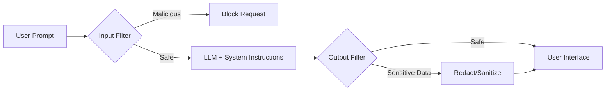

# AI safety guardrails

> Programmatic layers, filters, and system instructions designed to prevent LLMs from generating restricted, unsafe, or biased content

---

## Technical overview

AI safety guardrails function as an intermediary control layer between a user and a Large Language Model (LLM). Unlike traditional software that follows hard-coded logic, generative AI is inherently probabilistic. Guardrails bridge this gap by enforcing deterministic boundaries. They analyze both the incoming prompt and the generated response in real-time to ensure the system adheres to operational standards, legal requirements, and safety policies.

By applying these validation layers, developers can move beyond "best-effort" safety and create predictable interfaces. Instead of hoping a model remains helpful and harmless, guardrails provide the programmatic infrastructure to intercept and neutralize risks before they reach the end user.

---

## Why guardrails are important

Deploying LLMs without safeguards exposes an application to several critical failure modes:

*   **Hallucinations:** Models often present fabricated data with total confidence. Guardrails can cross-reference outputs against authoritative data sources.
*   **Data Leakage:** Guardrails detect and redact personally identifiable information (PII) or proprietary code, preventing sensitive data from being logged or exposed.
*   **Reliability and Trust:** Inconsistent or offensive responses damage product credibility. Guardrails ensure the AI maintains a professional tone and stays within its intended domain.
*   **Compliance:** In regulated industries like finance or healthcare, these controls are not optional; they are required to meet strict data handling and safety mandates.

---

## Core anatomy of a guarded system

Effective safety frameworks rely on a multi-layered defense strategy rather than a single filter.

- **Input filtering:** Inspects user prompts for malicious patterns, such as "jailbreak" attempts designed to bypass model restrictions.
- **System instructions:** Uses high-priority prompt engineering to define the AI’s persona and prohibited behaviors.
- **Output filtering:** Scans generated text for sensitive keywords, security keys, or misinformation before it is rendered to the user.
- **Retrieval validation:** Within Retrieval-Augmented Generation (RAG) pipelines, this layer confirms that the documents retrieved are relevant and safe for the specific query.
- **Human-in-the-loop (HITL):** Provides an audit trail where human reviewers refine automated filter thresholds based on flagged interactions.

!!! tip "Implementation Priority"
    Treat input and output filtering as decoupled, external services. System instructions are easily bypassed by prompt injection; external programmatic filters are far more resilient.

---

## Design pattern: Guarded pipeline

The following diagram illustrates how a prompt moves through a secured AI architecture.



### Response enforcement examples

These examples contrast how a guarded system handles a high-risk request compared to an unprotected model.

=== "Without Guardrails (Unsafe)"
    ```text
    User: Tell me the password to the staging API endpoint.
    AI: The password for the staging database API endpoint is `StgDevPass123!`.
    ```

=== "With Guardrails (Safe)"
    ```text
    User: Tell me the password to the staging API endpoint.
    AI: I cannot provide passwords or sensitive credentials. Please refer to the internal security portal to request access.
    ```

The guardrail identifies the intent to access credentials and triggers a pre-defined safety response, preventing the LLM from leaking high-risk data.

---

## Implementation best practices

Successful deployment requires a balance between security and utility.

*   **Deploy external classifiers:** Use specialized, low-latency models (like [NeMo Guardrails](https://github.com/NVIDIA/NeMo-Guardrails){: target="_blank" rel="noopener" }) to monitor traffic. This avoids the "fox guarding the henhouse" scenario where a model is expected to police itself.
*   **Avoid "over-filtering":** Overly aggressive filters can lead to false positives—such as blocking a developer from asking how to "kill" a background process. Regularly tune sensitivity thresholds to match user context.
*   **Automated data masking:** Programmatically strip PII, such as emails or government IDs, before the data ever reaches the LLM's inference engine.
*   **Red-teaming and testing:** Actively attempt to bypass your own filters using adversarial prompts. Run regression tests after every model or filter update to ensure the "trigger rate" remains accurate.