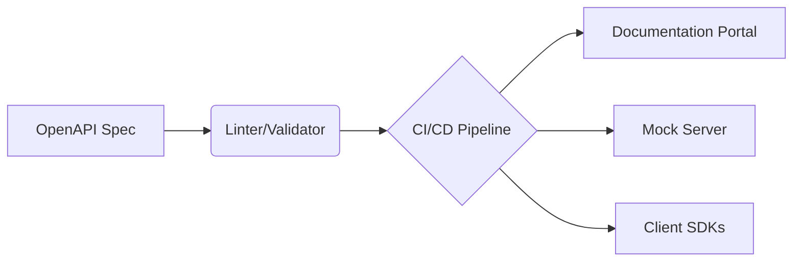

# API Documentation

> Documenting software endpoints, inputs, and outputs to help developers integrate and adopt APIs quickly and accurately

---

# What is API documentation?

API documentation is the technical reference that describes how to interact with an application programming interface (API). It provides the instructions necessary for developers, product teams, and technical writers to use the interface. This documentation defines available endpoints, authentication protocols, input parameters, request headers, and response formats—usually structured as JSON. By providing explicit instructions, this documentation helps separate software components communicate reliably.

In modern software environments, teams often use the [OpenAPI Specification (OAS)](https://www.openapis.org/){: target="_blank" rel="noopener" } to drive a spec-driven development workflow. Instead of manually writing references, you can use API documentation generators to extract metadata directly from source code annotations or machine-readable schema files. This approach integrates with docs-as-code pipelines, allowing technical writers and software engineers to use version control and publish updates to developer portals.



## Importance of API documentation

Quality API documentation improves the developer experience (DX). If an API is poorly documented, developer friction increases, leading to failed integrations, high support overhead, and project delays. Clear documentation accelerates onboarding, reduces the time-to-first-API-call, and helps [developer relations (DevRel)](https://en.wikipedia.org/wiki/Developer_relations){: target="_blank" rel="noopener" } initiatives.

If a team ignores documentation standards, several problems can occur:

*   **Out-of-sync endpoints:** Developers write code against stale parameters, which results in broken integrations.
*   **Undocumented breaking changes:** A lack of clear [Semantic Versioning (SemVer)](https://semver.org/){: target="_blank" rel="noopener" } alignment causes consumer applications to fail.
*   **Parsing errors:** Unclear object schemas lead to data format mismatches during processing.
*   **Increased support volume:** Internal engineering teams spend time answering repetitive questions instead of building new features.

## Syntax and structure

Modern API documentation relies on a structured schema. Whether you use [YAML](https://yaml.org/){: target="_blank" rel="noopener" } or [JSON](https://www.json.org/){: target="_blank" rel="noopener" }, the documentation requires specific core components to be machine-readable:

*   **Metadata block:** Includes the API title, description, and version.
*   **Servers:** The root addresses (base URLs) where the API hosts its services (such as sandbox or production).
*   **Paths and endpoints:** The specific URI paths where the API accepts requests.
*   **HTTP methods:** The actions allowed on the endpoint, such as `#!http GET`, `#!http POST`, `#!http PUT`, or `#!http DELETE`.
*   **Parameters:** Input requirements categorized by location: path, query string, header, or request body.
*   **Request and response bodies:** Detailed schemas showing the key-value pairs, data types, and required fields.
*   **Authentication:** Security schemes, such as API keys, Bearer tokens, or [OAuth 2.0](https://oauth.net/2/){: target="_blank" rel="noopener" }, required to authorize calls.

## Code example

The following example shows an OpenAPI 3.0 specification written in YAML. It details a single endpoint for a user directory service.

```yaml hl_lines="1 6 9 12"
openapi: 3.0.3
info:
  title: User Directory API
  version: 1.0.0
paths:
  /users/{id}:
    get:
      summary: Retrieve a user by ID
      parameters:
        - name: id
          in: path
          required: true
          schema:
            type: string
      responses:
        '200':
          description: User record retrieved successfully
          content:
            application/json:
              schema:
                type: object
                properties:
                  id:
                    type: string
                  name:
                    type: string
```

### How to read this example

*   **`openapi: 3.0.3`:** Specifies the version of the OpenAPI schema used to parse and render the page.
*   **`/users/{id}`:** Defines the relative endpoint path. It includes a path parameter placeholder (`{id}`) to target a specific user.
*   **`in: path`:** Identifies that the parameter must be sent in the URL path of the network request.
*   **`application/json`:** Declares that the response body is formatted as a JSON object.

## Common pitfalls and errors

When maintaining API reference pages, teams often encounter systemic errors that disrupt the user experience.

### API documentation drift

*   **Cause:** Engineers update application code but do not update the static documentation files or the OpenAPI spec files.
*   **Resolution:** Implement continuous documentation practices. Integrate validation tools into your CI/CD pipeline to ensure that documentation updates occur with every code release.

### Neglecting edge cases and error responses

*   **Cause:** Documentation only details the "happy path" (successful HTTP 200 responses) and ignores bad requests or server failures.
*   **Resolution:** Document standard HTTP error codes, such as 400 (Bad Request), 401 (Unauthorized), and 404 (Not Found). Explain what triggers these errors.

### Missing context and code snippets

*   **Cause:** The documentation provides a reference list of parameters but lacks functional examples in common programming languages.
*   **Resolution:** Combine reference sections with quickstart tutorials that demonstrate complete API requests and response lifecycles.

## Tooling and ecosystem

To scale API documentation, choose tools that integrate into your technical writing pipeline:

*   **Parsers and UI generators:** [Redocly](https://redocly.com/){: target="_blank" rel="noopener" }, [Swagger UI](https://swagger.io/tools/swagger-ui/){: target="_blank" rel="noopener" }, and [Stoplight Elements](https://stoplight.io/open-source/elements){: target="_blank" rel="noopener" }. These tools render YAML or JSON files into interactive portals.
*   **Linters and validators:** [Spectral](https://stoplight.io/open-source/spectral){: target="_blank" rel="noopener" } and [Vacuum](https://quobix.com/vacuum/){: target="_blank" rel="noopener" }. These utilities check that your specifications comply with style rules and industry best practices.
*   **Security scanners:** Use security guardrails to ensure endpoints do not expose personally identifiable information (PII) or system vulnerabilities.

## Best practices and validation

!!! tip "Practice spec-first development"
    Write and review your OpenAPI contract before writing application code. This ensures alignment between product design, engineering, and technical writing teams.

Follow these rules to maintain high-quality reference materials:

*   **Automate references:** Do not manually format API tables. Use API documentation generators to compile your YAML or JSON directly into your site.
*   **Enforce styling rules programmatically:** Add a linter like Spectral to your CI/CD workflow to flag schema errors before deployment.
*   **Provide functional mock servers:** Enable "Try It Out" consoles in your developer portal so users can test calls without writing code.
*   **Establish versioning parameters:** Align API changes with SemVer to signal when an update introduces breaking changes.