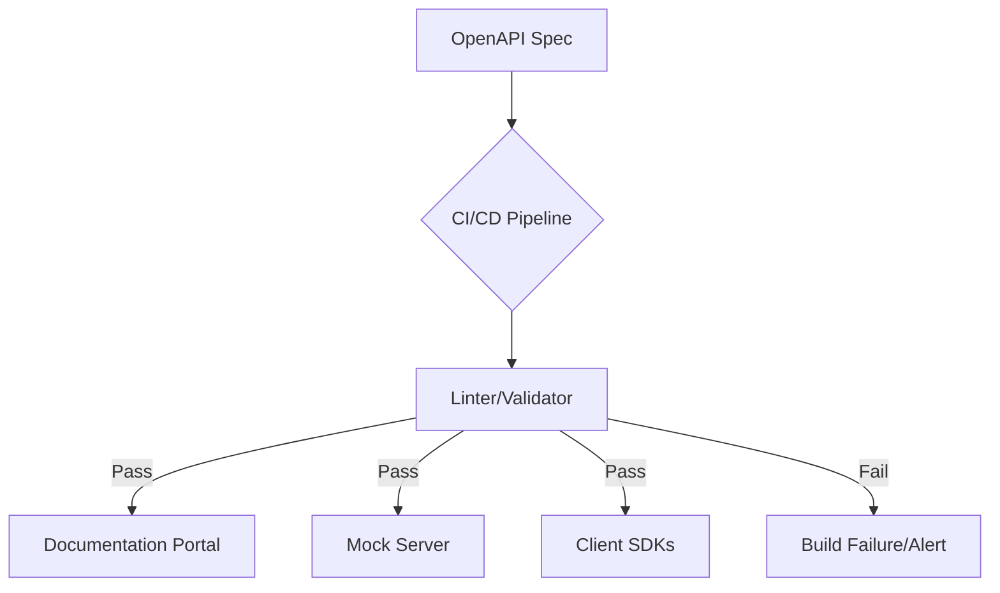

# API Documentation

> *Documenting software interfaces using OpenAPI, covering structured schemas, automation workflows, and best practices for developer experience*

---

# What is API documentation?

Application programming interface (API) documentation is the contract between a service and its consumers. It defines how to interact with an API by detailing endpoints, authentication protocols, input parameters, and response formats. These formats are typically JavaScript Object Notation (JSON) or Extensible Markup Language (XML). Instead of serving as a static manual, modern documentation often functions as a live reference.

Many teams use the [OpenAPI Specification (OAS)](https://www.openapis.org/){: target="_blank" rel="noopener" } to drive a spec-driven workflow. This allows for a docs-as-code approach where documentation generators extract metadata directly from the specification file. This process integrates with version control and continuous integration and continuous delivery (CI/CD) pipelines. Integration ensures that developer portals stay updated alongside the codebase.



---

## Why documentation matters

High-quality documentation is the primary driver of a positive developer experience (DX). When documentation is vague or missing, developers face friction. Integrations fail, support tickets spike, and projects stop. Effective documentation reduces the time it takes to make the first API call and supports [developer relations (DevRel)](https://en.wikipedia.org/wiki/Developer_relations){: target="_blank" rel="noopener" } goals by making a product easy to adopt.

Ignoring documentation standards leads to several risks:

- **Documentation drift:** Stale parameters that do not match the current production environment.
- **Breaking changes:** Updates that bypass [Semantic Versioning (SemVer)](https://semver.org/){: target="_blank" rel="noopener" } expectations. This causes client applications to crash.
- **Schema mismatches:** Unclear data types that lead to parsing errors during processing.
- **Support fatigue:** Internal engineers who spend time on repetitive implementation questions.

---

## Syntax and structure

Machine-readable schemas, such as [YAML](https://yaml.org/){: target="_blank" rel="noopener" } (YAML Ain't Markup Language) or [JSON](https://www.json.org/){: target="_blank" rel="noopener" }, form the backbone of modern API references. To be functional, an OpenAPI 3.x specification requires several core components:

- **Metadata:** The API title, description, and version. This is defined in the `info` object.
- **Servers:** Root addresses (base URLs) for sandbox and production environments.
- **Paths and Operations:** The Uniform Resource Identifier (URI) paths and the permitted Hypertext Transfer Protocol (HTTP) methods, such as `#!http GET`, `#!http POST`, `#!http PUT`, or `#!http DELETE`.
- **Parameters:** Requirements categorized by location: `path`, `query`, `header`, or `cookie`.
- **Request Bodies:** For POST, PUT, or PATCH. These include detailed payload definitions including media types and schemas.
- **Responses:** HTTP status codes and the resulting data schemas.
- **Authentication:** Security schemes, such as API keys, Bearer tokens, or [OAuth 2.0](https://oauth.net/2/){: target="_blank" rel="noopener" }.

---

## Code example

This OpenAPI 3.0.3 snippet in YAML defines a single endpoint for a user directory service.

```yaml hl_lines="1 6 9 12"
openapi: 3.0.3
info:
  title: User Directory API
  version: 1.0.0
paths:
  /users/{id}:
    get:
      summary: Retrieve a user by ID
      parameters:
        - name: id
          in: path
          required: true
          schema:
            type: string
      responses:
        '200':
          description: User record retrieved successfully
          content:
            application/json:
              schema:
                type: object
                properties:
                  id:
                    type: string
                  name:
                    type: string
```

### Key components

- **`openapi: 3.0.3`**: The semantic version of the OpenAPI Specification that the document follows.
- **`/users/{id}`**: The relative path that uses a template expression (`{id}`) to target specific resources.
- **`in: path`**: This indicates the parameter is part of the URL path. In OAS 3.0, path parameters must have `required: true`.
- **`application/json`**: The media type used for the response body.

---

## Mitigating common pitfalls

Even technical teams struggle to keep reference pages accurate. Addressing these three areas prevents the most common integration hurdles.

**Preventing Documentation Drift**
Drift occurs when code evolves but the OpenAPI spec remains static. To solve this, integrate contract testing or validation tools into your CI/CD pipeline. If the code implementation and the spec do not match, the build should fail.

**Beyond the happy path**
Documentation often ignores error states. Every endpoint should define standard HTTP error codes, such as 400 (Bad Request), 401 (Unauthorized), and 429 (Too Many Requests), along with specific error schemas that explain the failure.

**Providing functional context**
A list of parameters is only half the battle. Support your reference with code snippets in languages, such as Python, JavaScript, or Go, to show complete request and response lifecycles.

---

## Tooling and ecosystem

The right tools turn static files into interactive developer hubs:

- UI Generators: [Redocly](https://redocly.com/), [Swagger UI](https://swagger.io/tools/swagger-ui/), and [Stoplight Elements](https://stoplight.io/open-source/elements) render schemas into searchable portals.
- Linters: [Spectral](https://stoplight.io/open-source/spectral) or [Vacuum](https://quobix.com/vacuum/) enforce style consistency and schema validity.
- Security: Scanners, such as [42Crunch](https://42crunch.com/), check that endpoints do not accidentally expose personally identifiable information (PII) or contain security vulnerabilities.

---

## Best practices

!!! tip "Practice spec-first development"
    Review your OpenAPI contract before writing application code. This ensures alignment between product, engineering, and documentation teams.

- **Automate everything:** Use tools to generate documentation from the spec file. Do not manually maintain separate HTML tables for API parameters.
- **Enforce style:** Use a linter to flag schema errors and naming convention violations before they reach production.
- **Enable Try It Out:** Use mock servers (such as Prism) or sandbox environments in your portal so developers can test calls immediately.
- **Strict Versioning:** Use SemVer to signal when an update introduces breaking changes for consumers.