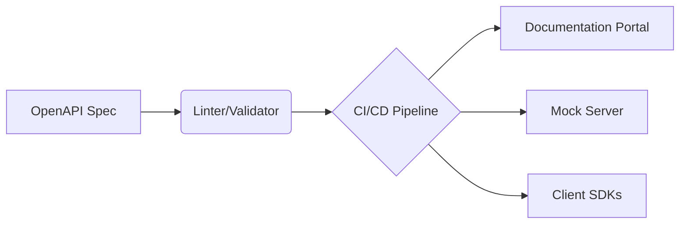

# API Documentation

> Documenting software interfaces using OpenAPI, covering structured schemas, automation workflows, and best practices for developer experience

---

# What is API documentation?

API documentation acts as the contract between a service and its consumers. It defines how to interact with an application programming interface (API) by detailing endpoints, authentication protocols, input parameters, and response formats—typically in JSON. Rather than serving as a static manual, modern documentation often functions as a live reference.

Many teams leverage the [OpenAPI Specification (OAS)](https://www.openapis.org/){: target="_blank" rel="noopener" } to drive a spec-driven workflow. This allows for a "docs-as-code" approach where documentation generators extract metadata directly from source code or schema files. This process integrates with version control and CI/CD pipelines, ensuring that developer portals stay updated alongside the codebase.



## Why documentation matters

High-quality documentation is the primary driver of a positive developer experience (DX). When documentation is vague or missing, developers face friction: integrations fail, support tickets spike, and projects stall. Effective docs accelerate the "time-to-first-API-call" and support [developer relations (DevRel)](https://en.wikipedia.org/wiki/Developer_relations){: target="_blank" rel="noopener" } goals by making a product easy to adopt.

Ignoring documentation standards leads to several systemic risks:

*   **Documentation drift:** Stale parameters that don't match the current production environment.
*   **Breaking changes:** Updates that bypass [Semantic Versioning (SemVer)](https://semver.org/){: target="_blank" rel="noopener" } expectations, causing client applications to crash.
*   **Schema mismatches:** Unclear data types leading to parsing errors during processing.
*   **Support fatigue:** Internal engineers wasting time on repetitive implementation questions.

## Syntax and structure

Machine-readable schemas like [YAML](https://yaml.org/){: target="_blank" rel="noopener" } or [JSON](https://www.json.org/){: target="_blank" rel="noopener" } form the backbone of modern API references. To be functional, a specification requires several core components:

*   **Metadata:** The API title, description, and version.
*   **Servers:** Root addresses (base URLs) for sandbox and production environments.
*   **Endpoints and Methods:** The URI paths and the permitted actions, such as `#!http GET`, `#!http POST`, `#!http PUT`, or `#!http DELETE`.
*   **Parameters:** Requirements categorized by location: path, query string, header, or body.
*   **Schemas:** Detailed key-value pairs and data types for both requests and responses.
*   **Authentication:** Security schemes like API keys, Bearer tokens, or [OAuth 2.0](https://oauth.net/2/){: target="_blank" rel="noopener" }.

## Code example

This OpenAPI 3.0 snippet in YAML defines a single endpoint for a user directory service.

```yaml hl_lines="1 6 9 12"
openapi: 3.0.3
info:
  title: User Directory API
  version: 1.0.0
paths:
  /users/{id}:
    get:
      summary: Retrieve a user by ID
      parameters:
        - name: id
          in: path
          required: true
          schema:
            type: string
      responses:
        '200':
          description: User record retrieved successfully
          content:
            application/json:
              schema:
                type: object
                properties:
                  id:
                    type: string
                  name:
                    type: string
```

### Key components

*   **`openapi: 3.0.3`:** The schema version used by parsers to render the documentation.
*   **`/users/{id}`:** The relative path using a placeholder (`{id}`) to target specific resources.
*   **`in: path`:** Indicates the parameter is part of the URL string itself.
*   **`application/json`:** Specifies the data format for the returned response.

## Mitigating common pitfalls

Even technical teams struggle to keep reference pages accurate. Addressing these three areas prevents the most common integration hurdles.

**Preventing Documentation Drift**
Drift occurs when code evolves but the OpenAPI spec remains static. To solve this, integrate validation tools into your CI/CD pipeline. If the code and the spec don't match, the build should fail.

**Beyond the "Happy Path"**
Documentation often ignores error states. Every endpoint should define standard HTTP error codes—such as 400 (Bad Request), 401 (Unauthorized), and 429 (Too Many Requests)—along with explanations of what triggers them.

**Providing Functional Context**
A list of parameters is only half the battle. Complement your reference with code snippets in languages like Python, JavaScript, or Go to show complete request and response lifecycles.

## Tooling and ecosystem

The right tools turn static files into interactive developer hubs:

*   **UI Generators:** [Redocly](https://redocly.com/), [Swagger UI](https://swagger.io/tools/swagger-ui/), and [Stoplight Elements](https://stoplight.io/open-source/elements) render schemas into searchable portals.
*   **Linters:** [Spectral](https://stoplight.io/open-source/spectral) or [Vacuum](https://quobix.com/vacuum/) enforce style consistency and schema validity.
*   **Security:** Scanners check that endpoints don't accidentally expose personally identifiable information (PII).

## Best practices

!!! tip "Practice spec-first development"
    Review your OpenAPI contract before writing application code. This ensures alignment between product, engineering, and documentation teams.

*   **Automate everything:** Never manually format API tables; use generators to compile YAML/JSON directly into your site.
*   **Enforce style:** Use a linter to flag schema errors before they reach production.
*   **Enable "Try It Out":** Use mock servers in your portal so developers can test calls without writing code.
*   **Strict Versioning:** Use SemVer to signal when an update introduces breaking changes for consumers.