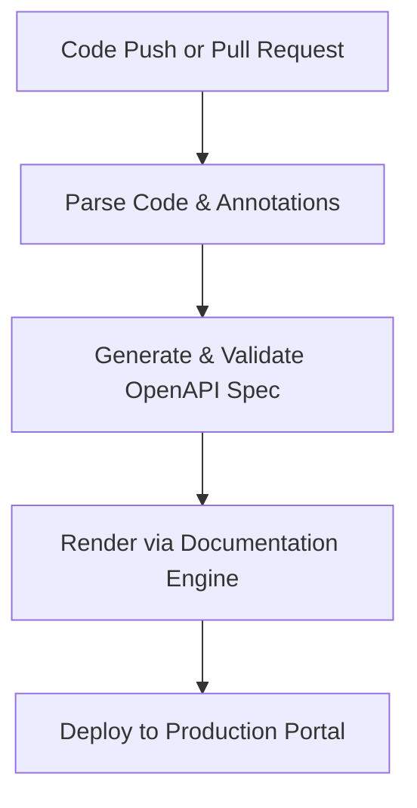

# Automated API reference generation

> *A documentation workflow that programmatically converts source code annotations and docstrings into structured, synchronized API reference guides*

---

## The mechanics of automated generation

Automated API reference generation eliminates manual synchronization errors by treating documentation as an extension of the codebase. Instead of maintaining a separate reference document, developers embed structured annotations, such as decorators or Javadoc/TypeDoc comments, directly into the controllers, models, and endpoint handlers.

During the build or continuous integration and continuous delivery (CI/CD) process, specialized parsers that often use an abstract syntax tree (AST) or reflection scan these files to produce a machine-readable specification. This is most commonly an OpenAPI Specification (OAS) file in YAML or JSON. This specification acts as the single source of truth. While software engineers maintain the technical parameters within the code, technical writers manage the rendering logic, the front-end documentation portal, and the surrounding conceptual content.

---

## Breaking the cycle of documentation lag

Manual documentation is a primary source of content debt. When an API change occurs, such as a data type update or a new authentication requirement, a manual document becomes stale immediately. This delay forces integration partners to rely on trial and error, which increases support overhead.

Structural details, such as endpoint paths, HTTP methods, and status codes, remain synchronized because the reference is generated from the code signatures and annotations. This synchronization allows technical writers to shift focus from administrative copy-paste tasks to high-value work, such as designing interactive tutorials, usage guides, and architectural overviews.

---

## When to transition to automation

For small, static APIs, manual updates may be manageable. However, specific technical triggers suggest the need for automation:

- **Release velocity:** If you deploy updates continuously, manual documentation cannot keep pace with the deployment pipeline.
- **Scale and complexity:** APIs with dozens of endpoints and deeply nested JSON schemas are prone to human error when transcribed manually.
- **Validation needs:** Automated pipelines can enforce schema validation, ensuring that every endpoint includes mandatory fields, such as descriptions or example payloads, before the build passes.
- **Developer experience (DX) metrics:** If the time required for a developer to make a first successful request is high due to 400-series errors caused by incorrect documentation, the manual process is a bottleneck.

---

## The generation pipeline

The documentation pipeline integrates with the CI/CD cycle to ensure every code modification is validated before reaching the production portal.

1.  **Extraction:** A build runner executes a language-specific parser to extract metadata from the source code. The parser analyzes function signatures and structured comments.
2.  **Transformation and Validation:** The extracted metadata is transformed into an OpenAPI Specification. This file is then validated against the OAS schema to catch missing types, invalid nesting, or incomplete endpoint definitions.
3.  **Rendering:** The validated specification is passed to a documentation engine, such as Redoc or Swagger UI, or a static site generator (SSG). The engine applies themes and syntax highlighting to convert the raw JSON/YAML into a searchable, interactive UI.

---

## Collaborative roles (RACI)

A successful pipeline requires clear ownership across engineering and content teams. The responsible, accountable, consulted, and informed (RACI) model defines these roles:

- **Responsible:** Software engineers write the code annotations and docstrings; technical writers define the documentation standards and maintain the rendering pipeline.
- **Accountable:** The DevOps/Release engineer or documentation lead ensures the automation runner executes correctly during CI/CD.
- **Consulted:** Product managers verify that parameter naming and public-facing descriptions align with product strategy.
- **Informed:** Quality assurance (QA) teams use the generated specification to sync automated test suites with the latest API changes.

---

## Integration and tooling

Documentation as code thrives when integrated into the continuous integration (CI) pipeline. Tools such as [GitHub Actions](https://github.com/features/actions) or GitLab CI trigger the generation whenever code is pushed.

Modern stacks typically use language-specific parsers, such as Swashbuckle for .NET, Sphinx-jsonschema for Python, or TypeDoc for TypeScript, to handle the initial extraction. These tools produce intermediate files that are then consumed by site generators, such as Docusaurus or Hugo, or specialized API renderers, such as Redocly, to build the final portal.

!!! tip "Integration Best Practice"
    Incorporate a breaking change detector in your pipeline, such as oasdiff. This warns the team if a code change modifies an existing endpoint in a way that would break client integrations.

---

## Maintaining the pipeline

Automated systems are robust but require oversight at the input level:

- **Parser failures:** A syntax error in a docstring or a decorator can break the build. Use local pre-commit hooks to validate code annotations before pushing to the repository.
- **Stale descriptions:** While code signatures update automatically, the descriptive text in a docstring may not. Implement linting rules that require a docstring update whenever a function's logic is modified.

By tracking build success rates and documentation freshness, teams ensure the automation reduces friction rather than moving the bottleneck to the build runner.