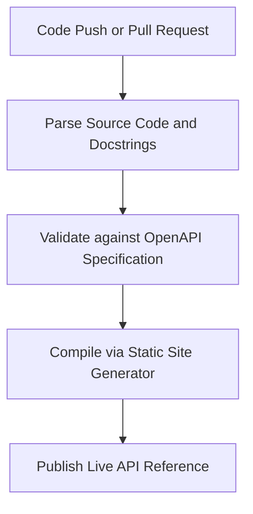

# Automated API reference generation

> Automatically generating synchronized, accurate reference documentation by extracting structured source code comments and translating them into user-facing tables

---

## What is automated API reference generation?

Automated API reference generation is the process of using tools to parse source code, extract structured developer comments (docstrings), and compile them into formatted documents. Instead of manually writing and updating descriptions for every function, parameter, and response payload, development teams configure tools to read the codebase. These tools then generate Markdown (MD) files, HTML tables, or JSON files that describe how users interact with the system.

This workflow occurs during the build and deploy phases of the software development life cycle (SDLC). It connects active programming with public content publishing. In this pipeline, software engineers write the in-code docstrings, while technical writers establish the publishing templates, style guides, and information architecture (IA).

---

## Why it matters

Automating this process prevents documentation lag—the time between a code update and the publication of the corresponding documentation. When you manually document an application programming interface (API), you risk publishing outdated endpoint parameters, incorrect data types, or missing authentication requirements. These gaps create content debt that frustrates developers, slows integration, and increases the volume of customer support tickets.

By automating your API reference, you ensure your documentation remains synchronized with your codebase. Changes to the source code appear in the documentation automatically, which removes the need to copy and paste code signatures into text editors. This automation allows technical writers to focus on conceptual guides, onboarding tutorials, and troubleshooting workflows.

---

## When to adopt this workflow 

Deciding when to transition from manual authoring to automated generation depends on the size of your development team and your release frequency. Consider adopting this process in the following scenarios:

- **Rapid release cycles:** If your team deploys updates daily or weekly, manual documentation cannot stay current with the evolving codebase.
- **Growing development teams:** As more engineers contribute code, the risk of inconsistent formatting increases. Automation provides a schema validation step to maintain quality.
- **Frequent documentation lag:** If support teams report that published references do not match live system behavior, your manual processes are not scaling effectively.
- **Complex API structures:** When an API grows to dozens of endpoints with nested JSON payloads, maintaining manual tables becomes inefficient and prone to error.

---

## How the workflow works

The generation pipeline follows a structured flow triggered by code changes. This ensures every modification is validated and compiled before it reaches the production documentation site.

1. **Source Code Extraction:** When an engineer commits changes to a version control system (VCS), a build script parses the source files. The script extracts inline comments, structural metadata, and formal docstrings.
2. **Schema Validation:** The tool structures the extracted metadata into an intermediate configuration file. The generator validates this file against the [OpenAPI Specification](https://www.openapis.org/){: target="_blank" rel="noopener" } (OAS) to ensure every endpoint, parameter, and data type is complete and correctly typed.
3. **Static Site Compilation:** The validated data moves to a static site generator (SSG) or a dedicated API rendering engine. The compiler applies formatting templates and syntax highlighting to convert raw data into searchable pages and tables.

---

## RACI and team roles

Define these roles early to ensure the automated pipeline functions correctly:

- **Responsible:** Software engineers write and maintain inline docstrings and code signatures. Technical writers define docstring style guidelines, build publishing templates, and write conceptual content.
- **Accountable:** The documentation lead or release engineer ensures the generation pipeline runs without errors during every software release.
- **Consulted:** Subject matter experts (SMEs) and product managers ensure parameter names align with user goals during the API design phase.
- **Informed:** The quality assurance (QA) team receives notification when new documentation is published so they can align automated testing scripts with the live reference.

---

## Pipeline integration and tooling

This workflow integrates into your continuous integration and continuous deployment (CI/CD) pipeline. When an engineer submits a pull request (PR), a build runner, such as [GitHub Actions](https://github.com/features/actions){: target="_blank" rel="noopener" }, triggers the documentation generator.

For modern teams, this pipeline is a core component of the "docs as code" methodology. You can use language-specific tools—such as [Sphinx](https://www.sphinx-doc.org/){: target="_blank" rel="noopener" } for [Python](https://www.python.org/){: target="_blank" rel="noopener" } or [TypeDoc](https://typedoc.org/){: target="_blank" rel="noopener" } for [TypeScript](https://www.typescriptlang.org/){: target="_blank" rel="noopener" }—to output intermediate files. These files are then pulled into your SSG to build the final site.

!!! tip "Integration Best Practice"
    Configure your build pipeline to run a linter against source code docstrings during the compile phase. This prevents poorly formatted comments or invalid Markdown from breaking the documentation layout.

---

## Troubleshooting and common points of failure

Automated pipelines can fail when they encounter unexpected input. Prepare for these common scenarios:

- **Broken builds due to syntax errors:** If a developer introduces an unclosed quote or incorrect indentation in a docstring, the parser might fail. 
    - **Solution:** Configure a local pre-commit hook to validate docstring formats before an engineer pushes code to the remote repository.
- **Desynchronized documentation parameters:** If a code change alters a parameter name but the docstring remains unupdated, it leads to missing metadata. 
    - **Solution:** Add an automated PR check that scans for modified parameters and blocks the merge if the corresponding inline comment is missing.

---

## Key metrics and success criteria

To measure the success of your automated reference workflow, track these key performance indicators:

- **Documentation accuracy index:** Monitor the reduction in support tickets or bugs related to incorrect API documentation.
- **Time-to-publish reduction:** Track how long it takes for a newly deployed endpoint to appear on the public documentation site.
- **Build pipeline reliability:** Measure the percentage of automated CI/CD runs that complete without parser warnings or schema validation errors.