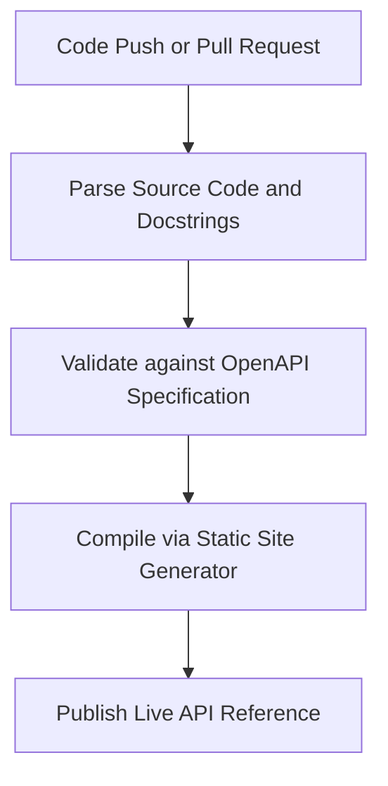

# Automated API reference generation

> A documentation workflow that programmatically converts source code docstrings into structured, synchronized API reference guides

---

## The mechanics of automated generation

Automated API reference generation eliminates the friction of manual updates by treating documentation as an extension of the codebase. Instead of treating the reference guide as a separate document, developers embed structured comments (docstrings) directly into the functions, parameters, and response payloads. 

During the build process, specialized parsers scan these files to produce Markdown, HTML, or JSON outputs. This creates a bridge between engineering and publishing. While software engineers maintain the technical details within the code, technical writers manage the rendering logic, style guides, and the broader information architecture.

---

## Breaking the cycle of documentation lag

Manual documentation is a primary source of "content debt." When an API changes—perhaps a data type is updated or a new authentication requirement is added—a manual document remains incorrect until a writer is notified and updates the text. This delay frustrates developers and forces support teams to address repetitive tickets about "ghost" parameters.

Automation ensures that documentation is a literal reflection of the system's behavior. Because the reference is generated from the code itself, code signatures are never out of sync. This shift moves the technical writer’s focus away from administrative "copy-paste" tasks and toward high-value work like designing onboarding tutorials and architectural overviews.

---

## When to transition to automation

For small, static APIs, manual updates might suffice. However, certain technical and organizational triggers suggest it is time to automate:

*   **Release velocity:** If you deploy updates daily or weekly, your documentation is likely perpetually outdated.
*   **Scale and complexity:** An API with dozens of endpoints and deeply nested JSON structures is too complex to manage in a standard text editor without introducing typos.
*   **Validation needs:** Large development teams often struggle with inconsistent formatting. Automated pipelines can enforce schema validation, ensuring every endpoint meets a specific standard before it goes live.
*   **Developer feedback:** If your "Time-to-First-Hello-World" metric is lagging because of incorrect reference data, your manual process has likely reached its limit.

---

## The generation pipeline

The documentation pipeline mirrors the standard software release cycle, ensuring every modification is validated before reaching the production site.

1.  **Extraction:** A build script parses the version control system (VCS) to extract metadata and formal docstrings.
2.  **Validation:** The generator converts this metadata into an intermediate configuration file and validates it against the [OpenAPI Specification](https://www.openapis.org/){: target="_blank" rel="noopener" }. This catches missing types or incomplete endpoint descriptions before they reach the user.
3.  **Compilation:** The validated data is passed to a static site generator (SSG). The compiler applies templates and syntax highlighting to turn raw metadata into a searchable, user-friendly interface.

---

## Collaborative roles (RACI)

A successful pipeline requires clear ownership across engineering and content teams:

*   **Responsible:** Software engineers write the docstrings; technical writers define the formatting standards and build the publishing templates.
*   **Accountable:** The release engineer or documentation lead ensures the pipeline executes correctly during every CI/CD run.
*   **Consulted:** Product managers and SMEs verify that parameter naming conventions align with the overall product strategy.
*   **Informed:** Quality assurance (QA) teams use the generated reference to sync their automated test scripts with the latest system changes.

---

## Integration and tooling

Documentation-as-code thrives when it is part of the continuous integration (CI) pipeline. When an engineer submits a pull request, a runner like [GitHub Actions](https://github.com/features/actions){: target="_blank" rel="noopener" } triggers the generator. 

Modern stacks typically use language-specific parsers—such as [Sphinx](https://www.sphinx-doc.org/){: target="_blank" rel="noopener" } for Python or [TypeDoc](https://typedoc.org/){: target="_blank" rel="noopener" } for TypeScript—to handle the initial extraction. These tools produce intermediate files that are then consumed by a site generator to build the final documentation portal.

!!! tip "Integration Best Practice"
    Run a linter against your docstrings during the compile phase. This prevents a single unclosed quote or a formatting error from breaking the entire documentation layout.

---

## Maintaining the pipeline

Automated systems are robust but not infallible. Most failures occur at the input level:

*   **Syntax errors:** A developer’s typo in a docstring can crash the parser. Use local pre-commit hooks to catch these errors before the code is pushed.
*   **Missing metadata:** Code might change while the docstring remains static. To solve this, implement automated checks that block a merge if a modified parameter lacks a corresponding description.

By tracking metrics like **build reliability** and **time-to-publish**, teams can verify that the automation is actually reducing friction rather than just moving the bottleneck to the build runner.