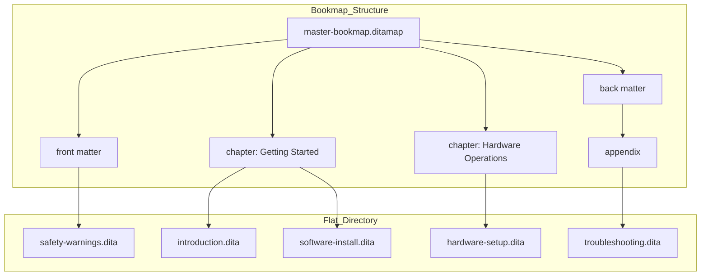

# Bookmap

> *A specialized manifest file that organizes modular topics into a hierarchical publication structure while maintaining the independence of source content*

---

## What is a bookmap?

A bookmap acts as a specialized manifest within structured writing workflows, specifically within the Darwin Information Typing Architecture (DITA). Unlike a standard DITA map, which is a generic collection of topics, a bookmap provides specific elements to support traditional book structures. 

A bookmap contains no narrative content. Instead, it holds pointers to modular source files, allowing architects to organize topics into front matter, chapters, and appendices without altering the underlying data. 

This separation of structure from content enables single-sourcing: the same topic can exist in a quick start guide and a reference manual simultaneously, assuming a different hierarchical role in each.

---

## Beyond the flat file

Centralized assembly eliminates the inconsistent navigation common in large documentation sets. A bookmap provides an authoritative source for the publication’s linear flow, managing how metadata, index terms, and keys behave across the entire set. 

For teams, this reduces the overhead of manual updates; changing a topic once ensures the revision propagates through every output format. Furthermore, bookmaps allow for complex relationship tables (reltables) that manage cross-references externally, preventing fragile hard-coded links within the topics themselves.

---

## Technical Foundation

Bookmaps leverage four primary mechanisms to control output:

- **Referencing (href and keyref):** The file stores Uniform Resource Identifiers (URIs) to topics or uses indirect key-based addressing to keep source material decoupled.
- **Specialized Hierarchical Elements:** Unlike standard maps, bookmaps use semantic tags such as `<preface>`, `<chapter>`, `<part>`, and `<appendix>` to dictate the final structure and numbering logic.
- **Metadata Inheritance:** Attributes such as `audience`, `platform`, or `product` applied at the map level cascade down to all referenced topics unless overridden.
- **Key Definition and Resolution:** Bookmaps serve as the scope for keys, allowing authors to define variables, such as product names, or link targets at the map level that resolve throughout the content.

---

## Visualizing the Hierarchy

A bookmap transforms a directory of independent files into a logical, readable sequence.

By organizing flat files into chapters, you provide the navigational aids necessary for users to navigate complex systems. If `software-install.dita` needs an update, you modify only that file; the bookmap ensures the structural context remains intact.

---

## Implementation Best Practices

- **Prioritize modularity:** Write topics that function independently. Removing context-dependent phrases such as "as mentioned in the previous chapter" allows the bookmap to reposition the topic without breaking narrative logic.
- **Use keys for variables:** Define product names and version numbers using `<keydef>` in the bookmap. This allows the map to inject specific strings into topics via `<ph keyref="product_name"/>`, preventing the need to find and replace text across individual files.
- **Standardize naming:** Use consistent taxonomies for file paths and IDs to prevent broken links during automated builds.
- **Leverage sub-maps:** Do not place unrelated product documentation into a single, massive map. Use `<mapref>` to include nested sub-maps, which are easier to maintain and improve build performance.

---

## Validation and Testing

1. **DITAVAL Verification:** If you use conditional processing, validate the bookmap against specific `.ditaval` files to ensure no orphan content or broken sequences are generated for specific audiences.
2. **Link and Key Validation:** Run automated tools, such as the DITA Open Toolkit, to catch unresolved `keyrefs` or broken `href` paths that occur when topics are moved or renamed.
3. **Context checking:** Verify that inherited metadata and book-level attributes, such as `copyryear` in `<bookmeta>`, correctly apply to the generated output (for example, PDF cover pages).