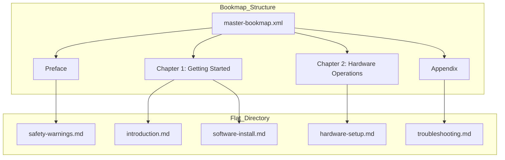

# Bookmap

> A manifest file that organizes modular topics into a hierarchical publication structure while maintaining the independence of source content

---

## What is a bookmap?

A bookmap acts as a specialized manifest within structured writing workflows, most commonly implemented in XML-based architectures like DITA. Unlike a standard topic file, a bookmap contains no narrative content. Instead, it holds pointers to modular source files, allowing architects to organize topics into nested chapters and sections without altering the underlying data. This separation of structure from content is what enables true single-sourcing; the same topic can exist in a "Quick Start Guide" and a "Reference Manual" simultaneously, assuming a different hierarchical role in each.

## Beyond the flat file

Centralized assembly eliminates the navigation drift common in large documentation sets. When authors link documents manually, the resulting web of references becomes brittle and difficult to audit. A bookmap provides a single source of truth for the publication’s linear flow, managing how metadata, index terms, and cross-references behave across the entire set. For teams, this reduces the overhead of manual updates; changing a topic once ensures the revision propagates through every output format, from PDF to web help.

## Technical Foundation

Bookmaps leverage four primary mechanisms to control output:

- **Path-based referencing:** The file stores URIs to topics, keeping the source material decoupled.
- **Hierarchical nesting:** Parent-child relationships in the map dictate the final Table of Contents.
- **Metadata inheritance:** Attributes like product version or security clearance applied at the root level cascade down to all referenced topics.
- **Conditional processing:** Build-time filters (ditaval) can include or exclude specific map branches based on the target audience or product variant.

---

## Visualizing the Hierarchy

A bookmap transforms a directory of independent files into a logical, readable sequence.

By organizing flat files into chapters, you provide the signposts necessary for users to navigate complex systems. If `software-install.md` needs an update, you modify only that file—the bookmap ensures the structural context remains intact.

---

## Implementation Best Practices

- **Prioritize modularity:** Write topics that function independently. Removing phrases like "as mentioned previously" allows the bookmap to reposition the topic anywhere in the hierarchy without breaking the narrative logic.
- **Centralize metadata:** Define product names and version numbers at the map level. This prevents the need to "find and replace" strings across hundreds of individual files when a product is rebranded.
- **Standardize naming:** Use consistent taxonomies for file paths and IDs to prevent broken links during automated builds.
- **Avoid the "Monolithic Map":** Do not cram unrelated product documentation into a single, massive map. This bloats build times and complicates version control. Smaller, nested sub-maps are easier to maintain.

## Validation and Testing

Structural integrity is as important as grammatical accuracy. Before publishing:

1.  **Tree Testing:** Evaluate the bookmap hierarchy by asking users to locate specific tasks using only the navigation tree.
2.  **Link Validation:** Run automated linters to catch broken paths or unresolved cross-references that occur when topics are moved between map branches.
3.  **Context Checking:** Verify that inherited metadata (like "Internal Use Only") correctly applies to all child topics in the generated output.