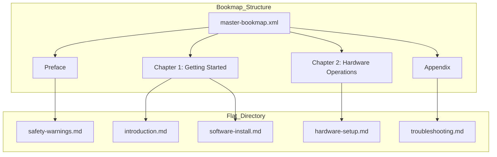

# Bookmap

> A master configuration file used to define the structural hierarchy, navigation, and publication assembly of individual documentation topics

---

## What is a bookmap?

A bookmap is a specialized manifest file used in structured writing and single-sourcing workflows. It is typically written in XML. Instead of storing content, a bookmap contains references to modular source files, called topics. 

By separating content from structure, you can organize topics into nested hierarchies, chapters, and sections without changing the source files. This separation enables content reuse and ensures consistent document assembly across various output formats, such as PDF and HTML. 

In information architecture (IA), a bookmap acts as a plan for both printed manuals and digital help systems. It defines the linear reading experience and manages how metadata, index terms, and relationships apply to the structure.

---

## Why it matters

Using a bookmap helps you create a predictable, scannable hierarchy. Without a centralized assembly file, documentation sets often lack organization, which makes it difficult for users to find information. If authors link documents manually, the resulting navigation can become disorganized and hard to maintain. 

For documentation teams, a bookmap reduces maintenance costs and prevents content errors. When you need to use the same topic in multiple manuals, you don't have to copy and paste the text. Instead, you update the topic in one place, and the bookmap ensures the change appears in all compiled outputs.

---

## Core principles and anatomy

A bookmap uses several core features to manage document hierarchies:

- **Decoupled structure:** The file contains pointers (paths) to topics rather than the text itself.
- **Hierarchical nesting:** Topics are organized into parent-child relationships that define the table of contents.
- **Metadata inheritance:** Metadata and product attributes applied at the root level apply to all child topics.
- **Conditional processing:** You can use filters to include or exclude topics based on the target audience or product version.

---

## Design pattern example

The following example shows how a bookmap transforms flat files into a logical structure.

### Flat directory vs. bookmap assembly

### Breakdown of the pattern

- **Modular separation:** Referenced files remain independent. To update `software-install.md`, you modify only that file. The table of contents remains unchanged.
- **Navigation:** Organizing flat files into chapters provides clear signposts that help users understand the system.

---

## Impact on user experience

Structuring documentation with a bookmap supports the following goals:

- **Easier navigation:** Clear structural paths allow users to find tasks quickly.
- **Consistency:** Standardizing the document structure—such as placing safety information at the beginning—helps users find key facts across different manuals.

---

## Implementation best practices

Follow these rules when configuring your assembly files:

- **Keep topics modular:** Write each topic so it can stand alone. Avoid phrases like "as mentioned in the previous chapter" so you can reuse the file in other contexts.
- **Use map-level metadata:** Define product names and version numbers in the bookmap instead of hardcoding them in individual topics.
- **Limit conditional processing:** Use build filters sparingly to keep the assembly file easy to debug.
- **Use standard naming conventions:** Ensure file paths and IDs follow a consistent taxonomy to prevent broken links during the build process.

---

## Common anti-patterns

Avoid these common mistakes:

- **The monolithic map:** Avoid creating one massive map for hundreds of unrelated topics. This can slow down build times and lead to configuration errors.
- **In-file structural links:** Do not hardcode navigation links (such as "Go to Chapter 3") inside topics. This breaks modularity and prevents reuse.

---

## How to validate and test

Verify that your structure works for your readers:

- **Tree testing:** Ask users to locate specific tasks using only your bookmap hierarchy to measure how easy it is to find information.
- **Link validation:** Use automated tools or linters to identify and fix broken paths or unresolved references.